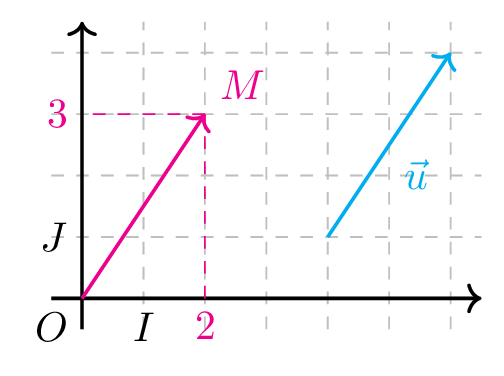
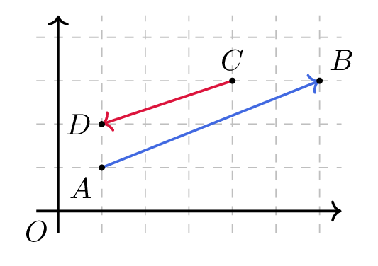

# Déterminer les coordonnées d'un vecteur

## Comment faire ?

!!! methode "Comment lire et représenter un vecteur par ses coordonnées ?"
    On lira les coordonnées du vecteur \( \textcolor{gray}{\vec{u}} \) tracé ci-dessous.

    1. **Pour lire les coordonnées**, on compte le déplacement **horizontal**, puis le déplacement **vertical**, en partant de l'origine de la flèche.  
        De \( \textcolor{gray}{2} \) vers la droite, puis de \( \textcolor{gray}{3} \) vers le haut : \( \textcolor{gray}{\vec{u}\begin{pmatrix}2\\3\end{pmatrix}} \).

    2. **Pour représenter un vecteur** dont on connait les coordonnées, on applique ces deux déplacements à partir du point voulu.  
        Depuis l'origine \( \textcolor{gray}{O} \), on arrive au point \( \textcolor{gray}{M(2\,;3)} \).

    3. **On vérifie :** les coordonnées de \( \vec{u} \) sont celles de l'unique point \( M \) tel que \( \vec{OM}=\vec{u} \).  
        \( \textcolor{gray}{\vec{OM}} \) et \( \textcolor{gray}{\vec{u}} \) ont bien même direction, même sens et même longueur.

    

!!! methode "Comment calculer des coordonnées de vecteurs ?"
    Dans le repère ci-dessous, \( \textcolor{gray}{A(1\,;1)} \), \( \textcolor{gray}{B(6\,;3)} \), \( \textcolor{gray}{C(4\,;3)} \) et \( \textcolor{gray}{D(1\,;2)} \).

    1. **Coordonnées de \( \vec{AB} \) :** on fait **arrivée moins départ**, coordonnée par coordonnée.  
        \( \textcolor{gray}{\vec{AB}\begin{pmatrix}x_B-x_A\\y_B-y_A\end{pmatrix}\Leftrightarrow\vec{AB}\begin{pmatrix}6-1\\3-1\end{pmatrix}\Leftrightarrow\vec{AB}\begin{pmatrix}5\\2\end{pmatrix}} \)

    2. **Somme de deux vecteurs :** on **ajoute les coordonnées** deux à deux.  
        \( \textcolor{gray}{\vec{CD}\begin{pmatrix}1-4\\2-3\end{pmatrix}\Leftrightarrow\vec{CD}\begin{pmatrix}-3\\-1\end{pmatrix}} \), donc \( \textcolor{gray}{\vec{AB}+\vec{CD}} \) a pour coordonnées \( \textcolor{gray}{\begin{pmatrix}5-3\\2-1\end{pmatrix}=\begin{pmatrix}2\\1\end{pmatrix}} \).

    3. **Produit par un réel :** on **multiplie chaque coordonnée** par \( k \).  
        \( \textcolor{gray}{3\vec{AB}} \) a pour coordonnées \( \textcolor{gray}{\begin{pmatrix}3\times 5\\3\times 2\end{pmatrix}=\begin{pmatrix}15\\6\end{pmatrix}} \).

    

## S'entrainer !

#### Travailler dans un repère orthogonal, normé ou quelconque

<iframe src="https://coopmaths.fr/alea/?EEEE2e0a294917e726bf13040f22272e13b0133711ab0f2717e80f1d17e612c72d0a14572cff18292cde277b2d0017e80f2c146e281a2a84277b2922132b26f117e60f2d295517e50f2e2dfe272e2757133c132b294917e71bce139615832b1613f3272e13350f2c17e90f2c13a6281a2a84277b2d0017e80f2217e60f1c272e132b2d9a2bde12c72e3627c127cb277b27c817e81336133512d10031" class="exerciseur" allowfullscreen></iframe>

#### Représenter un vecteur dans un repère, à partir de ses coordonnées

<iframe src="https://coopmaths.fr/alea/?EEEE2e0a294917e825f827b80f22272e13b0139b11a60f2717ea0f1d17e612c72d0a13f32922132b26f117e60f2d295517e50f2f181a2a762e5e0f1e2d0a13fe133612d112d2" class="exerciseur" allowfullscreen></iframe>

#### Lire les coordonnées d’un vecteur représenté dans un repère

<iframe src="https://coopmaths.fr/alea/?EEEE2e0a2949181612d3268c0f22272e13b0139b11a70f2717ea0f1d17e612c72922132b26f117e60f2d295517e50f2f181a2a762e5e0f1e2d0a13fe133612d112d2" class="exerciseur" allowfullscreen></iframe>

#### Calculer les coordonnées d'un vecteur à partir des coordonnées de deux points

<iframe src="https://coopmaths.fr/alea/?EEEE2e0a2949181b158e26be0f22272e13b0139d11a60f2717ea0f1d17e612c72d0a132b2922132b26f117e50f2d295517e50f2f181a2a762e5e0f1e2d0a13fe133612d112d2" class="exerciseur" allowfullscreen></iframe>

#### Calculer les coordonnées d'un vecteur exprimé comme somme, différence ou produit d'autre vecteur

<iframe src="https://coopmaths.fr/alea/?EEEE2e0a294917e9165a158d0f22272e13b0139d11a70f2217e60f2e2dfe272e133925f726b3294917e71bcf145e13f32922132b2e0a294917eb15f716580f22272e13b0139d11a90f2217e60f2f181a2a762e5e0f1e2d0a13fe133612d112d2" class="exerciseur" allowfullscreen></iframe>
