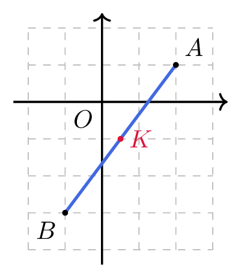

# Calculer les coordonnées du milieu d'un segment

## Comment faire ?

!!! methode "Comment calculer les coordonnées du milieu d'un segment ?"
    Dans un repère, \( \textcolor{gray}{A(2\,;1)} \) et \( \textcolor{gray}{B(-1\,;-3)} \). On cherche le milieu \( \textcolor{gray}{K} \) de \( \textcolor{gray}{[AB]} \).

    1. **On repère les coordonnées des deux extrémités** du segment.  
        \( \textcolor{gray}{x_A=2} \), \( \textcolor{gray}{y_A=1} \), \( \textcolor{gray}{x_B=-1} \), \( \textcolor{gray}{y_B=-3} \).

    2. **L'abscisse du milieu est la moyenne des abscisses.**  
        \( \textcolor{gray}{x_K=\dfrac{x_A+x_B}{2}=\dfrac{2+(-1)}{2}=0{,}5} \)

    3. **L'ordonnée du milieu est la moyenne des ordonnées.**  
        \( \textcolor{gray}{y_K=\dfrac{y_A+y_B}{2}=\dfrac{1+(-3)}{2}=-1} \)

    4. **On conclut** en écrivant le couple de coordonnées.  
        \( \textcolor{gray}{K(0{,}5\,;-1)} \)

    

## S'entrainer !

#### Calculer et utiliser les coordonnées du milieu d'un segment dans un repère

<iframe src="https://coopmaths.fr/alea/?EEEE2e0a294917e9265b14f60f22272e13b0133711a70f2717e80f1d17e612c72d0a132b2922132b26f117e50f2d295517e50f2e2dfe272e1493139e25eb294917e71bce1396138f2b1613f3272e13350f2c17e70f2217e60f1c272e12c72d9a2bde12c72e0a294917e9265b14f60f22272e13b0133711a70f2717e80f1d17e612c72d0a13f32922132b26f117e50f2d295517e50f2f181a2a762e5e0f1e2d0a13fe133612d112d2" class="exerciseur" allowfullscreen></iframe>
