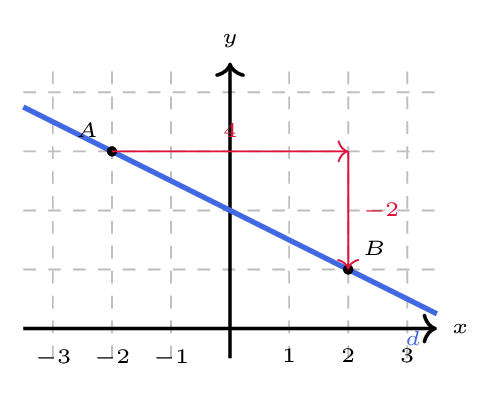

# Déterminer un vecteur directeur et la pente d'une droite

## Comment faire ?

!!! methode "Comment déterminer un vecteur directeur d'une droite ?"
    La droite \( \textcolor{gray}{d} \) ci-dessous passe par les points \( \textcolor{gray}{A(-2\,;3)} \) et \( \textcolor{gray}{B(2\,;1)} \).

    **Méthode 1 — à partir de deux points de la droite**

    1. **On calcule les coordonnées du vecteur \( \vec{AB} \) :** arrivée moins départ (fiche 37).  
        \( \textcolor{gray}{\vec{AB}\begin{pmatrix}2-(-2)\\1-3\end{pmatrix}\Leftrightarrow\vec{AB}\begin{pmatrix}4\\-2\end{pmatrix}} \)

    2. **Ce vecteur dirige la droite.** On peut le **simplifier** : tout vecteur non nul qui lui est colinéaire convient aussi.  
        \( \textcolor{gray}{\vec{AB}\begin{pmatrix}4\\-2\end{pmatrix}} \) dirige \( \textcolor{gray}{d} \), et \( \textcolor{gray}{\vec{u}\begin{pmatrix}2\\-1\end{pmatrix}} \) également.

    **Méthode 2 — à partir d'un graphique**

    1. **On repère deux points de la droite à coordonnées entières**, puis on compte le déplacement **horizontal** et le déplacement **vertical** de l'un vers l'autre.  
        De \( \textcolor{gray}{A(-2\,;3)} \) à \( \textcolor{gray}{B(2\,;1)} \) : \( \textcolor{gray}{4} \) carreaux vers la droite et \( \textcolor{gray}{2} \) vers le bas, donc \( \textcolor{gray}{\vec{u}\begin{pmatrix}4\\-2\end{pmatrix}} \).

    

!!! methode "Comment déterminer la pente d'une droite ?"
    On reprend la droite \( \textcolor{gray}{d} \) ci-dessus. La pente, ou coefficient directeur, se note \( m \).

    **Méthode 1 — à partir de deux points de la droite**

    1. **On applique la formule \( m=\dfrac{y_B-y_A}{x_B-x_A} \) :** le déplacement vertical divisé par le déplacement horizontal. Le **signe** obtenu dit si la droite monte ou descend.  
        \( \textcolor{gray}{m=\dfrac{1-3}{2-(-2)}=\dfrac{-2}{4}=-0{,}5} \) : négative, donc \( \textcolor{gray}{d} \) descend de gauche à droite.

    **Méthode 2 — à partir d'un vecteur directeur**

    1. **On relève les coordonnées \( \vec{u}\begin{pmatrix}x\\y\end{pmatrix} \) d'un vecteur directeur**, avec \( x\neq 0 \), et on calcule \( m=\dfrac{y}{x} \). Le résultat ne dépend pas du vecteur choisi.  
        \( \textcolor{gray}{\vec{u}\begin{pmatrix}4\\-2\end{pmatrix}} \) donne \( \textcolor{gray}{m=\dfrac{-2}{4}=-0{,}5} \), et \( \textcolor{gray}{\vec{u'}\begin{pmatrix}2\\-1\end{pmatrix}} \) donnerait \( \textcolor{gray}{\dfrac{-1}{2}=-0{,}5} \) aussi.
