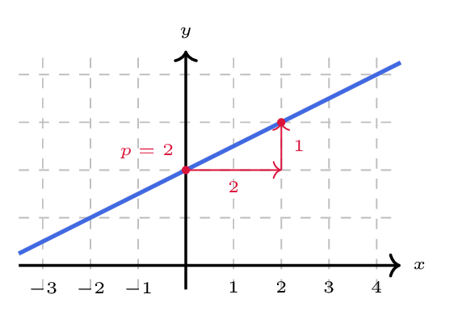

# Déterminer l'équation réduite d'une droite

## Comment faire ?

!!! methode "Comment déterminer l'équation réduite d'une droite ?"
    **Méthode 1 — à partir de l'équation cartésienne**

    On considère la droite \( \textcolor{gray}{d} \) d'équation cartésienne \( \textcolor{gray}{-3x+2y-5=0} \).

    1. **On isole \( y \)** (fiche 4). C'est possible dès que le coefficient de \( y \) n'est pas nul.  
        \( \textcolor{gray}{-3x+2y-5=0 \Leftrightarrow 2y=3x+5 \Leftrightarrow y=\dfrac{3}{2}x+\dfrac{5}{2}} \)

    2. **On identifie \( m \) et \( p \).**  
        La pente vaut \( \textcolor{gray}{m=\dfrac{3}{2}} \) et l'ordonnée à l'origine \( \textcolor{gray}{p=\dfrac{5}{2}} \).

    **Méthode 2 — à partir de deux points**

    On considère la droite \( \textcolor{gray}{d'} \) passant par \( \textcolor{gray}{A(-2\,;1)} \) et \( \textcolor{gray}{B(2\,;3)} \).

    1. **On calcule d'abord la pente \( m \)** (fiche 43), et on écrit l'équation avec \( p \) inconnu.  
        \( \textcolor{gray}{m=\dfrac{3-1}{2-(-2)}=\dfrac{2}{4}=0{,}5} \), donc \( \textcolor{gray}{y=0{,}5x+p} \).

    2. **On trouve \( p \) en remplaçant** \( x \) et \( y \) par les coordonnées de l'un des deux points.  
        \( \textcolor{gray}{A(-2\,;1)} \) appartient à la droite : \( \textcolor{gray}{1=0{,}5\times(-2)+p \Leftrightarrow 1=-1+p \Leftrightarrow p=2} \).

    3. **On conclut** en écrivant l'équation, et on **vérifie** avec l'autre point.  
        \( \textcolor{gray}{y=0{,}5x+2} \), et pour \( \textcolor{gray}{B(2\,;3)} \) : \( \textcolor{gray}{0{,}5\times 2+2=3} \). C'est bien l'ordonnée de \( \textcolor{gray}{B} \).

!!! methode "Comment tracer une droite d'équation réduite donnée ?"
    On tracera la droite d'équation \( \textcolor{gray}{y=0{,}5x+2} \).

    1. **On place le point d'ordonnée à l'origine**, de coordonnées \( (0\,;p) \).  
        Ici le point \( \textcolor{gray}{(0\,;2)} \).

    2. **Depuis ce point, on applique la pente :** on avance de \( 1 \) vers la droite et de \( m \) vers le haut. Si \( m \) n'est pas entier, on prend un multiple commode.  
        \( \textcolor{gray}{m=0{,}5} \) : plutôt que \( \textcolor{gray}{1} \) et \( \textcolor{gray}{0{,}5} \), on avance de \( \textcolor{gray}{2} \) et on monte de \( \textcolor{gray}{1} \).

    3. **On trace la droite passant par ces deux points**, et on la **prolonge** de part et d'autre.  
        On vérifie sur un troisième point, par exemple \( \textcolor{gray}{(-2\,;1)} \).

    

