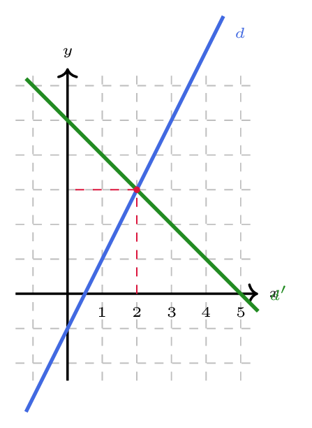

# Déterminer l'intersection de deux droites

## Comment faire ?

!!! methode "Comment déterminer le point d'intersection de deux droites ?"
    On cherchera le point d'intersection de \( \textcolor{gray}{d : 4x-2y-2=0} \) et de \( \textcolor{gray}{d' : y=-x+5} \).

    1. **On met les deux droites sous forme réduite** (fiche 45).  
        C'est déjà le cas pour \( \textcolor{gray}{d'} \). Pour \( \textcolor{gray}{d} \), on a : \( \textcolor{gray}{4x-2y-2=0 \Leftrightarrow 2y=4x-2 \Leftrightarrow y=2x-1} \)

    2. **On vérifie qu'elles ne sont pas parallèles :** leurs pentes doivent être différentes.  
        \( \textcolor{gray}{2\neq -1} \) : les droites se coupent en un unique point.

    3. **On égalise les deux expressions de \( y \)**, et on résout l'équation obtenue (fiche 4) : on trouve l'abscisse du point.  
        \( \textcolor{gray}{2x-1=-x+5 \Leftrightarrow 3x=6 \Leftrightarrow x=2} \)

    4. **On remplace cette abscisse dans l'une des deux équations** pour obtenir l'ordonnée, puis on conclut par le **couple**.  
        \( \textcolor{gray}{y=2\times 2-1=3} \) : les droites se coupent au point de coordonnées \( \textcolor{gray}{(2\,;3)} \).

    

