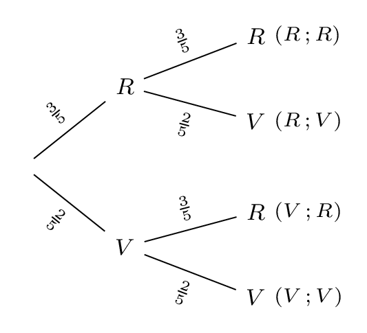

# Construire et exploiter un arbre pondéré

## Comment faire ?

!!! methode "Comment construire un arbre pondéré ?"
    Un sac contient \( \textcolor{gray}{3} \) jetons rouges et \( \textcolor{gray}{2} \) jetons verts, indiscernables au toucher. On tire un jeton au hasard, on note sa couleur, on le remet dans le sac, puis on tire un second jeton.

    1. **On trace une branche par issue de la première épreuve** et on écrit sa probabilité sur la branche.  
        Le sac contient \( \textcolor{gray}{5} \) jetons, dont \( \textcolor{gray}{3} \) rouges : au premier tirage, \( \textcolor{gray}{P(R)=\dfrac{3}{5}} \) et \( \textcolor{gray}{P(V)=\dfrac{2}{5}} \).

    2. **Depuis chaque extrémité, on trace une branche par issue de la seconde épreuve**, avec sa probabilité. Ici le jeton est remis : la seconde épreuve se déroule dans les mêmes conditions que la première.  
        Le sac contient de nouveau \( \textcolor{gray}{5} \) jetons : les probabilités du second tirage sont encore \( \textcolor{gray}{\dfrac{3}{5}} \) et \( \textcolor{gray}{\dfrac{2}{5}} \).

    3. **On vérifie** que la somme des probabilités des branches issues d'un même nœud est égale à \( 1 \).  
        \( \textcolor{gray}{\dfrac{3}{5}+\dfrac{2}{5}=1} \) à chacun des trois nœuds de l'arbre.

    4. **On lit les issues de l'expérience** au bout de chaque chemin.  
        \( \textcolor{gray}{\Omega=\{(R\,;R), (R\,;V), (V\,;R), (V\,;V)\}} \), donc \( \textcolor{gray}{\text{Card}(\Omega)=4} \).

    

!!! methode "Comment calculer une probabilité à l'aide d'un arbre pondéré ?"
    On reprend l'arbre ci-dessus.

    **Méthode 1 — la probabilité d'un chemin**

    1. **On repère le chemin** qui correspond à l'issue cherchée.  
        « Obtenir un jeton rouge puis un jeton vert » est le chemin \( \textcolor{gray}{R} \) puis \( \textcolor{gray}{V} \).

    2. **On multiplie** les probabilités des branches de ce chemin.  
        \( \textcolor{gray}{P\big((R\,;V)\big)=\dfrac{3}{5}\times\dfrac{2}{5}=\dfrac{6}{25}} \).

    **Méthode 2 — la probabilité d'un événement**

    1. **On traduit l'énoncé en symboles** (fiche 50) et on repère **tous les chemins** qui réalisent l'événement.  
        Soit \( \textcolor{gray}{E} \) : « obtenir deux jetons de la même couleur ». Il est réalisé par le chemin \( \textcolor{gray}{(R\,;R)} \) *ou* par le chemin \( \textcolor{gray}{(V\,;V)} \).

    2. **On additionne** les probabilités de ces chemins.  
        \( \textcolor{gray}{P(E)=\dfrac{3}{5}\times\dfrac{3}{5}+\dfrac{2}{5}\times\dfrac{2}{5}=\dfrac{9}{25}+\dfrac{4}{25}=\dfrac{13}{25}} \).
