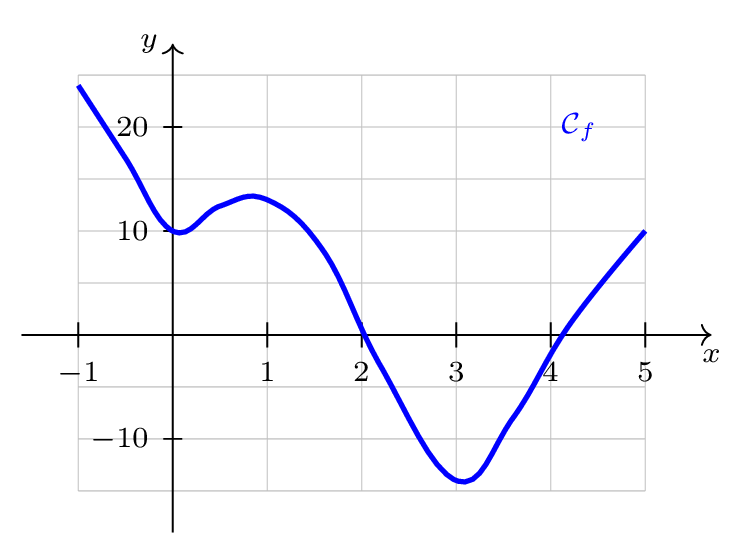
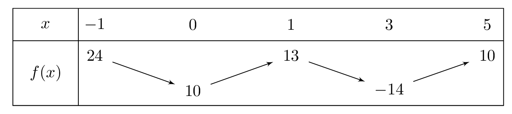

# Étudier les variations d'une fonction et déterminer ses extrémums

## Comment faire ?

!!! methode "Comment dresser le tableau de variations d'une fonction à partir de sa courbe ?"
    On considère la fonction \( f \) représentée ci-dessous sur l'intervalle \( \textcolor{gray}{[-1\,;5]} \).

    1. **On repère sur la courbe les intervalles où elle monte et ceux où elle descend.**  
        \( \textcolor{gray}{f} \) descend sur \( \textcolor{gray}{[-1\,;0]} \), monte sur \( \textcolor{gray}{[0\,;1]} \), descend sur \( \textcolor{gray}{[1\,;3]} \), puis monte sur \( \textcolor{gray}{[3\,;5]} \).

    2. **On note les abscisses où le sens change :** ce sont, avec les bornes, les valeurs de la première ligne.  
        \( \textcolor{gray}{-1} \), \( \textcolor{gray}{0} \), \( \textcolor{gray}{1} \), \( \textcolor{gray}{3} \) et \( \textcolor{gray}{5} \).

    3. **On lit sur la courbe les images de ces abscisses** (fiche 31).  
        \( \textcolor{gray}{f(-1)=24} \), \( \textcolor{gray}{f(0)=10} \), \( \textcolor{gray}{f(1)=13} \), \( \textcolor{gray}{f(3)=-14} \), \( \textcolor{gray}{f(5)=10} \).

    4. **On dresse le tableau :** une **flèche** par intervalle, montante ou descendante.

    

    

!!! methode "Comment déterminer les extrémums d'une fonction sur un intervalle ?"
    On reprend la fonction \( f \) et son tableau de variations ci-dessus.

    1. **Le maximum est la plus grande image du tableau** ; on précise en quelle valeur il est atteint.  
        La plus grande image est \( \textcolor{gray}{24} \) : le maximum de \( \textcolor{gray}{f} \) sur \( \textcolor{gray}{[-1\,;5]} \) est \( \textcolor{gray}{24} \), atteint en \( \textcolor{gray}{x=-1} \).

    2. **Le minimum est la plus petite image du tableau** ; on précise de même où il est atteint.  
        La plus petite image est \( \textcolor{gray}{-14} \) : le minimum de \( \textcolor{gray}{f} \) sur \( \textcolor{gray}{[-1\,;5]} \) est \( \textcolor{gray}{-14} \), atteint en \( \textcolor{gray}{x=3} \).

    3. **On en déduit un encadrement de \( f(x) \)** sur l'intervalle.  
        Pour tout réel \( \textcolor{gray}{x} \) de \( \textcolor{gray}{[-1\,;5]} \), on a \( \textcolor{gray}{-14\leqslant f(x)\leqslant 24} \).
