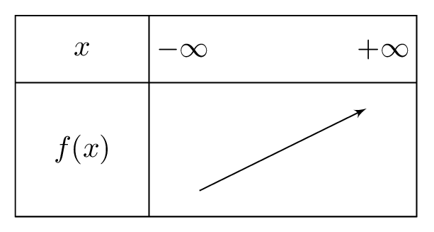

# Étudier une fonction affine

## Comment faire ?

!!! methode "Comment étudier les variations d'une fonction affine ?"
    Soit \( f \) la fonction affine définie sur \( \mathbb{R} \) par \( \textcolor{gray}{f(x)=2x-1} \).

    1. **On identifie le coefficient directeur \( m \) et l'ordonnée à l'origine \( p \).**  
        \( \textcolor{gray}{f(x)=mx+p} \) avec \( \textcolor{gray}{m=2} \) et \( \textcolor{gray}{p=-1} \).

    2. **Le signe de \( m \) donne le sens de variation :** s'il est positif, la fonction est croissante, sinon elle est décroissante.  
        \( \textcolor{gray}{m=2>0} \), donc \( \textcolor{gray}{f} \) est croissante sur \( \textcolor{gray}{\mathbb{R}} \).

    3. **On dresse le tableau de variations sur \( \mathbb{R} \) :** une seule flèche, car une fonction affine ne change jamais de sens.

    

## S'entrainer !

#### Déterminer le signe d'une fonction affine

<iframe src="https://coopmaths.fr/alea/?EEEE2e0a294917e5142f158e0f22272e13af133511aa0f2717ea0f1d17e612c72d0a132b2cff17e60f1c272e12c72e3627c127cb277b27c817e8139a133512d10f2d29592a7617f90e8714c714d813f2139e139e197e2d962cd6295327c70e8714c714c7130d277a139e139e13992d36288b277a139e139e13992716139e13a02e03277a139e139e139928282b3c2d9a2bab0e8714c714c71302281f29530065" class="exerciseur" allowfullscreen></iframe>
