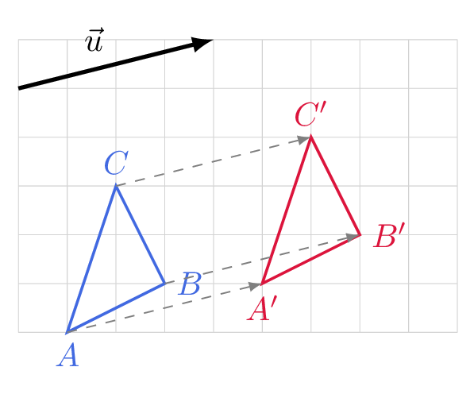

# Construire l'image d'une figure par une translation

## Comment faire ?

!!! methode "Comment construire l'image d'une figure par une translation ?"
    On construira l'image du triangle \( \textcolor{gray}{ABC} \) par la translation de vecteur \( \textcolor{gray}{\vec{u}} \).

    1. **On lit le déplacement** porté par le vecteur : sa direction, son sens et sa longueur.  
        \( \textcolor{gray}{\vec{u}} \) déplace de \( \textcolor{gray}{4} \) carreaux vers la droite et de \( \textcolor{gray}{1} \) carreau vers le haut.

    2. **On construit l'image de chaque sommet :** l'image de \( A \) est le point \( A' \) tel que \( \vec{AA'}=\vec{u} \).  
        On reporte le déplacement depuis \( \textcolor{gray}{A} \), puis depuis \( \textcolor{gray}{B} \), puis depuis \( \textcolor{gray}{C} \).

    3. **On relie** les images dans le même ordre que la figure de départ.  
        On trace le triangle \( \textcolor{gray}{A'B'C'} \).

    4. **On vérifie :** l'image a la même forme, la même taille et la même orientation.  
        \( \textcolor{gray}{A'B'C'} \) se superpose à \( \textcolor{gray}{ABC} \) sans être retourné.

    

## S'entrainer !

#### Déterminer graphiquement des images par des translations

<iframe src="https://coopmaths.fr/alea/?EEEE2e0a2949181913cb14cc0f22272e13b0139c11a60f2717ea0f1d17e612c72d0a132b2922132b26f117e60f2f181a2a762e5e0f1e2d0a13fe133612d112c72d9a2d9d27921a96139e1a400e8714d6169927c72ade2b3e2c94288f263528ea2c7a27c227c32d5c27562cf82952262c27c8111d2637111127c811212cca2b4c2a722d9a2bab0073" class="exerciseur" allowfullscreen></iframe>
