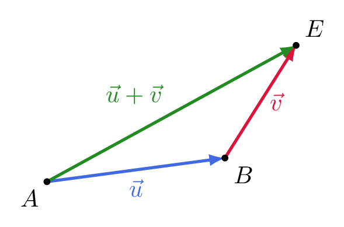

# Construire la somme de deux vecteurs

## Comment faire ?

!!! methode "Comment construire une somme de vecteurs ?"
    On construira la somme \( \textcolor{gray}{\vec{u}+\vec{v}} \) à partir du point \( \textcolor{gray}{A} \).

    1. **On trace le représentant de \( \vec{u} \) d'origine \( A \) :** \( \vec{AB}=\vec{u} \).  
        La flèche part de \( \textcolor{gray}{A} \) et arrive en \( \textcolor{gray}{B} \).

    2. **On trace le représentant de \( \vec{v} \) d'origine l'extrémité \( B \) :** \( \vec{BE}=\vec{v} \).  
        La deuxième flèche part de \( \textcolor{gray}{B} \), et non de \( \textcolor{gray}{A} \).

    3. **La somme joint l'origine du premier à l'extrémité du second.**  
        \( \textcolor{gray}{\vec{u}+\vec{v}=\vec{AE}} \).

    

## S'entrainer !

#### Construire géométriquement la somme de deux vecteurs

<iframe src="https://coopmaths.fr/alea/?EEEE2e0a294917eb26f314630f22272e13b0139a11a70f2717ea0f1d17e612c72d0a14572922132b26f117e60f2f181a2a762e5e0f1e2d0a13fe133612d112c72d9a2d9d27921a7c2b4c2da32dfe2cce11140e8714d813f2139e197e2baa0e8714d813f2139e197e2da329562dfa2ada2b4d111925f02d3c2ae227802756111127ca2eec2e5e270127ca2cdc" class="exerciseur" allowfullscreen></iframe>
