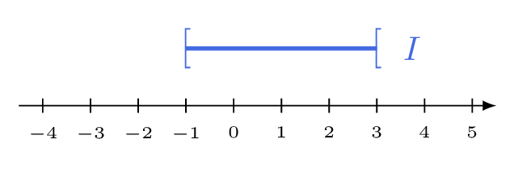
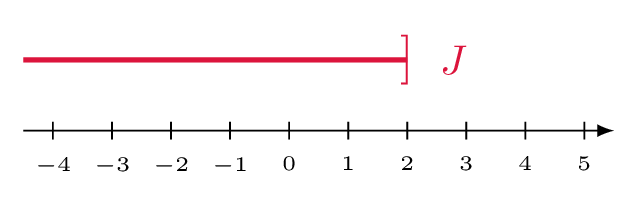

# Représenter un intervalle et tester l'appartenance d'un réel

## Comment faire ?

!!! methode "Comment représenter un intervalle sur une droite graduée ?"
    On représentera \( \textcolor{gray}{I=[-1\,;3[} \) et \( \textcolor{gray}{J=\left]-\infty\,;2\right]} \).

    1. **On repère les bornes** et on les place sur la droite.  
        \( \textcolor{gray}{-1} \) et \( \textcolor{gray}{3} \) pour \( \textcolor{gray}{I} \) ; seulement \( \textcolor{gray}{2} \) pour \( \textcolor{gray}{J} \).

    2. **On surligne** la portion de droite située entre ces bornes.  
        Pour \( \textcolor{gray}{J} \), le trait part de la gauche sans s'arrêter.

    3. **On oriente les crochets :** fermé si la borne appartient à l'intervalle, ouvert sinon.  
        \( \textcolor{gray}{-1} \) est pris, \( \textcolor{gray}{3} \) ne l'est pas.

    4. **Du côté de l'infini, le crochet est toujours ouvert.**  
        On écrit \( \textcolor{gray}{\left]-\infty\,;2\right]} \), jamais \( \textcolor{gray}{\left[-\infty\,;2\right]} \).

    

    

!!! methode "Comment tester si un réel appartient à un intervalle ?"
    Les nombres \( \textcolor{gray}{-1} \), \( \textcolor{gray}{3} \) et \( \textcolor{gray}{1{,}5} \) appartiennent-ils à \( \textcolor{gray}{I=[-1\,;3[} \) ?

    1. **On traduit l'intervalle en inégalités**, en respectant les crochets.  
        \( \textcolor{gray}{x\in I} \) signifie \( \textcolor{gray}{-1\leqslant x<3} \).

    2. **On remplace \( x \)** par le nombre testé et on vérifie les *deux* inégalités.  
        \( \textcolor{gray}{-1\leqslant -1} \) et \( \textcolor{gray}{-1<3} \) : vrai.  ·  \( \textcolor{gray}{3<3} \) : faux.  ·  \( \textcolor{gray}{-1\leqslant 1{,}5<3} \) : vrai.

    3. **On conclut avec \( \in \) ou \( \notin \).**  
        \( \textcolor{gray}{-1\in I} \)  ·  \( \textcolor{gray}{3\notin I} \)  ·  \( \textcolor{gray}{1{,}5\in I} \)

## S'entrainer !

#### Associer un intervalle de $\mathbb{R}$ à une inégalité

<iframe src="https://coopmaths.fr/alea/?EEEE2e0a294917e8136812d20f22272e13b7133611a60f2717e612c7272e13350f2c17e80f2c13a6164b2d0017ee0f2217e60f1c272e132b2e3627c127cb277b27c817e8139a133512d20f2d29592a7617f62d402ba0294a2c942e0311162b4d27c72e5a2a7d2780275610d820140e8714d813f2139e197511222b3e11162afe139e1a400e8714d6168c263129590e8714d813f2139e197e" class="exerciseur" allowfullscreen></iframe>
