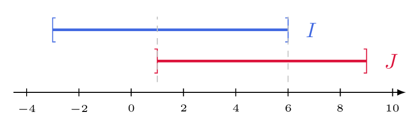

# Déterminer l'intersection et la réunion de deux intervalles

## Comment faire ?

!!! methode "Comment déterminer $I\cap J$ et $I\cup J$ ?"
    On déterminera \( \textcolor{gray}{I\cap J} \) et \( \textcolor{gray}{I\cup J} \) pour \( \textcolor{gray}{I=[-3\,;6]} \) et \( \textcolor{gray}{J=]1\,;9]} \).

    1. **On trace les deux intervalles l'un sous l'autre**, sur la même droite graduée (fiche 16).  
        Voir la figure ci-dessous.

    2. **L'intersection \( I\cap J \) est la partie commune :** les réels qui sont dans \( I \) **et** dans \( J \).  
        \( \textcolor{gray}{I\cap J=]1\,;6]} \)

    3. **La réunion \( I\cup J \) est tout ce que recouvre l'un ou l'autre.**  
        \( \textcolor{gray}{I\cup J=[-3\,;9]} \)

    4. **On contrôle chaque borne :** elle est prise dans l'intersection si elle l'est dans les *deux*, dans la réunion si elle l'est dans *au moins un*.  
        \( \textcolor{gray}{1\notin J} \), donc \( \textcolor{gray}{1\notin I\cap J} \). \( \textcolor{gray}{-3\in I} \), donc \( \textcolor{gray}{-3\in I\cup J} \).

    

## S'entrainer !

#### Donner l'union ou l'intersection de deux ensembles

<iframe src="https://coopmaths.fr/alea/?EEEE2e0a2949181926bf25fa0f22272e13b7133611a70f2717e612c7272e13350f2217e60f1c272e132b2e3627c127cb277b27c817e8139a133512d20f2d29592a7617f92bab2b3e2c942a36139e13a02e0329542b042bb211190e8714c715c62b4d27c72d32270129542b042756111127ca2eec27c32d322ad72a760073" class="exerciseur" allowfullscreen></iframe>
