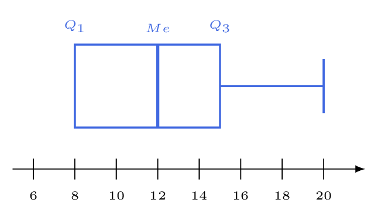

# Représenter une série par un diagramme en boite

## Comment faire ?

!!! methode "Comment tracer un diagramme en boite ?"
    On reprend les notes de la fiche 20, pour lesquelles \( \textcolor{gray}{Q_1=8} \), \( \textcolor{gray}{Me=12} \) et \( \textcolor{gray}{Q_3=15} \).

    1. **On relève les cinq nombres :** minimum, \( Q_1 \), \( Me \), \( Q_3 \), maximum (fiche 20).  
        \( \textcolor{gray}{8\ ;\ 8\ ;\ 12\ ;\ 15\ ;\ 20} \)

    2. **On trace une droite graduée, puis la boite**, de \( Q_1 \) à \( Q_3 \).  
        La boite va de \( \textcolor{gray}{8} \) à \( \textcolor{gray}{15} \).

    3. **On trace à l'intérieur le trait de la médiane.**  
        Le trait est à \( \textcolor{gray}{12} \).

    4. **On prolonge par les moustaches**, jusqu'au minimum et au maximum.  
        À gauche il n'y a pas de moustache : le minimum vaut déjà \( \textcolor{gray}{Q_1} \).

    

## S'entrainer !

#### Lire graphiquement des quartiles et des EIQ

<iframe src="https://coopmaths.fr/alea/?EEEE2e0a294918171593152b0f22272e13bc139911aa0f2717ea0f1d17e612c726f117e60f2f181a2a762e5e0f1e2d0a13fe133612d112c72d9a2d9d27921dfa2cce0e8714c714c713082cca2c0929562dfa2ada2b4d0e8714c714c7130527c80e8714c714c713122df62cdd295127c80e8714c714c713062d56139e139e139927562cf2139e139e13991b1e0051" class="exerciseur" allowfullscreen></iframe>

#### Calculer des étendues

<iframe src="https://coopmaths.fr/alea/?EEEE2e0a294917ea14f912d10f22272e13bc139911a90f2717ea0f1d17e612c72d0a132b2922132b26f117e60f2f181a2a762e5e0f1e2d0a13fe133612d112c72d9a2d9d27921a6e2a742e0127c70e8714c714c7130527c80e8714c714c712c6139e139e1a400e8714c714d6169927c3276627c8" class="exerciseur" allowfullscreen></iframe>
