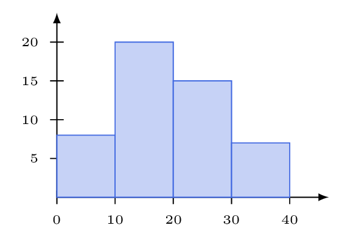
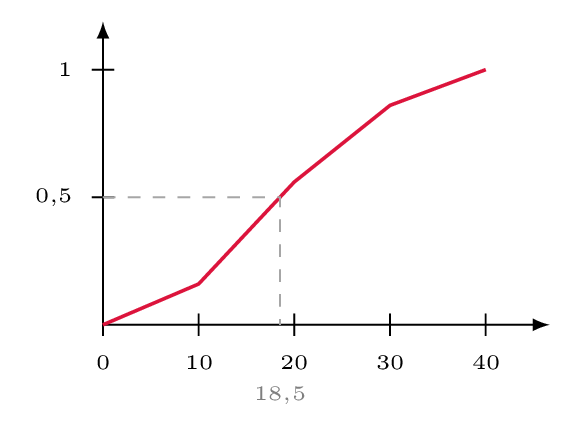

# Étudier une série regroupée en classes

## Comment faire ?

!!! methode "Comment représenter une série par un histogramme ?"
    On étudie la durée (en minutes) de \( \textcolor{gray}{N=50} \) appels téléphoniques.

    | Classe | \( [0\,;10[ \) | \( [10\,;20[ \) | \( [20\,;30[ \) | \( [30\,;40[ \) |
    |:--|:-:|:-:|:-:|:-:|
    | **Effectif** | 8 | 20 | 15 | 7 |

    1. **On vérifie que les classes ont toutes la même amplitude** et on relève leur **effectif**.  
        Amplitude \( \textcolor{gray}{10} \) pour les quatre classes ; effectifs \( \textcolor{gray}{8\ ;\ 20\ ;\ 15\ ;\ 7} \).

    2. **On trace un rectangle par classe**, de base la classe et de **hauteur proportionnelle à l'effectif**.  
        Hauteurs \( \textcolor{gray}{8\ ;\ 20\ ;\ 15\ ;\ 7} \).

    3. **On gradue l'axe vertical en effectifs** et on nomme les deux axes.  
        En abscisse la durée en minutes, en ordonnée l'effectif.

    

!!! methode "Comment tracer le polygone des fréquences cumulées croissantes ?"
    On reprend la même série, donnée cette fois par ses **fréquences**.

    | Classe | \( [0\,;10[ \) | \( [10\,;20[ \) | \( [20\,;30[ \) | \( [30\,;40[ \) |
    |:--|:-:|:-:|:-:|:-:|
    | **Fréq.** | 0,16 | 0,40 | 0,30 | 0,14 |
    | **FCC** | 0,16 | 0,56 | 0,86 | 1 |

    1. **On complète la ligne des fréquences cumulées croissantes** (FCC) : à chaque colonne, on ajoute la fréquence au cumul précédent.  
        \( \textcolor{gray}{0{,}16\ ;\ 0{,}56\ ;\ 0{,}86\ ;\ 1} \).

    2. **On place les points (borne supérieure de la classe ; FCC).**  
        \( \textcolor{gray}{(10\,;0{,}16)} \), \( \textcolor{gray}{(20\,;0{,}56)} \), \( \textcolor{gray}{(30\,;0{,}86)} \), \( \textcolor{gray}{(40\,;1)} \).

    3. **On part de l'origine** — la borne inférieure de la première classe, avec un cumul nul — **et on relie les points par des segments**.  
        Le premier segment part de \( \textcolor{gray}{(0\,;0)} \).

    

!!! methode "Comment calculer la moyenne ?"
    1. **On remplace chaque classe par son centre.**  
        Centres : \( \textcolor{gray}{5\ ;\ 15\ ;\ 25\ ;\ 35} \).

    2. **On calcule la moyenne pondérée de ces centres**, affectés des effectifs (fiche 18).  
        \( \textcolor{gray}{\overline{x}=\dfrac{8\times 5+20\times 15+15\times 25+7\times 35}{50}=\dfrac{960}{50}=19{,}2} \)

    3. **On annonce le résultat comme une estimation.**  
        La durée moyenne d'un appel est estimée à \( \textcolor{gray}{19{,}2} \) minutes.

!!! methode "Comment déterminer la classe médiane et estimer la médiane ?"
    1. **Méthode 1 — la classe médiane.** On complète les **effectifs cumulés croissants** (fiche 20), ou l'on repart des FCC, et on cherche la **première classe** dont le cumul atteint \( \dfrac{N}{2} \), c'est-à-dire \( 0{,}5 \) en fréquence.  
        ECC : \( \textcolor{gray}{8\ ;\ 28\ ;\ 43\ ;\ 50} \). Comme \( \textcolor{gray}{\dfrac{N}{2}=25} \) et \( \textcolor{gray}{8<25\leqslant 28} \), la classe médiane est \( \textcolor{gray}{[10\,;20[} \).  
        Avec les FCC : \( \textcolor{gray}{0{,}16<0{,}5\leqslant 0{,}56} \), on retrouve la même classe.

    2. **Méthode 2 — estimer la médiane.** On lit sur le polygone l'**abscisse du point d'ordonnée \( 0{,}5 \)**.  
        On lit \( \textcolor{gray}{Me\approx 18{,}5} \) minutes, valeur bien située dans la classe médiane.
