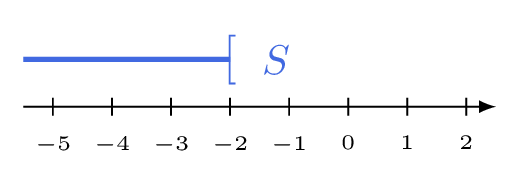

# Résoudre une inéquation du premier degré

## Comment faire ?

!!! methode "Comment résoudre une inéquation du premier degré ?"
    On résoudra \( \textcolor{gray}{-4x+3>11} \).

    1. **On isole le terme en \( x \)** en ajoutant ou en soustrayant le même nombre aux deux membres : le sens ne change pas.  
        \( \textcolor{gray}{-4x+3-3>11-3} \), soit \( \textcolor{gray}{-4x>8} \).

    2. **On divise les deux membres par le coefficient de \( x \)**, en **changeant le sens de l'inégalité si ce coefficient est négatif**.  
        On divise par \( \textcolor{gray}{-4} \), qui est négatif : l'inégalité s'inverse et donne \( \textcolor{gray}{x<\dfrac{8}{-4}} \), soit \( \textcolor{gray}{x<-2} \).

    3. **On écrit l'ensemble des solutions sous forme d'intervalle** (fiche 16), que l'on peut représenter sur une droite graduée.  
        \( \textcolor{gray}{S=\left]-\infty\,;-2\right[} \)

    

## S'entrainer !

#### Résoudre une inéquation du premier degré

<iframe src="https://coopmaths.fr/alea/?EEEE2e0a2949181726be27890f22272e13b7152911a90f2717ea0f1d17e612c72d0a2da32dfa0f2c13a614bb2922132b26f117e60f2f181a2a762e5e0f1e2d0a13fe133612d112c72d9a2d9d2792200e139e139e1a400e8714c714d616982bb22763277a139e139e13992e03277a139e139e139929530e8714c714d813f2139e139e197e2c7a263929542afe139e139e139927660e8714c714c713112cce2ade27c70e8714c714c7130527bc2c8e139e139e1a400e8714c714d60039" class="exerciseur" allowfullscreen></iframe>
