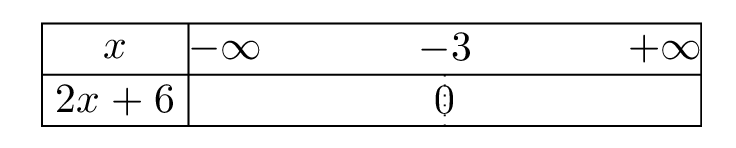
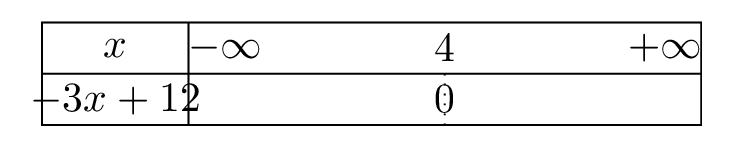
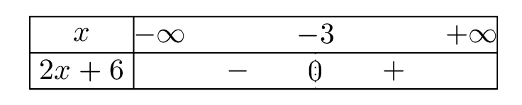
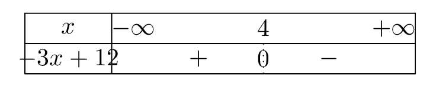
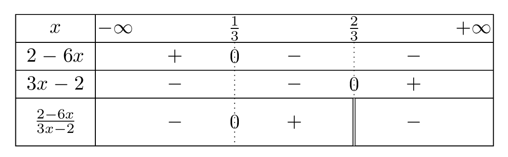

# Résoudre une inéquation produit ou quotient

## Comment faire ?

!!! methode "Comment dresser le tableau de signes de $ax+b$ ?"
    On traitera \( \textcolor{gray}{2x+6} \) et \( \textcolor{gray}{-3x+12} \).

    1. **On résout \( ax+b=0 \) :** c'est la **valeur qui annule** l'expression (fiche 4).  
        \( \textcolor{gray}{2x+6=0} \) donne \( \textcolor{gray}{x=-3} \).  ·  \( \textcolor{gray}{-3x+12=0} \) donne \( \textcolor{gray}{x=4} \).

    2. **On trace le tableau :** la ligne des \( x \) va de \( -\infty \) à \( +\infty \) et porte cette valeur, sous laquelle on inscrit un \( 0 \).

        
 

    3. **On complète les signes :** du signe contraire de \( a \) **avant** la valeur, du signe de \( a \) **après**.

        
 

!!! methode "Comment résoudre une inéquation produit ou quotient ?"
    On résoudra \( \textcolor{gray}{\dfrac{2-6x}{3x-2}\leqslant 0} \).

    1. **On ramène tout d'un côté** pour comparer l'expression à \( 0 \).  
        C'est déjà le cas ici.

    2. **On cherche les valeurs qui annulent chaque facteur** et, pour un quotient, les **valeurs interdites** (fiche 11).  
        \( \textcolor{gray}{2-6x=0} \) pour \( \textcolor{gray}{x=\dfrac{1}{3}} \).  ·  \( \textcolor{gray}{3x-2=0} \) pour \( \textcolor{gray}{x=\dfrac{2}{3}} \) : valeur interdite.

    3. **On dresse un tableau de signes commun :** une ligne par facteur, puis une ligne pour l'expression, obtenue par la **règle des signes**. Une **double barre** marque la valeur interdite.

        

    4. **On lit les solutions** sur la dernière ligne, en faisant attention aux crochets !  
        \( \textcolor{gray}{S=\left]-\infty\,;\dfrac{1}{3}\right]\cup\left]\dfrac{2}{3}\,;+\infty\right[} \)

## S'entrainer !

#### Résoudre une inéquation-produit

<iframe src="https://coopmaths.fr/alea/?EEEE2e0a294917e5133925f90f22272e13b7152a11a70f2717ea0f1d17e612c72d0a151f2922132b26f117e60f2f181a2a762e5e0f1e2d0a13ff133612d112c72d9a2d9d2792200e139e139e1a400e8714c714d616982bb22763277a139e139e13992e03277a139e139e139929530e8714c714d813f2139e139e197e2c7a263929542b062c132ba12dfe0074" class="exerciseur" allowfullscreen></iframe>

#### Résoudre une inéquation quotient

<iframe src="https://coopmaths.fr/alea/?EEEE2e0a294917e5158e155b0f22272e13b7152a11a90f2717e90f1d17e612c72d0a138f2922132b26f117e50f2f181a2a762e5e0f1e2d0a13ff133612d112c72d9a2d9d2792200e139e139e1a400e8714c714d616982bb22763277a139e139e13992e03277a139e139e139929530e8714c714d813f2139e139e197e2c7a263929542afe139e139e13992c7a2bb1294a2b4d" class="exerciseur" allowfullscreen></iframe>
