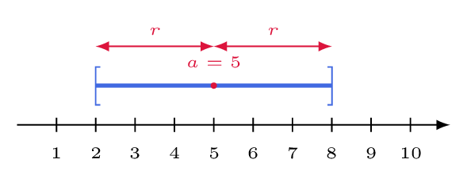

# Résoudre une inéquation du type |x − a| ⩽ r

## Comment faire ?

!!! methode "Comment résoudre une inéquation du type $|x-a|\leqslant r$ ?"
    On résoudra \( \textcolor{gray}{|x-5|\leqslant 3} \).

    1. **On traduit en distance :** \( |x-a| \) est la distance entre \( x \) et \( a \) (fiche 14).  
        On cherche les réels dont la distance à \( \textcolor{gray}{5} \) est au plus \( \textcolor{gray}{3} \).

    2. **On identifie le centre \( a \) et le rayon \( r \).**  
        \( \textcolor{gray}{a=5} \) et \( \textcolor{gray}{r=3} \).

    3. **On encadre :** \( |x-a|\leqslant r \) signifie \( a-r\leqslant x\leqslant a+r \).  
        \( \textcolor{gray}{5-3\leqslant x\leqslant 5+3} \), soit \( \textcolor{gray}{2\leqslant x\leqslant 8} \).

    4. **On écrit l'ensemble des solutions sous forme d'intervalle** (fiche 16), et on le contrôle sur la droite graduée : il est centré en \( a \).  
        \( \textcolor{gray}{S=[2\,;8]} \), centré en \( \textcolor{gray}{5} \), de rayon \( \textcolor{gray}{3} \).

    

