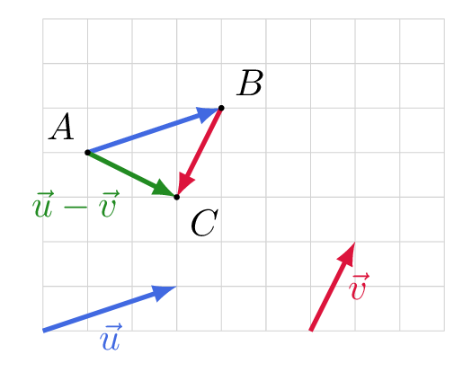

# Construire la différence de deux vecteurs

## Comment faire ?

!!! methode "Comment construire la différence $\vec{u}-\vec{v}$ ?"
    On construira \( \textcolor{gray}{\vec{u}-\vec{v}} \) à partir du point \( \textcolor{gray}{A} \).

    1. **On transforme la soustraction en addition :** \( \vec{u}-\vec{v}=\vec{u}+(-\vec{v}) \). C'est donc une somme, comme à la fiche 9.  
        Il n'y a pas de construction nouvelle à apprendre.

    2. **On dessine le premier vecteur** à partir de \( A \) : \( \vec{AB}=\vec{u} \).  
        \( \textcolor{gray}{\vec{u}} \) va de \( \textcolor{gray}{3} \) à droite et \( \textcolor{gray}{1} \) vers le haut : on obtient \( \textcolor{gray}{B} \).

    3. **On dessine l'opposé du second** à partir de \( B \) : \( -\vec{v} \) garde la direction et la longueur de \( \vec{v} \), mais on **change son sens**.  
        \( \textcolor{gray}{\vec{v}} \) va de \( \textcolor{gray}{1} \) à droite et \( \textcolor{gray}{2} \) vers le haut, donc \( \textcolor{gray}{-\vec{v}} \) va de \( \textcolor{gray}{1} \) à gauche et \( \textcolor{gray}{2} \) vers le bas : on obtient \( \textcolor{gray}{C} \).

    4. **On trace la somme :** elle joint l'**origine du premier** à l'**extrémité du second**.  
        \( \textcolor{gray}{\vec{u}-\vec{v}=\vec{AC}} \)

    

