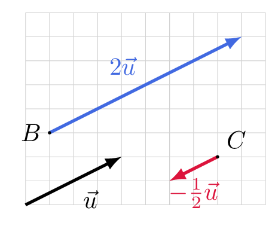

# Construire le produit d'un vecteur par un réel et démontrer une colinéarité

## Comment faire ?

!!! methode "Comment construire le vecteur $k\vec{u}$ ?"
    On construira \( \textcolor{gray}{2\vec{u}} \) et \( \textcolor{gray}{-\dfrac{1}{2}\vec{u}} \), à partir des points \( \textcolor{gray}{B} \) et \( \textcolor{gray}{C} \).

    1. **On lit le déplacement de \( \vec{u} \)** sur le quadrillage.  
        \( \textcolor{gray}{\vec{u}} \) : \( \textcolor{gray}{4} \) carreaux à droite, \( \textcolor{gray}{2} \) vers le haut.

    2. **On multiplie les deux déplacements par \( k \).**  
        \( \textcolor{gray}{2\vec{u}} \) : \( \textcolor{gray}{8} \) et \( \textcolor{gray}{4} \).  ·  \( \textcolor{gray}{-\dfrac{1}{2}\vec{u}} \) : \( \textcolor{gray}{-2} \) et \( \textcolor{gray}{-1} \).

    3. **On contrôle le résultat :** \( k>0 \) donne le même sens, \( k<0 \) le sens contraire, et la longueur est multipliée par \( |k| \).  
        \( \textcolor{gray}{2\vec{u}} \) : même sens, deux fois plus long.  ·  \( \textcolor{gray}{-\dfrac{1}{2}\vec{u}} \) : sens contraire, deux fois plus court.

    

!!! methode "Comment démontrer que deux vecteurs sont colinéaires ?"
    \( \textcolor{gray}{\vec{u}} \) et \( \textcolor{gray}{\vec{v}} \) sont deux vecteurs non nuls tels que \( \textcolor{gray}{-4\vec{u}+3\vec{v}=\vec{0}} \).

    1. **On isole** l'un des deux vecteurs, comme dans une équation (fiche 4).  
        \( \textcolor{gray}{3\vec{v}=4\vec{u}} \)

    2. **On écrit l'un comme un multiple de l'autre**, sous la forme \( \vec{v}=k\vec{u} \).  
        \( \textcolor{gray}{\vec{v}=\dfrac{4}{3}\vec{u}} \)

    3. **On conclut :** il existe un réel \( k \) tel que \( \vec{v}=k\vec{u} \), donc les deux vecteurs sont colinéaires.  
        Ici \( \textcolor{gray}{k=\dfrac{4}{3}} \) : \( \textcolor{gray}{\vec{u}} \) et \( \textcolor{gray}{\vec{v}} \) sont colinéaires.
