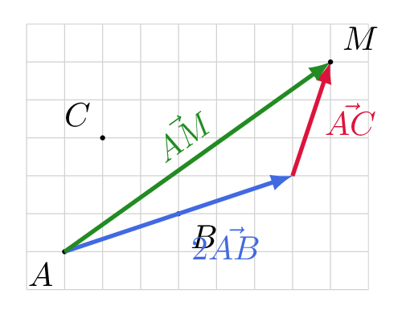

# Utiliser la relation de Chasles

## Comment faire ?

!!! methode "Comment simplifier une expression vectorielle ?"
    On simplifiera \( \textcolor{gray}{\vec{AB}+\vec{CD}+\vec{BC}} \) et \( \textcolor{gray}{\vec{AB}-\vec{AC}} \).

    1. **On transforme toute l'expression en somme :** chaque soustraction devient l'addition de l'opposé, obtenu en échangeant les deux lettres (fiche 26).  
        La première est déjà une somme.  ·  \( \textcolor{gray}{\vec{AB}-\vec{AC}=\vec{AB}+\vec{CA}} \)

    2. **On cherche les vecteurs qui s'enchainent** — l'extrémité de l'un est l'origine du suivant — quitte à **réordonner** la somme.  
        \( \textcolor{gray}{\vec{AB}+\vec{CD}+\vec{BC}=\vec{AB}+\vec{BC}+\vec{CD}} \)  ·  \( \textcolor{gray}{\vec{AB}+\vec{CA}=\vec{CA}+\vec{AB}} \)

    3. **On remplace** chaque enchainement par le vecteur qui joint la première origine à la dernière extrémité.  
        \( \textcolor{gray}{\vec{AB}+\vec{BC}+\vec{CD}=\vec{AD}} \)  ·  \( \textcolor{gray}{\vec{CA}+\vec{AB}=\vec{CB}} \)

!!! methode "Comment construire un point défini par une égalité vectorielle ?"
    \( \textcolor{gray}{A} \), \( \textcolor{gray}{B} \) et \( \textcolor{gray}{C} \) étant donnés, on construira le point \( \textcolor{gray}{M} \) tel que \( \textcolor{gray}{\vec{AM}=2\vec{AB}+\vec{AC}} \).

    1. **On isole le point cherché :** l'égalité doit s'écrire \( \vec{AM}=\dots \), où \( A \) est un point connu.  
        C'est déjà le cas ici.

    2. **On construit le vecteur du membre de droite**, en mettant ses termes bout à bout (fiches 9 et 27).  
        On trace \( \textcolor{gray}{2\vec{AB}} \) à partir de \( \textcolor{gray}{A} \), puis \( \textcolor{gray}{\vec{AC}} \) à partir de son extrémité.

    3. **L'extrémité du vecteur ainsi construit est le point \( M \).**  
        On place \( \textcolor{gray}{M} \) et on vérifie : \( \textcolor{gray}{\vec{AM}} \) est bien la somme voulue.

    

