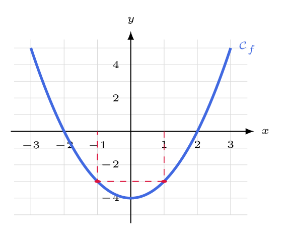
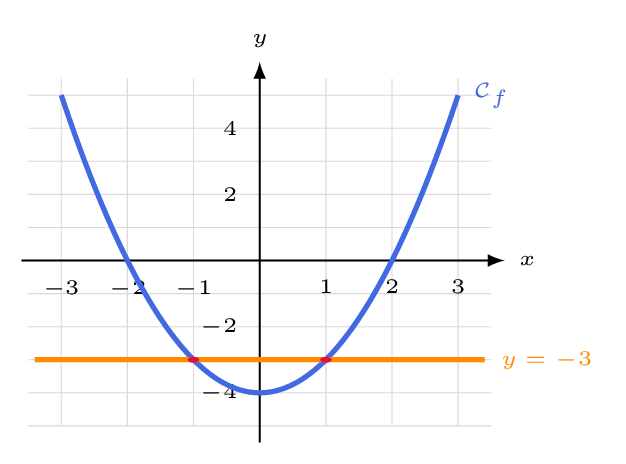
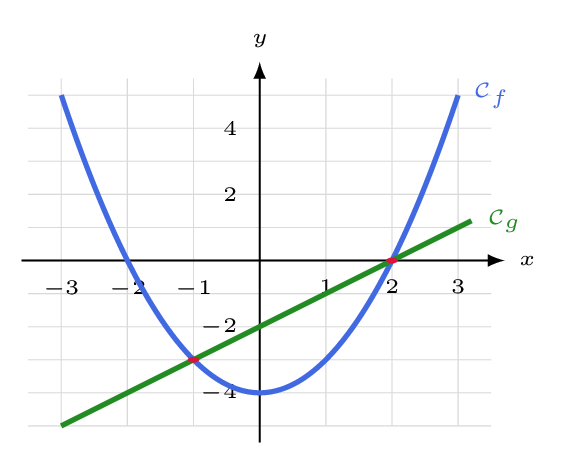
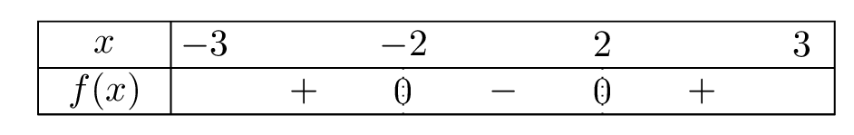

# Exploiter la représentation graphique d'une fonction

## Comment faire ?

Dans toute la fiche, \( \mathcal{C}_f \) est la courbe tracée ci-dessous, et \( g \) est la fonction définie par \( g(x)=x-2 \).

!!! methode "Comment lire une image, un antécédent, et tester l'appartenance d'un point ?"
    1. **Image de \( a \) :** on part de \( a \) sur l'axe des abscisses, on rejoint la courbe, puis on lit l'**ordonnée** du point atteint.  
        Pour \( \textcolor{gray}{a=1} \), on lit \( \textcolor{gray}{f(1)=-3} \).

    2. **Antécédents de \( k \) :** on part de \( k \) sur l'axe des ordonnées, on trace l'**horizontale**, et on lit les **abscisses** des points d'intersection.  
        Pour \( \textcolor{gray}{k=-3} \), on lit deux antécédents : \( \textcolor{gray}{-1} \) et \( \textcolor{gray}{1} \).

    3. **Appartenance :** le point \( M(a\,;b) \) est sur \( \mathcal{C}_f \) si, et seulement si, \( b=f(a) \).  
        \( \textcolor{gray}{M(1\,;-3)} \) est sur la courbe ; \( \textcolor{gray}{N(1\,;0)} \) ne l'est pas, car \( \textcolor{gray}{f(1)\neq 0} \).

    

!!! methode "Comment résoudre graphiquement $f(x)=k$ et $f(x)<k$ ?"
    On résoudra \( \textcolor{gray}{f(x)=-3} \), puis \( \textcolor{gray}{f(x)<-3} \).

    1. **On trace la droite horizontale** d'équation \( y=k \).  
        Ici, la droite d'équation \( \textcolor{gray}{y=-3} \).

    2. **Les solutions de \( f(x)=k \) sont les abscisses des points d'intersection** de la courbe et de la droite.  
        \( \textcolor{gray}{S=\{-1\,;1\}} \)

    3. **Les solutions de \( f(x)<k \)** sont les abscisses des points où la courbe est **au-dessous** de la droite.  
        \( \textcolor{gray}{S=\left]-1\,;1\right[} \)

    

!!! methode "Comment résoudre graphiquement $f(x)=g(x)$ et $f(x)<g(x)$ ?"
    1. **On trace les deux courbes** dans le même repère.  
        \( \textcolor{gray}{\mathcal{C}_g} \) est la droite d'équation \( \textcolor{gray}{y=x-2} \).

    2. **Les solutions de \( f(x)=g(x) \) sont les abscisses de leurs points d'intersection.**  
        \( \textcolor{gray}{S=\{-1\,;2\}} \)

    3. **Les solutions de \( f(x)<g(x) \)** sont les abscisses des points où \( \mathcal{C}_f \) est **au-dessous** de \( \mathcal{C}_g \).  
        \( \textcolor{gray}{S=\left]-1\,;2\right[} \)

    

!!! methode "Comment lire le signe de $f$ et dresser son tableau de signes ?"
    1. **On repère les abscisses où la courbe coupe l'axe des abscisses :** ce sont les solutions de \( f(x)=0 \).  
        La courbe coupe l'axe en \( \textcolor{gray}{-2} \) et en \( \textcolor{gray}{2} \).

    2. **\( f(x)>0 \) là où la courbe est au-dessus de l'axe**, \( f(x)<0 \) là où elle est **au-dessous**.  
        Au-dessus avant \( \textcolor{gray}{-2} \) et après \( \textcolor{gray}{2} \), au-dessous entre les deux.

    3. **On reporte le tout dans un tableau de signes** (fiche 24).

    

## S'entrainer !

#### Lire graphiquement l'image d'un nombre par une fonction

<iframe src="https://coopmaths.fr/alea/?EEEE2e0a294917eb26c3265c0f22272e1413133511a90f2717e60f1d17e612c72d0a14bb2cff181b26312d320f2217e60f1c272e132b2e3627c127cb277b27c817e81336133512d10f2d29592a7618012957277a139e139e1399288f263528ea2c7a27c227c32d56139e139e13992a36139e13a02952262c277a139e139e13992716139e13a02e030e8714c714c7130f2baa269b277a139e139e13992c022c8e139e139e13992e03277a139e139e139928282b3c2d9a2bab" class="exerciseur" allowfullscreen></iframe>

#### Montrer qu'un point appartient ou non à une courbe

<iframe src="https://coopmaths.fr/alea/?EEEE2e0a294917e81530165a0f22272e13af139911a60f2717ea0f1d17e612c72d0a14572cff17e60f2217e60f1c272e132b2e3627c127cb277b27c817e8139a133512d10f2d29592a7618022bab2da327c70e8714c714c713122dba139e13a02e030e8714c714c713112ba62b4d0e8714c714c713022c1126372d9a27c32d56139e139e13992bb20e8714c714c7130f2bab0e8714c714c712c6139e139e1a400e8714c714d612c6139e139e13992e03277a139e139e139926fc2e07268e" class="exerciseur" allowfullscreen></iframe>

#### Résoudre graphiquement une équation du type $f(x)=k$

<iframe src="https://coopmaths.fr/alea/?EEEE2e0a2949181613ca26bf0f22272e13af139b11a60f2f181a2a762e5e0f1e2d0a13ff133612d112c72d9a2d9d2792200e139e139e1a400e8714c714d616982bb22763277a139e139e1399288f263528ea2c7a27c227c32d56139e139e13992e03277a139e139e13990e8714c714d813f2139e139e197e2c7a263929542afe139e139e139927660e8714c714c713152f95277a139e139e13990e8714c714c714970e8714c716390e8714c7164a139e139e141129d2139e139e139d" class="exerciseur" allowfullscreen></iframe>
