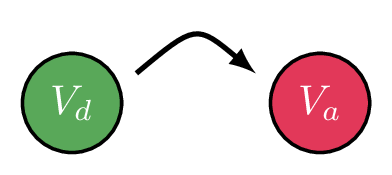

# Calculer un taux d'évolution et déterminer une valeur

## Comment faire ?

On parle d'**évolution** lorsqu'une valeur de départ, notée \( V_d \), évolue vers une valeur d'arrivée, notée \( V_a \).

!!! methode "Comment calculer un taux d'évolution ?"
    Un prix valait \( \textcolor{gray}{8} \) € et vaut maintenant \( \textcolor{gray}{9} \) €.

    1. **On repère la valeur de départ \( V_d \) et la valeur d'arrivée \( V_a \).**  
        \( \textcolor{gray}{V_d=8} \) et \( \textcolor{gray}{V_a=9} \).

    2. **On calcule la variation relative**, c'est-à-dire le **taux d'évolution** \( t=\dfrac{V_a-V_d}{V_d} \).  
        \( \textcolor{gray}{t=\dfrac{V_a-V_d}{V_d}=\dfrac{9-8}{8}=0{,}125} \)

    3. **On convertit en pourcentage et on conclut par une phrase.**  
        Le prix a augmenté de \( \textcolor{gray}{12{,}5\ \%} \).

!!! methode "Comment déterminer une valeur initiale ou finale ?"
    Après avoir subi une baisse de \( \textcolor{gray}{20\ \%} \), un article coûte \( \textcolor{gray}{41{,}60} \) €. Quel était son prix avant la baisse ?

    1. **On calcule le coefficient multiplicateur** de l'évolution.  
        Baisser de \( \textcolor{gray}{20\ \%} \) revient à multiplier par \( \textcolor{gray}{\left(1-\dfrac{20}{100}\right)=0{,}8} \).

    2. **On écrit la relation \( V_a=V_d\times CM \)** avec ce que l'on connait.  
        \( \textcolor{gray}{V_d\times 0{,}8=41{,}60} \)

    3. **On isole la valeur cherchée** et on calcule (fiche 4).  
        \( \textcolor{gray}{V_d=\dfrac{41{,}60}{0{,}8}=52} \)

    4. **On conclut par une phrase.**  
        L'article valait \( \textcolor{gray}{52} \) € avant la baisse.

## S'entrainer !

#### Calculer un CM à partir d'un taux d'évolution et inversement

<iframe src="https://coopmaths.fr/alea/?EEEE2e0a294917e514f926600f22272e13bc133611a60f2717ea0f1d17e612c72d0a132b2922132b26f117e60f2f181a2a762e5e0f1e2d0a13ff133612d113350f2d29592a7617f8263127022a762c8e139e139e13992e030e8714c714c712e41e1a139e139e13990e8714c714d813f2139e139e19750e8714c714c7131126372d9a2c8e139e139e13992716139e13a02e030e8714c714c71315263a2ee6139e139e13992716139e13a00e8714c714d813f2139e139e197e2e682a862d9a2bab0e8714c714c713062d56139e139e139929532e5e2cdc27c227c30074" class="exerciseur" allowfullscreen></iframe>

#### Calculer une évolution en pourcentages, une valeur finale ou une valeur initiale

<iframe src="https://coopmaths.fr/alea/?EEEE2e0a294917e6139d14650f22272e13bc133611a70f2717ea0f1d17e612c72d0a14572922132b26f117e60f2f181a2a762e5e0f1e2d0a13ff133612d113350f2d29592a7617f8263127022a762c8e139e139e13992e03277a139e139e13990e8714c714d813f2139e139e197e2e682a862d9a2bab0e8714c714c713062afe139e139e13992c102e0726f22b4d262c27c80e8714c714c71a32139e139e13992e03277a139e139e13992e5a2a762e070e8714c714c7130729532631277a139e139e13992bb20e8714c714c713162b3e0e8714c714c71317263127ca2c8e139e139e13992953295929462a76" class="exerciseur" allowfullscreen></iframe>
