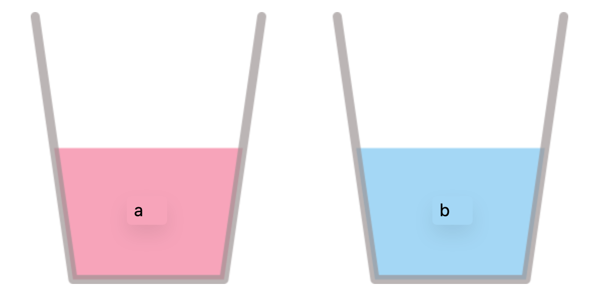
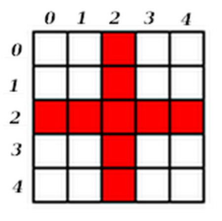
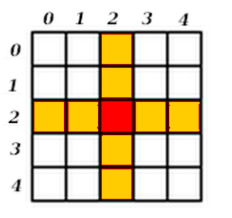

# Exercices 

Vous trouverez ci-dessous les exercices de cette séquence.

- Les exercices marqués avec :fontawesome-solid-pencil: se réalisent **sans ordinateur**.  
  Ceux indiqués par :fontawesome-solid-laptop: se font **directement dans la page** : l'éditeur exécute du vrai Python dans votre navigateur, et votre travail est conservé d'une séance à l'autre.

- Le **niveau de difficulté** est indiqué par des étoiles :  
    <ul style="list-style: none;">
        <li>:fontawesome-solid-star: :fontawesome-regular-star: :fontawesome-regular-star: → Exercices pour **s'approprier les notions**.</li>
        <li>:fontawesome-solid-star: :fontawesome-solid-star: :fontawesome-regular-star: → Exercices pour **renforcer vos compétences**.</li>
        <li>:fontawesome-solid-star: :fontawesome-solid-star: :fontawesome-solid-star: → Exercices pour vous **challenger** et tester vos acquis.</li>
    </ul>

!!! info "Mode d'emploi des éditeurs"
    - **Exécuter** (ou ++ctrl+enter++) lance votre programme ; l'affichage apparaît dans la console juste en dessous.
    - **Valider** — quand le bouton est présent — vérifie votre code sur plusieurs cas : tant qu'une ligne est rouge, c'est qu'un cas ne passe pas.
    - :fontawesome-solid-lightbulb: affiche la correction, :fontawesome-solid-arrow-rotate-right: remet le code de départ, :fontawesome-solid-trash: vide l'éditeur.
    - Quand un programme utilise `input()`, la question s'affiche dans la console : vous tapez votre réponse **à la suite**, puis ++enter++.
    - Le tout premier lancement demande quelques secondes : Python doit d'abord être téléchargé.

    Besoin d'un éditeur libre pour tester une idée ? Direction le [**Playground Python**](Python_playground.md).

Les corrections sont accessibles à tout moment, mais elles ne doivent être consultées **qu'après avoir vraiment cherché** — et, pour les travaux notés, qu'après validation de votre production par l'enseignant.

---

## Variables et types de bases

!!! exoordi "Exercice 1 - Anticiper les affectations - :fontawesome-solid-star: :fontawesome-regular-star: :fontawesome-regular-star:"
    **1.** Sur votre cahier, anticipez la valeur contenue dans chaque variable à la fin du programme. Vérifiez ensuite en exécutant le code.

    {{ python_playground(
      key="ch1-p1-anticiper-a",
      hauteur="180px",
      example_file="files/NSI/Python/exemples/ch1/p1_anticiper_a.py"
    ) }}

    **2.** Même travail avec ce second programme.

    {{ python_playground(
      key="ch1-p1-anticiper-b",
      hauteur="180px",
      example_file="files/NSI/Python/exemples/ch1/p1_anticiper_b.py"
    ) }}

    ??? success "Correction"
        **1.** Le programme affiche `5 3 15`.

        L'ordre des lignes est essentiel : `b` a été calculé **avant** que `a` ne change de valeur, il vaut donc $2+1 = 3$. En revanche `c` est calculé **après**, donc $3 \times 5 = 15$.

        **2.** Le programme affiche `5`.

        La ligne `a = a + 1` n'est pas une équation mathématique ! On calcule d'abord `a + 1` avec la valeur actuelle de `a`, puis on range le résultat dans `a`.

        Ajouter 1 à une variable de façon répétée s'appelle **incrémenter** la variable. Il existe une écriture plus rapide : `a += 1` au lieu de `a = a + 1`, `a -= 1` au lieu de `a = a - 1`, etc.

!!! exopapier "Exercice 2 - Reconnaître un type - :fontawesome-solid-star: :fontawesome-regular-star: :fontawesome-regular-star:"
    Pour chacune des variables ci-dessous, indiquer son type.

    1. `a = 2`
    2. `b = -1`
    3. `c = 3.14`
    4. `d = 1.0`
    5. `e = "Kevin"`
    6. `f = "Bonjour, " + "ça va ?"`
    7. `g = 2 + 6`
    8. `h = 4.2 + 1`
    9. `i = True`
    10. `j = False`

    ??? success "Correction"
        1. Integer
        2. Integer
        3. Float
        4. Float (à cause du `.0`)
        5. String
        6. String (car égal à `"Bonjour, ça va ?"`)
        7. Integer (car égal à `8`)
        8. Float (car égal à `5.2`)
        9. Boolean
        10. Boolean

!!! exoordi "Exercice 3 - Traduire une phrase en code - :fontawesome-solid-star: :fontawesome-regular-star: :fontawesome-regular-star:"
    Ici, il ne s'agit plus d'anticiper des valeurs mais d'**écrire** le code correspondant aux instructions.

    1. On initialise une variable `x` à 5, puis une variable `y` à 3, et on stocke leur somme dans une variable `somme`.
    2. On initialise une variable `score` à 100, puis on l'augmente de 15.
    3. On initialise une variable `cellule` à 1, puis on la multiplie par 2.
    4. On initialise une variable `capital` à 1000, puis on lui enlève 5 %.

    {{ python_playground(
      key="ch1-p1-ecrire",
      hauteur="300px",
      example_file="files/NSI/Python/exemples/ch1/p1_ecrire.py",
      solution_file="files/NSI/Python/.corrections/ch1/p1_ecrire_solution.py",
      tests_file="files/NSI/Python/.corrections/ch1/p1_ecrire_tests.py"
    ) }}

!!! exoordi "Exercice 4 - Échanger deux variables - :fontawesome-solid-star: :fontawesome-solid-star: :fontawesome-regular-star:"
    Le programme ci-dessous **est censé** échanger les contenus de `a` et `b`... mais il n'y arrive pas. Corrigez-le, **sans utiliser d'opération mathématique**.

    ⚠️ Votre programme doit fonctionner **quelles que soient les valeurs initiales** de `a` et `b`.

    <p align="center">
        
    </p>

    💡 Comment feriez-vous pour échanger réellement le contenu de ces deux verres ?

    {{ python_playground(
      key="ch1-p1-echange",
      hauteur="220px",
      example_file="files/NSI/Python/exemples/ch1/p1_echange.py",
      solution_file="files/NSI/Python/.corrections/ch1/p1_echange_solution.py",
      tests_file="files/NSI/Python/.corrections/ch1/p1_echange_tests.py"
    ) }}

    ??? tip "Coup de pouce"
        Avec deux verres pleins, il faut un troisième verre — vide — pour y arriver. En Python, ce troisième verre est une **variable temporaire**.

!!! exoordi "Exercice 5 - Prévoir le type d'un calcul - :fontawesome-solid-star: :fontawesome-regular-star: :fontawesome-regular-star:"
    Pour chaque variable, prévoyez sa **valeur** et son **type**, puis vérifiez avec la fonction `type(...)` en décommentant les lignes une à une.

    Une opération pose problème : laquelle, et pourquoi ?

    | Opérateur | Symbole Python | Opérateur | Symbole Python |
    |:---------:|:--------------:|:---------:|:--------------:|
    | Addition | `+` | Puissance | `**` |
    | Soustraction | `-` | Quotient de la division entière | `//` |
    | Multiplication | `*` | Reste de la division entière | `%` |
    | Division | `/` | | |

    {{ python_playground(
      key="ch1-p1-types-ops",
      hauteur="320px",
      example_file="files/NSI/Python/exemples/ch1/p1_types_ops.py"
    ) }}

    ??? success "Correction"
        | Variable | Valeur | Type | Pourquoi |
        |:--------:|:------:|:----:|:---------|
        | `a` | `5.0` | `float` | dès qu'un flottant intervient, le résultat est un flottant |
        | `b` | `3.0` | `float` | l'opérateur `/` renvoie **toujours** un flottant, même pour $6 \div 2$ |
        | `c` | `3` | `int` | `//` est la division **entière** |
        | `d` | `3.375` | `float` | $1{,}5^3$ |
        | `e` | `"python"` | `str` | avec deux chaînes, `+` réalise une **concaténation** |
        | `f` | `"miaoumiaoumiaou"` | `str` | multiplier une chaîne par un entier la répète |
        | `g` | ❌ | — | `TypeError` : on ne peut pas additionner un entier et une chaîne |

        Pour additionner `2` et `"a"`, il faudrait d'abord **convertir** : `str(2) + "a"` donne `"2a"`.

!!! exoordi "Exercice 6 - Trouver la ligne fautive - :fontawesome-solid-star: :fontawesome-regular-star: :fontawesome-regular-star:"
    L'exécution de ce code provoque une erreur.

    1. **Sans exécuter**, devinez quelle instruction est fautive.
    2. Vérifiez en exécutant, puis **commentez** la ligne responsable (avec un `#` en début de ligne) pour que le reste du programme fonctionne.

    {{ python_playground(
      key="ch1-p1-bug",
      hauteur="220px",
      example_file="files/NSI/Python/exemples/ch1/p1_bug_commentaire.py"
    ) }}

    ??? info "À savoir : les commentaires"
        Tout ce qui suit le caractère dièse `#` (++altgr+3++) n'est pas interprété par Python. On parle de **commentaire**. Il y a deux usages :

        - documenter et expliquer son code, pour en faciliter la lecture (par soi-même plus tard, ou par quelqu'un d'autre) ;
        - désactiver des lignes sans les supprimer — on pourra les *décommenter* en retirant simplement le `#` — notamment pendant la phase de débogage.

    ??? success "Correction"
        La ligne fautive est celle de `maggie` : comme `marge` vaut 5, le calcul `10 - 2 * marge` donne **0**, et Python refuse la division par zéro (`ZeroDivisionError`).

        ```python linenums="1"
        lisa = 2
        marge = 5
        bart = lisa + 2 * marge
        # maggie = bart / (10 - 2 * marge)
        homer = bart * "D'oh!"
        ```

        Attention au piège : la ligne de `homer`, elle, est parfaitement valide ! `bart` vaut 12, et multiplier une chaîne par un entier la répète — `homer` contient donc 12 fois `D'oh!`.

!!! exoordi "Exercice 7 - Dialoguer avec l'utilisateur - :fontawesome-solid-star: :fontawesome-regular-star: :fontawesome-regular-star:"
    **1.** Écrivez un programme qui demande deux nombres à l'utilisateur, puis affiche leur somme.

    {{ python_playground(
      key="ch1-p1-dialogue-somme",
      hauteur="200px",
      example_file="files/NSI/Python/exemples/ch1/p1_dialogue_somme.py",
      solution_file="files/NSI/Python/.corrections/ch1/p1_dialogue_somme_solution.py"
    ) }}

    ⚠️ `input()` renvoie **toujours** une chaîne de caractères : sans conversion, `"2" + "3"` donnerait `"23"` et non `5` !

    **2.** Complétez le programme suivant pour qu'il demande le prénom et l'âge de l'utilisateur, puis affiche la phrase *« Bonjour, je m'appelle ___ et j'ai ___ ans. »* avec **un seul** appel à `print()`.

    {{ python_playground(
      key="ch1-p1-dialogue-phrase",
      hauteur="200px",
      example_file="files/NSI/Python/exemples/ch1/p1_dialogue_phrase.py",
      solution_file="files/NSI/Python/.corrections/ch1/p1_dialogue_phrase_solution.py"
    ) }}

!!! exoordi "Exercice 8 - Le cercle - :fontawesome-solid-star: :fontawesome-solid-star: :fontawesome-regular-star:"
    Écrivez un programme qui demande à l'utilisateur le rayon d'un cercle, puis affiche sa **circonférence** et son **aire** avec un seul appel à `print()`.

    Rappels : $\mathcal{C} = 2\pi r$ et $\mathcal{A} = \pi r^2$. La première ligne du code de départ importe la constante `pi`.

    {{ python_playground(
      key="ch1-p1-cercle",
      hauteur="200px",
      example_file="files/NSI/Python/exemples/ch1/p1_cercle.py",
      solution_file="files/NSI/Python/.corrections/ch1/p1_cercle_solution.py"
    ) }}

---

## Instructions conditionnelles

!!! exoordi "Exercice 9 - Deux programmes à comparer - :fontawesome-solid-star: :fontawesome-regular-star: :fontawesome-regular-star:"
    **1.** Testez le premier programme avec plusieurs notes (par exemple 18, 13, 5). Que fait-il ?

    {{ python_playground(
      key="ch1-p2-comparer-a",
      hauteur="260px",
      example_file="files/NSI/Python/exemples/ch1/p2_comparer_a.py"
    ) }}

    **2.** Testez maintenant le second programme en saisissant 0, puis 20, puis 10. Que se passe-t-il ?

    {{ python_playground(
      key="ch1-p2-comparer-b",
      hauteur="200px",
      example_file="files/NSI/Python/exemples/ch1/p2_comparer_b.py"
    ) }}

    **3.** Quelle est la différence de fonctionnement entre une suite de `elif` et une suite de `if` indépendants ?

    ??? success "Correction"
        **1.** Le programme affiche une mention à partir d'une note : dès qu'une condition est vraie, le bloc correspondant est exécuté et **tous les tests suivants sont ignorés**. C'est pour cela qu'une note de 18 n'affiche que `TB`, et pas aussi `B`, `AB` et `reçu`.

        **2.** Ici, les deux `if` sont **indépendants** : ils sont tous les deux évalués.

        - avec 0 : rien ne s'affiche (la note n'est pas 20, et elle est nulle) ;
        - avec 20 : les deux messages s'affichent ;
        - avec 10 : seul `Ce n'est pas nul !` s'affiche.

        **3.** Avec `elif`, les cas sont **exclusifs** : au plus un bloc s'exécute. Avec des `if` séparés, chaque condition est testée à son tour, et plusieurs blocs peuvent s'exécuter.

!!! exoordi "Exercice 10 - Triangle rectangle en B ? - :fontawesome-solid-star: :fontawesome-solid-star: :fontawesome-regular-star:"
    On considère un triangle $ABC$ tel que $BC = 3$, $AC = 5$ et $AB = 4$. On cherche à déterminer s'il est rectangle **en B**.

    **1.** Complétez la condition. 💡 Si l'angle droit est en $B$, quel côté est l'hypoténuse ?

    {{ python_playground(
      key="ch1-p2-triangle-b",
      hauteur="200px",
      example_file="files/NSI/Python/exemples/ch1/p2_triangle_b.py",
      solution_file="files/NSI/Python/.corrections/ch1/p2_triangle_b_solution.py",
      tests_file="files/NSI/Python/.corrections/ch1/p2_triangle_b_tests.py"
    ) }}

    **2.** Comment le programme aurait-il réagi si le triangle n'avait pas été rectangle ? Testez votre réponse en remplaçant `AC = 5` par `AC = 6`.

    ??? success "Correction de la question 2"
        Il n'aurait **rien affiché du tout**. Sans `else`, un `if` dont la condition est fausse ne produit aucune sortie : l'utilisateur ne peut pas distinguer « le triangle n'est pas rectangle » de « le programme n'a pas fonctionné ». C'est exactement ce que corrige l'exercice suivant.

!!! exoordi "Exercice 11 - Pile ou face - :fontawesome-solid-star: :fontawesome-solid-star: :fontawesome-regular-star:"
    On simule le lancer de deux pièces :

    - si les deux pièces tombent du même côté, on gagne 1 euro ;
    - si l'une tombe sur pile et l'autre sur face, on perd 1 euro.

    **1.** Complétez le programme pour qu'il affiche `gagné 1 euro` ou `perdu 1 euro`, en n'utilisant **que des `if`** (pas de `else`).

    👉 Exécutez plusieurs fois de suite pour observer les différentes possibilités.

    {{ python_playground(
      key="ch1-p2-pieces-if",
      hauteur="260px",
      example_file="files/NSI/Python/exemples/ch1/p2_pieces_if.py",
      solution_file="files/NSI/Python/.corrections/ch1/p2_pieces_if_solution.py",
      tests_file="files/NSI/Python/.corrections/ch1/p2_pieces_tests.py"
    ) }}

    **2.** Recommencez, cette fois avec un seul test suivi d'un `else`.

    {{ python_playground(
      key="ch1-p2-pieces-else",
      hauteur="260px",
      example_file="files/NSI/Python/exemples/ch1/p2_pieces_else.py",
      solution_file="files/NSI/Python/.corrections/ch1/p2_pieces_else_solution.py",
      tests_file="files/NSI/Python/.corrections/ch1/p2_pieces_tests.py"
    ) }}

    **3.** Quelle version préférez-vous ? Que se passerait-il, dans la première, si vous vous trompiez dans la seconde condition ?

    ??? success "Correction de la question 3"
        La version avec `else` est plus sûre : la seconde situation est **automatiquement** le contraire de la première, il est donc impossible d'oublier un cas ou d'écrire deux conditions incohérentes. Dans la version à deux `if`, une erreur dans la seconde condition peut produire deux messages à la fois — ou aucun.

!!! exoordi "Exercice 12 - Où est l'angle droit ? - :fontawesome-solid-star: :fontawesome-solid-star: :fontawesome-regular-star:"
    Écrivez un programme qui détermine si le triangle $ABC$ est rectangle, et si oui **en quel sommet**.

    {{ python_playground(
      key="ch1-p2-triangle-angle",
      hauteur="340px",
      example_file="files/NSI/Python/exemples/ch1/p2_triangle_angle.py",
      solution_file="files/NSI/Python/.corrections/ch1/p2_triangle_angle_solution.py",
      tests_file="files/NSI/Python/.corrections/ch1/p2_triangle_angle_tests.py"
    ) }}

    Une fois validé, testez votre programme avec d'autres longueurs, par exemple $AB = 6$, $AC = 8$, $BC = 10$, puis $AB = 2$, $AC = 3$, $BC = 4$.

!!! exoordi "Exercice 13 - Les fléchettes de Bob - :fontawesome-solid-star: :fontawesome-solid-star: :fontawesome-solid-star:"
    Bob a inventé un jeu de fléchettes très simple : il lance une fléchette sur le plateau ci-dessous et gagne si elle atteint la **croix rouge**.

    <p align="center">
        
    </p>

    Le programme utilise la fonction `randint()` : `randint(1, 6)` renvoie un entier aléatoire compris entre 1 et 6 **inclus**. Pour pouvoir l'utiliser, on écrit au début du programme `from random import randint`.

    **1.** Complétez le programme.

    {{ python_playground(
      key="ch1-p2-flechettes-1",
      hauteur="300px",
      example_file="files/NSI/Python/exemples/ch1/p2_flechettes_1.py",
      solution_file="files/NSI/Python/.corrections/ch1/p2_flechettes_1_solution.py",
      tests_file="files/NSI/Python/.corrections/ch1/p2_flechettes_1_tests.py"
    ) }}

    **2.** Si la condition `numero_ligne == 2` est vérifiée, la condition `numero_colonne == 2` peut-elle l'être aussi ? Est-elle alors testée par le programme ? Cela change-t-il le résultat affiché ?

    **3.** Bob change les règles : la case rouge rapporte désormais 100 points, les cases oranges 50 points, et les cases blanches ne rapportent rien.

    <p align="center">
        
    </p>

    Complétez le programme pour qu'il affiche le nombre de points gagnés. ⚠️ L'**ordre** des tests a ici une importance capitale.

    {{ python_playground(
      key="ch1-p2-flechettes-2",
      hauteur="300px",
      example_file="files/NSI/Python/exemples/ch1/p2_flechettes_2.py",
      solution_file="files/NSI/Python/.corrections/ch1/p2_flechettes_2_solution.py",
      tests_file="files/NSI/Python/.corrections/ch1/p2_flechettes_2_tests.py"
    ) }}

    ??? success "Correction de la question 2"
        Oui, les deux conditions peuvent être vraies en même temps : c'est le cas de la **case centrale** (ligne 2, colonne 2). Mais avec un `elif`, la seconde condition n'est **pas testée** dès que la première est vraie.

        Ici, cela ne change rien au résultat : les deux branches affichent le même message. Une seule condition avec un `or` serait d'ailleurs plus lisible :

        ```python linenums="1"
        if numero_ligne == 2 or numero_colonne == 2:
            print("Bob a gagné")
        else:
            print("Bob a perdu")
        ```

        À la question **3**, en revanche, cette subtilité devient déterminante : la case rouge appartenant aussi à la croix orange, il faut la tester **en premier**, sinon elle ne rapporterait que 50 points.

!!! exoordi "Exercice 14 - Simulateur de résultats du bac - :fontawesome-solid-star: :fontawesome-solid-star: :fontawesome-solid-star:"
    On simule le résultat du baccalauréat, en ne tenant compte que des épreuves terminales :

    | Épreuve | Coefficient |
    |:--------|:-----------:|
    | Écrit de français | 3 |
    | Oral de français | 3 |
    | Mathématiques | 2 |
    | Philosophie | 8 |
    | Grand oral | 10 |
    | Spécialité 1 | 16 |
    | Spécialité 2 | 16 |

    **1.** Calculez la **moyenne pondérée** de l'élève dans la variable `moyenne`.

    **2.** Affichez ensuite son résultat :

    - *Admis mention très bien* si la moyenne est supérieure ou égale à 16 ;
    - *Admis mention bien* entre 14 et 16 ;
    - *Admis mention assez bien* entre 12 et 14 ;
    - *Admis* entre 10 et 12 ;
    - *Rattrapage* entre 8 et 10 ;
    - *Non admis* en dessous de 8.

    {{ python_playground(
      key="ch1-p2-bac",
      hauteur="360px",
      example_file="files/NSI/Python/exemples/ch1/p2_bac.py",
      solution_file="files/NSI/Python/.corrections/ch1/p2_bac_solution.py",
      tests_file="files/NSI/Python/.corrections/ch1/p2_bac_tests.py"
    ) }}

    **3.** Une fois votre programme validé, remplacez les notes fixées par des `input()` pour en faire un vrai simulateur.

    ??? tip "Coup de pouce"
        Une moyenne pondérée, c'est la somme des (note × coefficient) divisée par la **somme des coefficients** — ici $3+3+2+8+10+16+16 = 58$.

---

## Les boucles 

### Boucles non bornées : `while`

!!! exoordi "Exercice 15 - Deux boucles à observer - :fontawesome-solid-star: :fontawesome-regular-star: :fontawesome-regular-star:"
    **1.** Exécutez ce programme. Que fait-il ? Combien de tours de boucle effectue-t-il ?

    {{ python_playground(
      key="ch1-p3-observer-a",
      hauteur="180px",
      example_file="files/NSI/Python/exemples/ch1/p3_observer_a.py"
    ) }}

    **2.** Exécutez ce second programme **plusieurs fois**. Que fait-il ? Pourquoi n'affiche-t-il pas le même nombre de lignes à chaque exécution ?

    {{ python_playground(
      key="ch1-p3-observer-b",
      hauteur="220px",
      example_file="files/NSI/Python/exemples/ch1/p3_observer_b.py"
    ) }}

    !!! info "Remarque"
        Le caractère `:` est obligatoire après `if`, `elif`, `else`, `for` et `while`. Il annonce le bloc d'instructions qui suit, lequel doit être **indenté**.

    ??? success "Correction"
        **1.** La variable `nombre` double à chaque tour : 6, 12, 24. Le programme s'arrête dès que la condition `nombre < 20` devient fausse — mais l'affichage a lieu **après** le doublement, c'est pourquoi 24 est affiché alors qu'il dépasse déjà 20. Trois tours de boucle.

        **2.** Le programme relance un dé tant qu'il n'obtient pas 6. Le nombre de tours est **imprévisible** : il dépend du hasard. C'est toute la différence avec une boucle bornée — on ne peut pas savoir à l'avance combien de tours seront nécessaires, seulement quand s'arrêter.

!!! exoordi "Exercice 16 - Contrôler une saisie - :fontawesome-solid-star: :fontawesome-solid-star: :fontawesome-regular-star:"
    **1.** Complétez le programme suivant : tant que l'utilisateur n'entre pas le bon mot de passe (`123456`), la question est reposée.

    {{ python_playground(
      key="ch1-p3-mot-de-passe",
      hauteur="260px",
      example_file="files/NSI/Python/exemples/ch1/p3_mot_de_passe.py",
      solution_file="files/NSI/Python/.corrections/ch1/p3_mot_de_passe_solution.py"
    ) }}

    **2.** Sur le même principe, écrivez un programme qui demande un nombre décimal entre 1 et 100. Tant que la saisie n'est pas dans l'intervalle, une nouvelle saisie est demandée. Quand elle est correcte, le programme affiche `On peut continuer !`.

    {{ python_playground(
      key="ch1-p3-saisie-intervalle",
      hauteur="200px",
      example_file="files/NSI/Python/exemples/ch1/p3_saisie_intervalle.py",
      solution_file="files/NSI/Python/.corrections/ch1/p3_saisie_intervalle_solution.py"
    ) }}

    ??? tip "Coup de pouce"
        Le schéma est toujours le même : une **première saisie avant** la boucle, puis une **nouvelle saisie à l'intérieur** de la boucle. Sans cette seconde saisie, la condition ne changerait jamais... et la boucle tournerait indéfiniment (voir l'exercice suivant !).

!!! exoordi "Exercice 17 - La boucle qui ne s'arrête jamais - :fontawesome-solid-star: :fontawesome-regular-star: :fontawesome-regular-star:"
    🌵 Il est très fréquent d'écrire une boucle `while` en oubliant de vérifier qu'elle se termine : on écrit *tant que...*, mais la condition d'arrêt ne se réalise jamais. Le programme ne s'arrête donc plus.

    **1.** Exécutez le code ci-dessous et observez ce qu'il se passe.

    {{ python_playground(
      key="ch1-p3-boucle-infinie",
      hauteur="200px",
      example_file="files/NSI/Python/exemples/ch1/p3_boucle_infinie.py",
      solution_file="files/NSI/Python/.corrections/ch1/p3_boucle_infinie_solution.py"
    ) }}

    **2.** Pourquoi cette boucle est-elle infinie ? Corrigez-la pour qu'elle affiche les entiers de 0 à 9.

    ??? success "Correction"
        La variable `n` vaut 0 et **rien ne la modifie** dans la boucle : la condition `n < 10` reste donc vraie pour toujours. Il manque une incrémentation :

        ```python linenums="1"
        n = 0

        while n < 10 :
            print(n)
            n = n + 1

        print("fin de la boucle, n =", n)
        ```

        À retenir : dans une boucle `while`, une (au moins) des variables de la condition doit être modifiée **à l'intérieur** de la boucle.

    !!! warning "Et si cela arrive ailleurs ?"
        Ici, l'éditeur de la page vous protège : votre programme s'exécute à l'écart de la page et est interrompu automatiquement au bout de quelques secondes.

        Sur Basthon, Capytale ou dans un notebook, **ce n'est pas le cas** : l'onglet se fige complètement et la seule issue est de fermer la page — en perdant le travail non sauvegardé. Alors prenez le réflexe : **on sauvegarde avant de tester une boucle `while`**.

!!! exoordi "Exercice 18 - Le drapeau - :fontawesome-solid-star: :fontawesome-regular-star: :fontawesome-regular-star:"
    Un **drapeau** (*flag* en anglais) est une variable booléenne qui sert à marquer une situation. Ici, `continuer` vaut `True` tant que la partie n'est pas terminée, et passe à `False` quand elle l'est — que l'on ait gagné **ou** abandonné.

    **1.** Jouez quelques parties, puis repérez les deux endroits où le drapeau est abaissé.

    {{ python_playground(
      key="ch1-p3-drapeau",
      hauteur="380px",
      example_file="files/NSI/Python/exemples/ch1/p3_drapeau.py",
      solution_file="files/NSI/Python/.corrections/ch1/p3_drapeau_solution.py"
    ) }}

    **2.** Améliorez le jeu : comptez le nombre d'essais et affichez-le à la fin, puis indiquez après chaque proposition si le nombre cherché est *plus grand* ou *plus petit*.

    ??? info "Pourquoi `while continuer` et pas `while continuer == True` ?"
        Parce que `continuer` **est déjà** un booléen : il vaut `True` ou `False`. Écrire `continuer == True` revient à demander « est-il vrai que c'est vrai ? ». Les deux fonctionnent, mais la première écriture est celle des programmeurs.

!!! exoordi "Exercice 19 - Le bilan des dépenses - :fontawesome-solid-star: :fontawesome-solid-star: :fontawesome-solid-star:"
    L'administration de l'université doit faire le bilan annuel de ses dépenses. Toutes les dépenses ont été enregistrées, mais **personne ne sait combien il y en a**.

    Écrivez un programme qui lit une suite d'entiers positifs et affiche leur somme. Les saisies s'arrêtent quand l'utilisateur entre la valeur `-1` (ce n'est pas une dépense, seulement un **marqueur de fin**).

    Exemple d'exécution :

    ```
    Entrez la somme dépensée : 200
    Entrez la somme dépensée : 100
    Entrez la somme dépensée : 40
    Entrez la somme dépensée : -1
    Dépense totale : 340
    ```

    {{ python_playground(
      key="ch1-p3-depenses",
      hauteur="220px",
      example_file="files/NSI/Python/exemples/ch1/p3_depenses.py",
      solution_file="files/NSI/Python/.corrections/ch1/p3_depenses_solution.py"
    ) }}

    ⚠️ Attention à ne pas ajouter le `-1` au total !

!!! exoordi "Exercice 20 - Le capital d'Alice - :fontawesome-solid-star: :fontawesome-solid-star: :fontawesome-regular-star:"
    Alice a déposé 1000 € sur un compte rémunéré à 5 % par an. Chaque année, son capital est donc multiplié par $\left(1 + \dfrac{t}{100}\right)$.

    Écrivez la boucle qui calcule le nombre d'années au bout duquel son capital aura **au moins doublé**.

    {{ python_playground(
      key="ch1-p3-capital",
      hauteur="300px",
      example_file="files/NSI/Python/exemples/ch1/p3_capital.py",
      solution_file="files/NSI/Python/.corrections/ch1/p3_capital_solution.py",
      tests_file="files/NSI/Python/.corrections/ch1/p3_capital_tests.py"
    ) }}

    Une fois validé, modifiez le taux : combien d'années faut-il à 1 % ? à 10 % ? Le résultat dépend-il du capital de départ ?

!!! exoordi "Exercice 21 - Combien de lancers pour un 6 ? - :fontawesome-solid-star: :fontawesome-solid-star: :fontawesome-regular-star:"
    Écrivez un programme qui lance un dé jusqu'à obtenir un 6, puis affiche le nombre de lancers qu'il a fallu. Ce nombre devra être stocké dans une variable `nb_lancers`.

    {{ python_playground(
      key="ch1-p3-de-tentatives",
      hauteur="240px",
      example_file="files/NSI/Python/exemples/ch1/p3_de_tentatives.py",
      solution_file="files/NSI/Python/.corrections/ch1/p3_de_tentatives_solution.py",
      tests_file="files/NSI/Python/.corrections/ch1/p3_de_tentatives_tests.py"
    ) }}

    💡 Exécutez une dizaine de fois : en moyenne, combien de lancers sont nécessaires ? Le résultat vous semble-t-il cohérent ?

### Boucles bornées : `for`

!!! exoordi "Exercice 22 - Premiers `for` - :fontawesome-solid-star: :fontawesome-regular-star: :fontawesome-regular-star:"
    **1.** Écrivez un programme qui affiche 7 fois la phrase `Je dois respecter le Grand Sorcier.`

    ⚠️ Votre programme ne doit pas faire plus de **2 lignes**.

    {{ python_playground(
      key="ch1-p3-sorcier",
      hauteur="180px",
      example_file="files/NSI/Python/exemples/ch1/p3_sorcier.py",
      solution_file="files/NSI/Python/.corrections/ch1/p3_sorcier_solution.py",
      tests_file="files/NSI/Python/.corrections/ch1/p3_sorcier_tests.py"
    ) }}

    **2.** Testez le script suivant, puis corrigez la ou les erreurs pour que la phrase s'affiche 10 fois.

    {{ python_playground(
      key="ch1-p3-debug-for",
      hauteur="180px",
      example_file="files/NSI/Python/exemples/ch1/p3_debug_for.py",
      solution_file="files/NSI/Python/.corrections/ch1/p3_debug_for_solution.py",
      tests_file="files/NSI/Python/.corrections/ch1/p3_debug_for_tests.py"
    ) }}

    ??? tip "Coup de pouce pour la question 2"
        Deux erreurs se cachent dans ces deux lignes : l'une concerne un caractère manquant en fin de première ligne, l'autre l'**indentation**. Sans elle, comment Python saurait-il quelles instructions répéter ?

!!! exoordi "Exercice 23 - Bob et les fraises - :fontawesome-solid-star: :fontawesome-regular-star: :fontawesome-regular-star:"
    Bob découvre un beau fraisier. Il cueille une fraise et la mange. Y prenant goût, il y retourne et en prend 2. N'y tenant plus, il y retourne et en prend 3. Et ainsi de suite : à chaque cueillette, il en mange une de plus que la fois précédente.

    **1.** Testez le programme ci-dessous. Quel est le problème ? Corrigez-le pour que Bob mange bien 1, puis 2, puis 3 fraises... jusqu'à 10.

    {{ python_playground(
      key="ch1-p3-bob-fraises",
      hauteur="240px",
      example_file="files/NSI/Python/exemples/ch1/p3_bob_fraises.py",
      solution_file="files/NSI/Python/.corrections/ch1/p3_bob_fraises_solution.py",
      tests_file="files/NSI/Python/.corrections/ch1/p3_bob_fraises_tests.py"
    ) }}

    **2.** En réalité, la variable `nombre` était inutile : la variable de boucle `i` suffit ! Exécutez cette seconde version et comparez les affichages.

    {{ python_playground(
      key="ch1-p3-bob-sans-variable",
      hauteur="140px",
      example_file="files/NSI/Python/exemples/ch1/p3_bob_sans_variable.py"
    ) }}

    ??? success "Correction de la question 1"
        À la première cueillette, `nombre` vaut encore 0 : Bob mange donc 0 fraise ! Et à la dernière, il n'en mange que 9. Il suffit d'initialiser `nombre` à 1 — ou d'incrémenter **avant** d'afficher.

!!! exoordi "Exercice 24 - Les trois visages de `range()` - :fontawesome-solid-star: :fontawesome-regular-star: :fontawesome-regular-star:"
    Exécutez la première boucle, puis décommentez les deux autres, une par une, et observez.

    {{ python_playground(
      key="ch1-p3-range-args",
      hauteur="280px",
      example_file="files/NSI/Python/exemples/ch1/p3_range_args.py"
    ) }}

    Pour chacune, répondez : quelle est la **première** valeur prise par `i` ? La **dernière** ? Le **pas** entre deux valeurs ? Combien de tours de boucle au total ?

    ??? success "Correction"
        | Écriture | Valeurs de `i` | Nombre de tours |
        |:---------|:---------------|:---------------:|
        | `range(10)` | 0, 1, 2, …, 9 | 10 |
        | `range(1, 10)` | 1, 2, 3, …, 9 | 9 |
        | `range(5, 55, 5)` | 5, 10, 15, …, 50 | 10 |

        Trois règles à retenir :

        - avec **un** argument, on part toujours de 0 ;
        - la valeur de fin est **toujours exclue** — c'est pourquoi `range(5, 55, 5)` s'arrête à 50 ;
        - avec **trois** arguments, le dernier est le **pas**.

        ⚠️ Piège classique : passer de `range(10)` à `range(1, 10)` fait perdre un tour ! Pour conserver 10 tours en démarrant à 1, il faut écrire `range(1, 11)`.

!!! exoordi "Exercice 25 - Compter jusqu'à 50 - :fontawesome-solid-star: :fontawesome-solid-star: :fontawesome-regular-star:"
    Écrivez un programme qui affiche exactement :

    ```
    i = 0
    i = 1
    i = 2
    ...
    i = 49
    i = 50
    ```

    {{ python_playground(
      key="ch1-p3-compter",
      hauteur="180px",
      example_file="files/NSI/Python/exemples/ch1/p3_compter.py",
      solution_file="files/NSI/Python/.corrections/ch1/p3_compter_solution.py",
      tests_file="files/NSI/Python/.corrections/ch1/p3_compter_tests.py"
    ) }}

!!! exoordi "Exercice 26 - Le même affichage, trois fois - :fontawesome-solid-star: :fontawesome-solid-star: :fontawesome-regular-star:"
    Les trois éditeurs ci-dessous doivent produire **exactement le même affichage** :

    ```
    3
    6
    9
    12
    15
    18
    ```

    **1.** Avec une boucle `for i in range(...)` à **un seul** argument.

    {{ python_playground(
      key="ch1-p3-trois-range-1",
      hauteur="160px",
      example_file="files/NSI/Python/exemples/ch1/p3_trois_range.py",
      solution_file="files/NSI/Python/.corrections/ch1/p3_trois_range_1_solution.py",
      tests_file="files/NSI/Python/.corrections/ch1/p3_trois_range_tests.py"
    ) }}

    **2.** Avec une boucle `for i in range(...)` à **deux** arguments.

    {{ python_playground(
      key="ch1-p3-trois-range-2",
      hauteur="160px",
      example_file="files/NSI/Python/exemples/ch1/p3_trois_range.py",
      solution_file="files/NSI/Python/.corrections/ch1/p3_trois_range_2_solution.py",
      tests_file="files/NSI/Python/.corrections/ch1/p3_trois_range_tests.py"
    ) }}

    **3.** Avec une boucle `for i in range(...)` à **trois** arguments.

    {{ python_playground(
      key="ch1-p3-trois-range-3",
      hauteur="160px",
      example_file="files/NSI/Python/exemples/ch1/p3_trois_range.py",
      solution_file="files/NSI/Python/.corrections/ch1/p3_trois_range_3_solution.py",
      tests_file="files/NSI/Python/.corrections/ch1/p3_trois_range_tests.py"
    ) }}

    💡 Dans les deux premiers cas, `i` ne prend pas les valeurs affichées : c'est le `print()` qui doit faire le calcul.

!!! exopapier "Exercice 27 - Écrire des boucles sur le papier - :fontawesome-solid-star: :fontawesome-regular-star: :fontawesome-regular-star:"
    1. Écrire un code Python qui affiche les entiers de 0 à 11.
    2. Écrire un code Python qui affiche les entiers de 10 à 21. 
    3. Écrire un code Python qui affiche les carrés des entiers entre 1 et 10 compris.
    4. Écrire un code Python qui affiche les multiples de 5 entre 5 et 100 compris.

    ??? success "Correction"
        1. On a : 
            ```python linenums="1"
            for i in range(12): 
                print(i)
            ```
        2. On a : 
            ```python linenums="1"
            for i in range(10, 22) : 
                print(i)
            ```
        3. On a : 
            ```python linenums="1"
            for i in range(1, 11) :
                print(i ** 2)
            ```
        4. On a : 
            ```python linenums="1"
            for i in range(5, 101, 5) : 
                print(i)
            ```

!!! exopapier "Exercice 28 - Dérouler une boucle - :fontawesome-solid-star: :fontawesome-regular-star: :fontawesome-regular-star:"
    On donne le script suivant : 

    ```python linenums="1"
    somme = 0
    for i in range(1, 6):
        somme = somme + i
    print(somme)
    ```

    Qu'affiche-t-il ?

    ??? success "Correction"
        Il affichera $15$.

        1. Au premier passage : `somme = 0+1 = 1`
        2. Au second passage : `somme = 1+2 = 3`
        3. Au troisième passage : `somme = 3+3 = 6`
        4. Au quatrième passage : `somme = 6+4 = 10`
        5. Au cinquième passage : `somme = 10+5 = 15`

!!! exoordi "Exercice 29 - Accumuler dans une variable - :fontawesome-solid-star: :fontawesome-solid-star: :fontawesome-regular-star:"
    Complétez le programme pour qu'à la fin :

    1. `somme` contienne la somme des entiers de 1 à 100 (compris) ;
    2. `produit` contienne le produit des entiers de 1 à 10 (compris) ;
    3. `somme_carres` contienne la somme des carrés des entiers de 1 à 5 (compris).

    Aucun affichage n'est demandé.

    {{ python_playground(
      key="ch1-p3-somme-produit",
      hauteur="320px",
      example_file="files/NSI/Python/exemples/ch1/p3_somme_produit.py",
      solution_file="files/NSI/Python/.corrections/ch1/p3_somme_produit_solution.py",
      tests_file="files/NSI/Python/.corrections/ch1/p3_somme_produit_tests.py"
    ) }}

    ??? tip "Coup de pouce"
        Pourquoi `produit` est-il initialisé à 1 et non à 0 ? Parce que multiplier par 0 donnerait... 0 ! L'initialisation doit être l'**élément neutre** de l'opération : 0 pour une somme, 1 pour un produit.

!!! exoordi "Exercice 30 - Le triangle de dièses - :fontawesome-solid-star: :fontawesome-solid-star: :fontawesome-solid-star:"
    Écrivez un programme qui provoque l'affichage suivant : 20 lignes, la $n$-ième contenant $n$ symboles `#`.

    ```
    #
    ##
    ###
    ####
    #####
    ...
    ####################
    ```

    {{ python_playground(
      key="ch1-p3-triangle-hash",
      hauteur="180px",
      example_file="files/NSI/Python/exemples/ch1/p3_triangle_hash.py",
      solution_file="files/NSI/Python/.corrections/ch1/p3_triangle_hash_solution.py",
      tests_file="files/NSI/Python/.corrections/ch1/p3_triangle_hash_tests.py"
    ) }}

    ??? tip "Coup de pouce"
        Testez d'abord ces trois instructions dans un éditeur :

        ```python
        print("#" + "#")
        print(3 * "#")
        print(1 * "#")
        ```

--- 

## Les fonctions

### Le parc d'attraction

Le droit d'entrée journalier dans un parc d'attraction est de **37 €** pour un adulte et de **28 €** pour un enfant.

Alice et Bob font payer les entrées, mais leur caisse est tombée en panne et la queue s'allonge très vite… On leur fournit en urgence une calculatrice équipée de Python.

- Un groupe de 2 adultes et 2 enfants : il faut calculer $2\times 37 + 2\times 28$
- Un groupe de 3 adultes et 5 enfants : il faut calculer $3\times 37 + 5\times 28$
- Un groupe de 1 adulte et 3 enfants : il faut calculer $1\times 37 + 3\times 28$

😢 Ces calculs sont répétitifs et prennent du temps. Il suffirait pourtant de saisir le nombre d'adultes et d'enfants pour automatiser le calcul : ils décident d'écrire une **fonction**.

!!! exoordi "Exercice 31 - Définir puis appeler - :fontawesome-solid-star: :fontawesome-regular-star: :fontawesome-regular-star:"
    **1.** Exécutez le script ci-dessous. Que se passe-t-il ? Pourquoi ?

    **2.** Ajoutez maintenant la ligne `print(prix(3, 2))` à la fin, puis exécutez à nouveau. Recommencez avec `print(prix(2, 3))` : pourquoi le résultat change-t-il ?

    {{ python_playground(
      key="ch1-p4-parc-definition",
      hauteur="200px",
      example_file="files/NSI/Python/exemples/ch1/p4_parc_definition.py"
    ) }}

    **3.** Alice et Bob veulent aller plus vite encore : saisir simplement les nombres, sans avoir à écrire `prix(3, 2)`. Exécutez leur programme.

    {{ python_playground(
      key="ch1-p4-parc-programme",
      hauteur="260px",
      example_file="files/NSI/Python/exemples/ch1/p4_parc_programme.py"
    ) }}

    ??? success "Correction"
        **1.** Rien ne s'affiche ! **Définir** une fonction, c'est seulement expliquer à Python comment faire le calcul — un peu comme écrire une recette. Tant que personne ne l'**appelle**, la recette reste dans le tiroir.

        **2.** Lors de l'appel `prix(3, 2)`, la valeur 3 est automatiquement affectée au paramètre `nbre_adultes` et la valeur 2 à `nbre_enfants` : on obtient $3\times37+2\times28 = 167$ €.

        L'ordre des arguments est donc capital : `prix(2, 3)` correspond à 2 adultes et 3 enfants, soit $2\times37+3\times28 = 158$ €.

        **3.** Le programme demande les deux nombres, appelle la fonction, et le résultat **renvoyé** par `return` est affecté à la variable `a_payer`, qui est ensuite affichée.

!!! exoordi "Exercice 32 - Le tarif étudiant - :fontawesome-solid-star: :fontawesome-solid-star: :fontawesome-regular-star:"
    On vient de signaler à Alice et Bob qu'un nouveau tarif entre en vigueur : le tarif **étudiant**, à 30 €.

    Écrivez la fonction `prix_etudiants` qui prend en paramètres un nombre d'adultes, un nombre d'étudiants et un nombre d'enfants — **dans cet ordre** — et renvoie le prix total.

    {{ python_playground(
      key="ch1-p4-parc-etudiant",
      hauteur="240px",
      example_file="files/NSI/Python/exemples/ch1/p4_parc_etudiant.py",
      solution_file="files/NSI/Python/.corrections/ch1/p4_parc_etudiant_solution.py",
      tests_file="files/NSI/Python/.corrections/ch1/p4_parc_etudiant_tests.py"
    ) }}

    ⚠️ La fonction doit **renvoyer** le prix avec `return`, et non l'afficher : c'est le programme qui appelle la fonction qui décidera quoi en faire.

### Les tables de multiplication

Le petit frère de Bob doit apprendre ses tables de multiplication. Bob veut lui écrire un programme qui affiche les 10 premiers résultats de chaque table.

!!! exoordi "Exercice 33 - Le piège du `return` - :fontawesome-solid-star: :fontawesome-regular-star: :fontawesome-regular-star:"
    **1.** Pensant bien faire, Bob écrit la fonction suivante. Exécutez-la : que s'affiche-t-il ? À quoi vous attendiez-vous ?

    {{ python_playground(
      key="ch1-p4-return-boucle",
      hauteur="180px",
      example_file="files/NSI/Python/exemples/ch1/p4_return_boucle.py"
    ) }}

    **2.** Exécutez maintenant cette seconde version et comparez.

    {{ python_playground(
      key="ch1-p4-procedure",
      hauteur="180px",
      example_file="files/NSI/Python/exemples/ch1/p4_procedure.py"
    ) }}

    **3.** Supprimez la ligne `return None` de la seconde version, puis testez à nouveau. Que constatez-vous ?

    ??? success "Correction"
        **1.** Seul `9` s'affiche. Dès que Python rencontre `return`, il **sort immédiatement de la fonction** — même au beau milieu d'une boucle. La boucle n'effectue donc qu'un seul tour.

        **2.** Cette fois les 10 résultats s'affichent, car `print()` n'interrompt pas la fonction.

        **3.** Rien ne change : dans une fonction qui ne renvoie rien, la ligne `return None` est facultative — Python renvoie `None` de toute façon.

        !!! definition "Définition : procédure"
            Une fonction qui ne renvoie rien mais réalise des actions (des affichages, par exemple) s'appelle une **procédure**. En Python, on parle le plus souvent simplement de *fonction*.

!!! exoordi "Exercice 34 - Afficher le calcul complet - :fontawesome-solid-star: :fontawesome-solid-star: :fontawesome-regular-star:"
    Modifiez la fonction pour qu'elle affiche également le calcul. Par exemple, `table_multiplication(9)` doit afficher :

    ```
    9 x 1 = 9
    9 x 2 = 18
    9 x 3 = 27
    ...
    9 x 10 = 90
    ```

    {{ python_playground(
      key="ch1-p4-table",
      hauteur="200px",
      example_file="files/NSI/Python/exemples/ch1/p4_table.py",
      solution_file="files/NSI/Python/.corrections/ch1/p4_table_solution.py",
      tests_file="files/NSI/Python/.corrections/ch1/p4_table_tests.py"
    ) }}

    💡 Un seul `print()` suffit : il accepte autant d'arguments que l'on veut, séparés par des virgules.

### Exercices divers

!!! exopapier "Exercice 35 - Variables locales et globales - :fontawesome-solid-star: :fontawesome-solid-star: :fontawesome-regular-star:"
    On considère le programme suivant : 

    ```python linenums="1"
    def euro_vers_dollar(euros):
        return euros * 1.19 # en supposant qu'un euro vaut 1,19 dollars

    def dollar_vers_yuan(dollars):
        return dollars * 6.93 # en supposant qu'un dollar vaut 6,93 yuans

    def euro_vers_yuan(montant):
        # Appel de la fonction euro_vers_dollar
        montant_dollar = euro_vers_dollar(montant)
        # Appel de la fonction dollar_vers_yuan
        montant_yuan = dollar_vers_yuan(montant_dollar)
        # Valeur renvoyée
        return montant_yuan

    euros = float(input("entrez le montant en euros :"))
    montant_converti = euro_vers_yuan(euros)
    print(euros, "€ représente ", montant_converti, "yuan")
    ```

    Déterminer, pour chaque variable, si elle est **globale** ou **locale**. 
    
    Si elle est locale, on précisera la fonction associée et si elle est paramètre ou non.

    ??? success "Correction"
        - `euros` est une variable locale (paramètre) dans la fonction `euro_vers_dollars`. Une autre variable `euros` dans le corp du programme (ligne 15) est elle une variable globale.
        - `dollars` est une variable locale (paramètre) dans la fonction `dollars_vers_yuan`.
        - `montant` est une variable locale (paramètre) dans la fonction `euro_vers_yuan`.
        - `montant_dollar` est une variable locale dans la fonction `euro_vers_yuan`.
        - `montant_yuan` est une variable locale dans la fonction `euro_vers_yuan`.
        - `montant_converti` est une variable globale.

!!! exoordi "Exercice 36 - Le plus grand - :fontawesome-solid-star: :fontawesome-solid-star: :fontawesome-regular-star:"
    1. Écrivez une fonction `maxi_2` qui prend en paramètres deux nombres entiers `n1` et `n2`, et renvoie le plus grand des deux.
    2. Écrivez une fonction `maxi_3` qui prend en paramètres trois nombres entiers et renvoie le plus grand des trois. ⚠️ Vous appellerez **obligatoirement** la fonction `maxi_2`.

    {{ python_playground(
      key="ch1-p4-maxi",
      hauteur="280px",
      example_file="files/NSI/Python/exemples/ch1/p4_maxi.py",
      solution_file="files/NSI/Python/.corrections/ch1/p4_maxi_solution.py",
      tests_file="files/NSI/Python/.corrections/ch1/p4_maxi_tests.py"
    ) }}

    💡 Réutiliser une fonction déjà écrite plutôt que de recopier son code, c'est tout l'intérêt des fonctions : le jour où l'on corrige `maxi_2`, `maxi_3` est corrigée elle aussi.

!!! exoordi "Exercice 37 - Compter les voyelles - :fontawesome-solid-star: :fontawesome-solid-star: :fontawesome-regular-star:"
    **1.** Testez ces deux instructions dans un éditeur, et observez ce qu'elles renvoient :

    ```python
    print("e" in "aeiouy")
    print("f" in "aeiouy")
    ```

    **2.** Exécutez le code de départ ci-dessous. Que fait la boucle `for lettre in mot` ?

    **3.** Complétez la fonction `nombre_voyelles`, qui renvoie le nombre de voyelles contenues dans `mot`. On considérera que `y` est une voyelle, et on ne s'occupera pas des majuscules.

    {{ python_playground(
      key="ch1-p4-voyelles",
      hauteur="300px",
      example_file="files/NSI/Python/exemples/ch1/p4_voyelles.py",
      solution_file="files/NSI/Python/.corrections/ch1/p4_voyelles_solution.py",
      tests_file="files/NSI/Python/.corrections/ch1/p4_voyelles_tests.py"
    ) }}

    ??? success "Correction de la question 2"
        La boucle parcourt le mot **caractère par caractère** : à chaque tour, la variable `lettre` contient la lettre suivante. C'est une boucle bornée, mais sans `range()` : on itère directement sur la chaîne.

!!! exoordi "Exercice 38 - La suite de Syracuse - :fontawesome-solid-star: :fontawesome-solid-star: :fontawesome-solid-star:"
    La **conjecture de Syracuse** (ou de Collatz) postule ceci. Partons d'un entier $n$ :

    - si $n$ est pair, on le divise par 2 ;
    - sinon, on le multiplie par 3 puis on ajoute 1.

    On recommence indéfiniment. Au bout d'un certain temps, on finit **toujours** par tomber sur 1 — du moins, personne n'a encore trouvé de contre-exemple, ni réussi à le démontrer !

    1. Complétez la fonction `suivant`, qui prend en paramètre un entier `n` et renvoie son successeur selon les règles ci-dessus.
    2. Écrivez la fonction `syracuse`, qui affiche tous les termes de la suite en partant de `n` jusqu'à 1. Vous appellerez obligatoirement `suivant`.
    3. Écrivez la fonction `temps_de_vol`, qui renvoie le **nombre d'étapes** nécessaires pour arriver à 1 en partant de `n`. Par exemple, `temps_de_vol(5)` renvoie 5.
    4. Complétez `temps_max`, qui renvoie le plus grand temps de vol obtenu pour un nombre de départ inférieur ou égal à `n`, ainsi que le nombre de départ correspondant.

    {{ python_playground(
      key="ch1-p4-syracuse",
      hauteur="460px",
      example_file="files/NSI/Python/exemples/ch1/p4_syracuse.py",
      solution_file="files/NSI/Python/.corrections/ch1/p4_syracuse_solution.py",
      tests_file="files/NSI/Python/.corrections/ch1/p4_syracuse_tests.py"
    ) }}

    ??? tip "Coups de pouce"
        - Pour savoir si `n` est pair, testez le **reste** de sa division par 2 : `n % 2 == 0`.
        - Pour diviser par 2 en restant dans les entiers, utilisez `//` et non `/`.
        - À la question 4, `temps_max` renvoie **deux** valeurs à la fois : c'est un couple, que l'on récupère par exemple avec `(maxi, depart) = temps_max(100)`.

!!! exoordi "Exercice 39 - La parfumerie - :fontawesome-solid-star: :fontawesome-solid-star: :fontawesome-solid-star:"
    Dans une parfumerie, deux promotions sont proposées pour l'achat de deux articles :

    - **Formule A** : une réduction de 50 % sur le prix du 2ème article (le moins cher) ;
    - **Formule B** : une réduction de 20 % sur le montant total à payer.

    Muni d'un billet de 50 €, Nicolas souhaite offrir deux parfums à sa mère.

    1. Écrivez la fonction `promo_A`, qui prend en paramètres `prix_1` et `prix_2` et renvoie le prix total à payer avec la formule A. Par exemple, `promo_A(10, 20)` **et** `promo_A(20, 10)` doivent renvoyer 25.
    2. Écrivez de même la fonction `promo_B`. Par exemple, `promo_B(10, 20)` doit renvoyer 24.
    3. Écrivez la fonction `meilleure_formule`, qui renvoie `"A"` ou `"B"` selon la formule la plus avantageuse (en cas d'égalité, on renverra `"A"`).

    {{ python_playground(
      key="ch1-p4-parfumerie",
      hauteur="400px",
      example_file="files/NSI/Python/exemples/ch1/p4_parfumerie.py",
      solution_file="files/NSI/Python/.corrections/ch1/p4_parfumerie_solution.py",
      tests_file="files/NSI/Python/.corrections/ch1/p4_parfumerie_tests.py"
    ) }}

    **4.** Ajoutez enfin le programme principal : il demande le prix des deux parfums, affiche le total pour chaque formule, indique la plus avantageuse et précise si Nicolas peut s'offrir les deux parfums avec ses 50 €.

    Testez-le pour : 10 € et 20 € ; 12 € et 45 € ; 35 € et 20 €.

    ??? tip "Coup de pouce"
        Pour la formule A, attention : la réduction porte sur le **moins cher** des deux parfums, quel que soit l'ordre dans lequel les prix ont été donnés. Un `if` s'impose.

!!! exoordi "Exercice 40 - La distance d'arrêt - :fontawesome-solid-star: :fontawesome-solid-star: :fontawesome-regular-star:"
    Pour déterminer la distance d'arrêt d'un véhicule, on additionne la distance parcourue pendant le **temps de réaction** et la **distance de freinage**.

    Sur route sèche, avec $V$ la vitesse du véhicule en km/h :

    - distance de réaction : $R = \dfrac{V}{3{,}6}$ (en m)
    - distance de freinage : $F = \dfrac{V^2}{200}$ (en m)
    - distance d'arrêt : $A = R + F$ (en m)

    Complétez les trois fonctions en remplaçant le mot-clé `pass` par les instructions nécessaires.

    Une fois vos fonctions validées, décommentez la dernière ligne et complétez le programme pour qu'il affiche les trois distances correspondant à la vitesse saisie par l'utilisateur.

    {{ python_playground(
      key="ch1-p4-distance-arret",
      hauteur="440px",
      example_file="files/NSI/Python/exemples/ch1/p4_distance_arret.py",
      solution_file="files/NSI/Python/.corrections/ch1/p4_distance_arret_solution.py",
      tests_file="files/NSI/Python/.corrections/ch1/p4_distance_arret_tests.py"
    ) }}

    💡 La fonction `arret` doit **appeler** les deux précédentes plutôt que de refaire les calculs.

    Comparez enfin les distances d'arrêt à 50 km/h, 90 km/h et 130 km/h : la vitesse double-t-elle vraiment la distance ?
