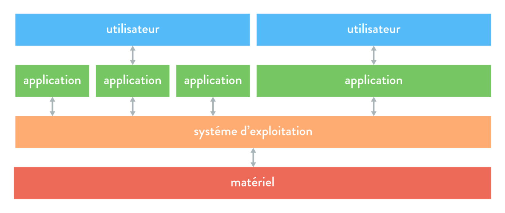
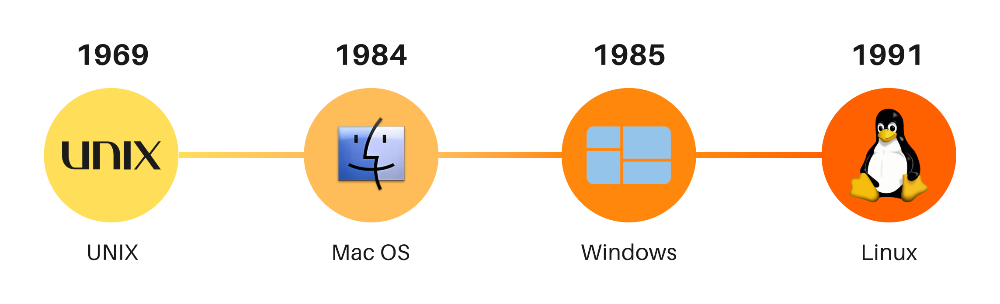

# Le système d'exploitation 💾

## 1 - Matériel et logiciels 🧩

Un ordinateur réunit deux mondes :

- le **matériel** (*hardware* en anglais) 🛠️ : le processeur, la mémoire vive, le disque, le clavier, l’écran, la carte réseau…
- les **logiciels** (*software* en anglais) 🎛️, que l’on appelle aussi **applications** : un navigateur web, un traitement de texte, un jeu…

Lorsqu’un utilisateur souhaite exécuter une **action** sur un ordinateur, il ne peut pas s’adresser directement au matériel. En effet, cela impliquerait d’utiliser un **langage de bas niveau**, complexe et réservé aux experts en informatique. Pour interagir avec la machine, l’utilisateur passe donc par :

- **un logiciel** (exemple : un navigateur web, un éditeur de texte…), ou
- **une interface de commande** ⌨️ (comme un terminal, qui permet de saisir des instructions).

Mais ce n’est pas tout. Un **ordinateur personnel** (ou *Personal Computer*, PC, en anglais) exécute **plusieurs logiciels simultanément** pour un utilisateur. Un **serveur**, quant à lui, va encore plus loin : il exécute plusieurs applications en parallèle et **sert plusieurs utilisateurs en même temps**.

Tous se partagent pourtant **les mêmes ressources matérielles** : un processeur, une mémoire, un disque… Il faut donc un programme qui fasse l’**intermédiaire** entre les logiciels et le matériel, et qui **répartisse** ces ressources de façon équilibrée. C’est le rôle du **système d’exploitation**.

---

## 2 - Définition d’un système d’exploitation 🖥️  

!!! definition "Définition : Système d'exploitation"
    Un **système d’exploitation** est un ensemble de programmes permettant de gérer les ressources matérielles et logicielles d’un ordinateur. Il sert d’interface entre l’utilisateur et la machine.

Le système d’exploitation se place entre le **matériel** et les **applications** : les applications ne s’adressent jamais directement au matériel, elles passent toujours par lui.
 

        

**Windows**, **macOS** ou encore **Linux** sont des systèmes d’exploitation pour ordinateurs fixes et portables. Nous en rencontrerons d’autres dans la suite.

!!! info "À retenir !" 
    Le système d’exploitation permet à l’utilisateur de transmettre des instructions à l’ordinateur **sans** avoir à manipuler directement le matériel.

    On le désigne souvent par l’abréviation **OS**, pour **Operating System** : c’est la traduction anglaise de **système d’exploitation**. Cette abréviation est couramment employée, y compris chez les francophones.

--- 

## 3 - Les fonctions d’un système d’exploitation ⚙️  

Le **système d’exploitation** assure plusieurs fonctions essentielles pour garantir le bon fonctionnement d’un ordinateur.  

#### Gestion des ressources 🔄

!!! definition "Définition : Processus"
    Un **processus** est un **programme en cours d’exécution**.

Pour permettre à l’utilisateur d’exécuter plusieurs applications simultanément **sans conflit**, le système d’exploitation gère l’accès des processus aux différentes **ressources matérielles** :  

- **Processeur** 🖥️ : il planifie et ordonne l’exécution des processus, en accordant à chacun un **temps d’accès** au processeur pour effectuer ses tâches ;
- **Mémoire vive** 💾 : il attribue à chaque processus une **zone de mémoire** pour stocker son code et ses données, puis la libère ;
- **Périphériques d’entrée/sortie** 🎛️ : il gère l’accès aux composants comme le clavier, la souris, la carte réseau…  *(Nous détaillerons ces notions ultérieurement.)*  

Cette gestion garantit une exécution fluide et optimisée des différentes applications.

#### Gestion des fichiers 📂  
Le système d’exploitation :  

- assure le **stockage des fichiers** sur le disque dur,  
- organise ce stockage pour une meilleure accessibilité,  
- matérialise le concept de fichier (*qui, à la base, est purement abstrait*),  
- permet de **manipuler les fichiers** comme des objets (déplacement, suppression, modification…).  

#### Gestion des utilisateurs et de leurs droits 👥  
- Un système d’exploitation peut gérer **plusieurs utilisateurs**,  
- il définit et applique des **droits d’accès** aux fichiers et aux ressources,  
- il sécurise les accès en fonction des autorisations attribuées à chaque utilisateur.  

!!! info "À retenir !"  
    Un système d’exploitation assure principalement la **gestion des ressources matérielles**, des **fichiers** et des **utilisateurs** afin de garantir un fonctionnement fluide et sécurisé de l’ordinateur.  

---

## 4 - Un peu d’histoire 🏛️  

#### Avant les années 50 : pas de système d’exploitation 📜  
Jusqu’aux années **1950**, les ordinateurs étaient réservés aux **programmeurs**, qui devaient interagir **directement** avec le matériel. Il **n’existait pas de système d’exploitation**, et les rôles de **programmeur** et d’**opérateur** étaient confondus.  

#### Les années 60 : naissance des premiers systèmes d’exploitation 🚀  
Avec l’arrivée des premiers **systèmes d’exploitation** dans les années **1960**, de nouvelles fonctionnalités apparaissent :  

- **Ordonnancement des tâches** 🗂️ pour optimiser l’utilisation des ordinateurs,  
- **Séparation des rôles** entre programmeurs et opérateurs pour améliorer l’organisation.  

#### Les années 70 : partage des ressources ⚡  
Dans les années **1970**, le développement des systèmes d’exploitation s’accélère. L’objectif principal est alors d’**optimiser** l’usage des calculateurs en permettant le **partage des ressources matérielles** entre plusieurs programmes exécutés simultanément.  

#### Depuis les années 80 : sophistication et interconnexion 🌍  
À partir des années **1980**, les systèmes d’exploitation deviennent **plus complexes et performants**, notamment grâce à :  

- l’**essor de la micro-informatique** 🖥️,  
- le développement des **réseaux locaux** et d’**Internet** 🌐,  
- l’**interconnexion** entre systèmes hétérogènes.  

!!! info "À retenir !"
    Les systèmes d’exploitation ont évolué pour répondre aux besoins croissants en termes de **gestion des ressources**, **efficacité** et **connectivité**.

!!! histoire "Repères historiques"
    - **1969** : Première version du système d'exploitation **Unix**. Un grand nombre de systèmes d'exploitation ultérieurs s'en inspirent.
    - **1984** : Première version du système d'exploitation graphique **Mac OS**, développé par Apple pour les ordinateurs personnels Macintosh. La souris existait depuis les années 1960, mais c'est avec le Macintosh qu'elle devient *grand public* : elle permet de naviguer dans l'interface autrement qu'avec des lignes de commande.
    - **1985** : Première version du système d'exploitation **Windows**, qui équipe aujourd'hui la grande majorité des ordinateurs personnels. 
    - **1991** : Première version du système d'exploitation **Linux**, qui est gratuit, open source et utilisé sur divers matériels informatiques.

    

--- 

## 5 - Les systèmes d’exploitation libres et propriétaires 💾

#### Des systèmes d’exploitation partout 🌐

Les **systèmes d’exploitation** sont nombreux. Sur leurs **ordinateurs personnels**, les particuliers comme les professionnels utilisent principalement :  

- **Windows** (développé par **Microsoft**),  
- **macOS** (développé par **Apple**),  
- **Linux** (moins répandu chez les particuliers mais souvent utilisé dans le monde professionnel).  

Les **appareils mobiles** tels que **tablettes et smartphones** possèdent également un système d’exploitation :  

- **Android** (développé par **Google**),  
- **iOS/iPadOS** (développés par **Apple**).  

!!! note "Infos"
    Il existe une multitude de systèmes d'exploitation pour une multitude d'objets ! On pensera, par exemple, à : 

    - Téléviseurs connectés : **webOS** (par LG), **Android TV** (par Google), **tvOS** (par Apple), ...
    - Montres connectées : **watchOS** (par Apple), **Wear OS** (par Google), ...
    - Réfrigérateurs connectés : **Family Hub** (par Samsung), **Hitachi Fridgee** (par Hitachi), ... 

#### Libre ou propriétaire ? 🔓

Bien que tous ces **systèmes d’exploitation** remplissent les **mêmes fonctions**, **certains sont libres tandis que d’autres sont propriétaires**.

!!! definition "Définition : Logiciel libre"
    Un **logiciel libre** (*open source* en anglais) est un logiciel dont le **code source est accessible et modifiable**.  
    Il peut être **consulté, modifié et redistribué sans restriction financière**.

Pour comprendre le cas d’Android, il nous faut une dernière notion :

!!! definition "Définition : Noyau"
    Le **noyau** (*kernel* en anglais) est le cœur du système d’exploitation : c’est la partie qui communique directement avec le matériel (processeur, mémoire, périphériques).

**Exemples :** 

- **Linux** est un système libre, offrant plusieurs variantes (appelées **distributions**) comme **Debian**, **Ubuntu** ou **Zorin OS**.  
- **Android** est **partiellement libre** : il repose sur le noyau Linux, mais certaines parties du système sont propriétaires.
- En opposition, **Windows, macOS et iOS** sont **des logiciels propriétaires** : leur code source est fermé et ils sont soumis à des licences restreintes.

!!! info "À retenir !"  
    **Linux est un système d’exploitation libre**, contrairement à **Windows** et **macOS**, qui sont des systèmes **propriétaires**.  

!!! tip "Astuce 💡"  
    Lors de l’achat d’un **ordinateur neuf**, un **système d’exploitation préinstallé** (Windows ou macOS) est souvent inclus dans le prix.  
    💰 **Il est possible d’acheter un ordinateur sans OS et d’y installer Linux gratuitement !**  
