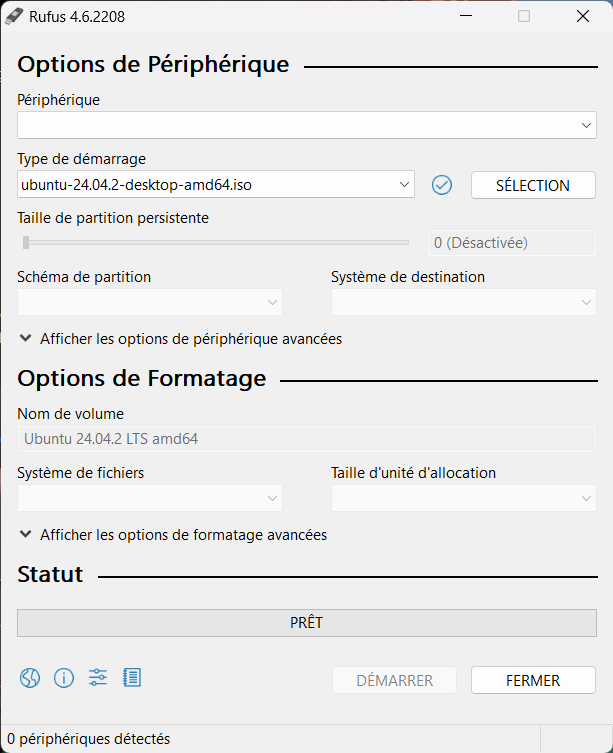
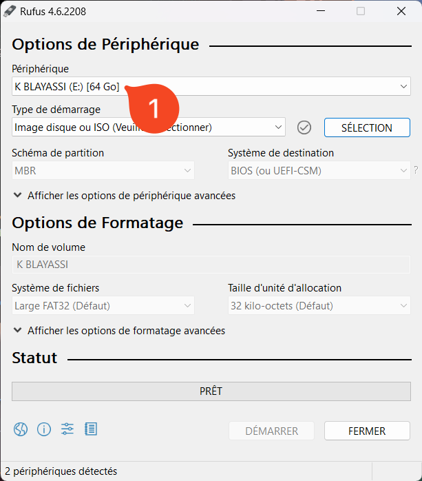
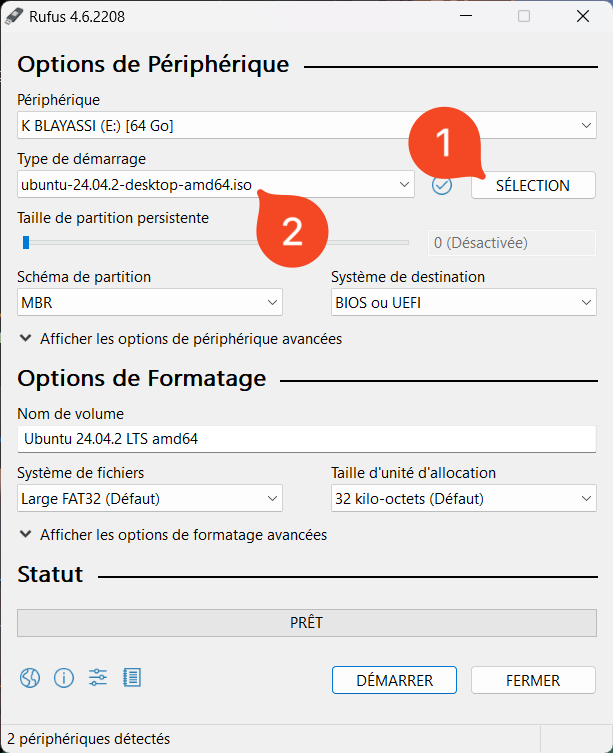
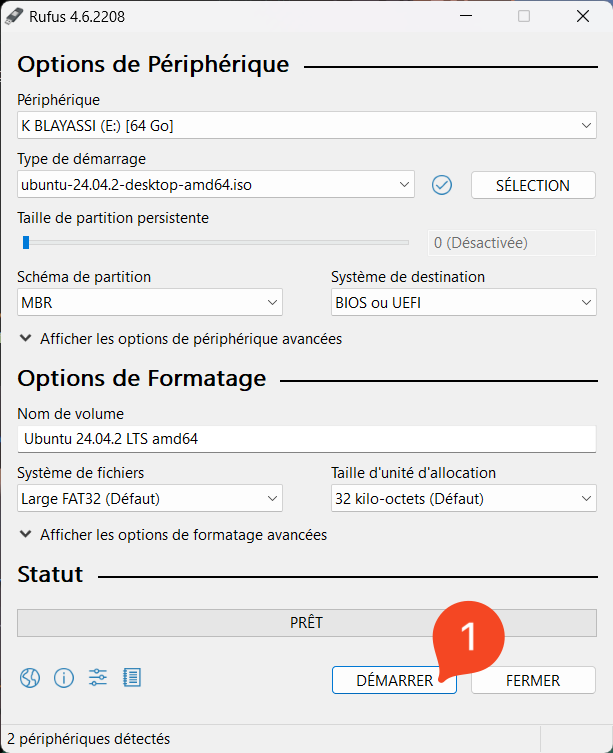
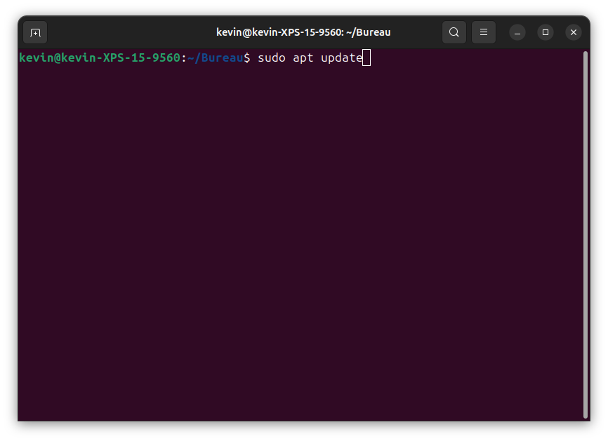
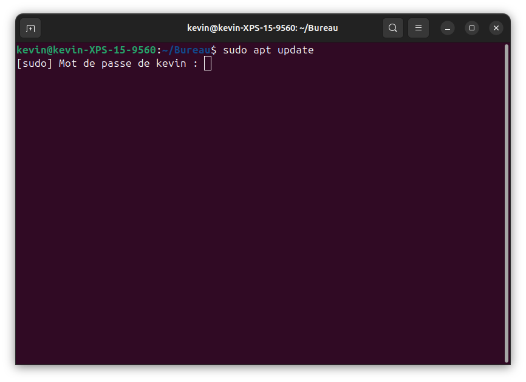
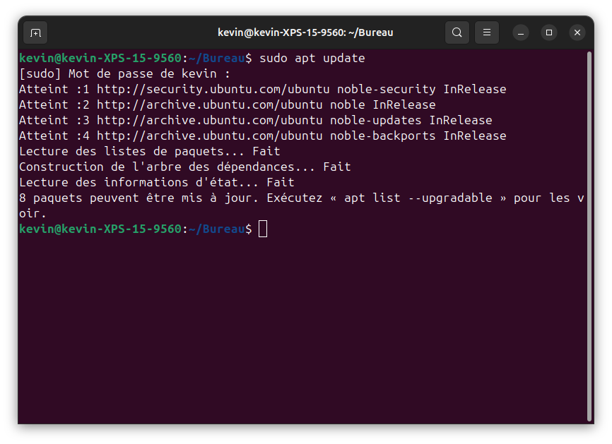
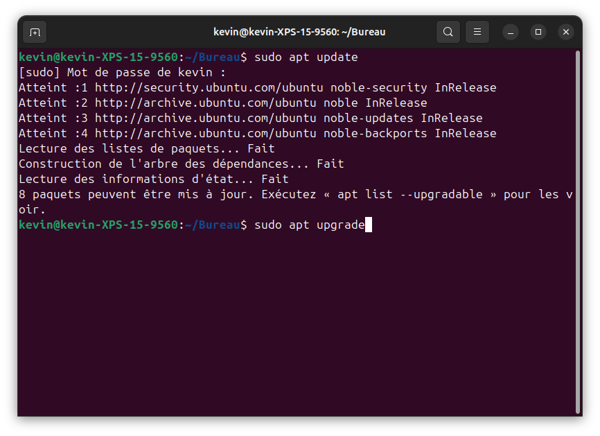
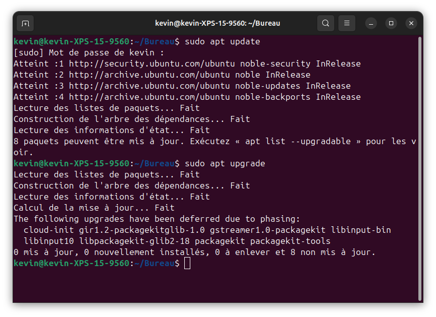

# Installation de Linux

## 🎯 Introduction  

Nous allons préparer un **environnement de travail portable** : un **disque dur externe** sur lequel on installe une **distribution Linux**, **Zorin OS**, à l'aide d'une **clé USB bootable**.

!!! info "Zorin OS, une distribution Linux"
    **Zorin OS** est une distribution Linux basée sur **Ubuntu**. Son interface ressemble à celle de Windows, ce qui facilite la prise en main. Nous utiliserons son édition gratuite, **Zorin OS Core**.

#### Pourquoi faire cela ? 💡
- **Découvrir Linux** : nous allons utiliser cet environnement tout au long de l’année en NSI.  
- **Travailler sur n’importe quel ordinateur** sans modifier le système installé.  
- **Apprendre à installer un OS** sur un support externe, une compétence essentielle en informatique.  

#### Objectifs du TP  📌
✅ Télécharger une image d’installation de Linux.  
✅ Créer une clé USB bootable.  
✅ Démarrer un ordinateur sur cette clé et installer Linux sur un disque dur externe.

#### Résultats 🚀 

À la fin de ce TP, vous serez capables d’utiliser un système Linux sans toucher au disque dur de votre machine.

👉 **Passons à la première étape !** ⬇️ 

---

## 1️⃣ Préparation

Pour réaliser ce TP, il vous faudra : 

- Une clé USB de 8 Go ou plus (son contenu sera **effacé**).
- Un disque dur ou SSD externe de 128 Go ou plus (pour avoir suffisamment de place). Son contenu sera lui aussi **effacé**.
- L'image (ISO) de **Zorin OS Core**, disponible gratuitement [ici :octicons-link-external-16:](https://zorin.com/os/download/).
- Le logiciel **Rufus** (sur Windows), disponible gratuitement [ici :octicons-link-external-16:](https://rufus.ie/fr/).

---

## 2️⃣ Création de la clé USB bootable

Nous allons copier l'image de Zorin OS sur la clé USB pour qu'un ordinateur puisse **démarrer** dessus.

1. Branchez la clé USB à l'ordinateur.

2. Lancez le logiciel **Rufus** téléchargé précédemment.

    

    
    
 

3. Dans la zone **Périphérique**, sélectionnez la clé USB.

    

    
    
 

4. Appuyez ensuite sur le bouton **SÉLECTION** et sélectionnez l'image ISO de Zorin OS téléchargée précédemment.

    

    
    

5. Finalement, appuyez sur le bouton **DÉMARRER** en bas. Si Rufus propose un mode d'écriture, gardez le mode recommandé (**ISO**).

    

    
    

6. Patientez... Le logiciel vous indiquera quand la tâche est terminée.

---

## 3️⃣ Installer Zorin OS

Notre clé USB bootable est prête ! Il ne reste plus qu'à démarrer dessus pour installer Zorin OS sur le disque dur externe.

1. Éteignez complètement votre ordinateur, la clé USB branchée.
2. Rallumez-le et ouvrez le **menu de démarrage** (boot menu) du BIOS : selon l'ordinateur, touche `F12`, `F2`, `Échap` ou `Suppr` juste après l'allumage. Choisissez la **clé USB**.
3. Dans le menu qui s'affiche, choisissez **Try or Install Zorin OS**, puis patientez (cela peut prendre plusieurs minutes).
4. Branchez le **disque dur externe** à l'ordinateur.
5. Sur le bureau de Zorin OS, lancez l'installation en cliquant sur **Install Zorin OS** (Installer Zorin OS).
6. **Langue** : choisissez **Français**, puis **Continuer**.
7. **Disposition du clavier** : choisissez **Français**. Vérifiez dans la zone de saisie que le clavier correspond bien au vôtre, puis **Continuer**.
8. **Réseau et mises à jour** : ne vous connectez pas à Internet pour le moment. Cochez l'installation des **logiciels tiers** (pilotes graphiques, Wi-Fi, formats multimédias) *(recommandé)*, puis **Continuer**.
9. **Type d'installation** : choisissez **Autre chose** (partitionnement manuel), puis **Continuer**.

    !!! warning "Attention au choix du disque 🚨"
        N'utilisez **surtout pas** l'option qui efface le disque : elle viserait le disque **interne** de l'ordinateur. Avec **Autre chose**, c'est vous qui choisissez le disque externe.

10. Repérez le **disque dur externe** dans la liste (grâce à sa taille). Sélectionnez-le aussi dans la zone **Périphérique où sera installé le programme de démarrage** (le chargeur d'amorçage).
11. Sélectionnez l'espace libre du disque externe, puis appuyez sur le bouton **+**. Dans la fenêtre qui s'ouvre, choisissez **système de fichiers journalisé ext4** dans *Utiliser comme* et **/** dans *Point de montage*. Validez avec **OK**, puis **Installer maintenant** et confirmez.
12. **Fuseau horaire** : choisissez **Paris**, puis **Continuer**.
13. **Compte utilisateur** : complétez votre nom, le nom de l'ordinateur, votre identifiant et votre mot de passe, puis **Continuer**.
14. Patientez pendant l'installation...
15. Quand l'installation est terminée, éteignez l'ordinateur.

<!-- Captures d'écran de l'installateur de Zorin OS à ajouter (étapes 6 à 13). -->

---

## 4️⃣ Premier démarrage

À ce stade, Zorin OS est installé sur notre disque dur externe. Nous allons démarrer dessus.

1. Une fois l'ordinateur éteint, retirez la clé USB (gardez le disque externe branché).
2. Allumez l'ordinateur et ouvrez le menu de démarrage du BIOS comme précédemment.
3. Sélectionnez le **disque dur externe** et validez avec la touche `Entrée`.
4. Dans le menu de démarrage de Linux, sélectionnez **Zorin OS** et appuyez à nouveau sur `Entrée`.
5. Connectez-vous avec votre identifiant et votre mot de passe.
6. Une fenêtre de bienvenue propose quelques réglages (mises à jour automatiques, confidentialité...). Ils sont facultatifs : vous pouvez les passer.

Félicitations ! Vous avez installé Zorin OS sur un disque dur externe !

Dans la suite, nous allons mettre le système à jour et installer un premier logiciel qui nous sera utile toute l'année...

---

## 5️⃣ Premiers pas

Si Linux n'a pas reconnu la connexion filaire du PC, commencez par vous connecter à Internet (par exemple via un partage de connexion) : cliquez sur la zone en **bas à droite** de l'écran, puis choisissez un réseau **Wi-Fi**.

1. Ouvrez un terminal avec le raccourci `Ctrl + Alt + T`.
2. Sur la première ligne, écrivez `sudo apt update`.

    

    
    

3. Appuyez sur la touche `Entrée` : votre mot de passe vous est demandé. Il ne s'affiche pas quand vous le tapez, c'est normal.

    

    
    

4. Patientez jusqu'à obtenir une nouvelle ligne colorée.

    

    
    

5. Saisissez `sudo apt upgrade` puis appuyez sur la touche `Entrée`.

    

    
    

6. Patientez, puis fermez le terminal lorsque la mise à jour est terminée. 

    

    
    

7. **LibreOffice** (traitement de texte, tableur…) est déjà installé avec Zorin OS Core : rien à faire.
8. Ouvrez l'application **Logiciels**, recherchez *Visual Studio Code* et appuyez sur **Installer**.

---

## 6️⃣ Explorer

Notre TP s'achève ici ! Prenez le temps de parcourir l'interface graphique et les différents menus. Nous continuerons à explorer les spécificités de ce système d'exploitation dans la suite du chapitre.
