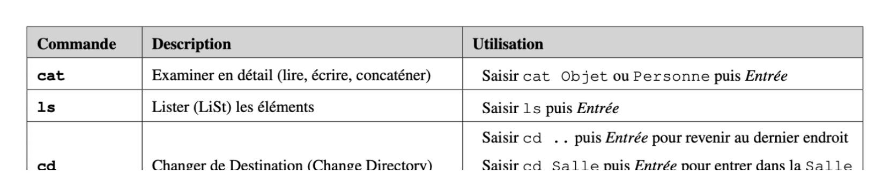
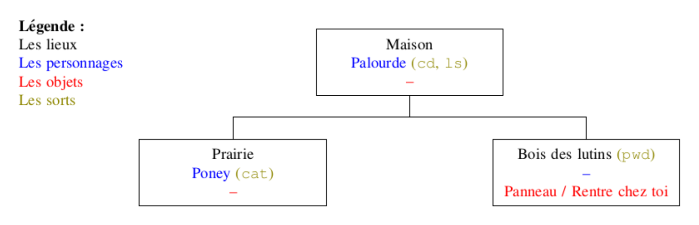

## 🎯 Introduction  

Après avoir créé un environnement Linux sur clé USB, nous allons maintenant **explorer les lignes de commande** à travers un **jeu interactif** 🎮  : **Terminus** 

#### Pourquoi faire cela ? 💡  
- **Découvrir l’univers du terminal Linux** de manière ludique.  
- **Apprendre les commandes de base** (navigation, manipulation de fichiers…).  
- **Comprendre l’intérêt de la ligne de commande** pour interagir efficacement avec un système.  

#### Objectifs du TP 📌  
✅ Se familiariser avec le terminal Linux à travers un jeu de rôle interactif.  
✅ Apprendre à naviguer dans un environnement en ligne de commande.  
✅ Manipuler des fichiers et exécuter des commandes essentielles.  

#### Résultats 🚀  
Vous serez plongés dans un monde où chaque commande vous aidera à progresser ! Prêt à relever le défi et à devenir un expert du terminal ?  

---

## 1️⃣ Consignes

Vous allez accéder dans quelques instants à l'univers fictif de Terminus. 

Dans ce jeu, tu vas incarner une personne qui devait effacer un fichier à tout prix, mais a oublié où se situait ce dernier. Il te faudra utiliser les **commandes Linux** que tu découvriras tout au long du chemin pour progresser dans le Terminal et localiser le fichier à effacer. 

Il va donc falloir vous laisser guider par le jeu, mais attention ! - vous devez noter sur un papier chaque nouvelle commande que vous apprenez. Vous pouvez par exemple construire un tableau de ce type :

    

Je vous recommande également de créer une "carte" du jeu au fur et à mesure que vous avancez dans l'histoire. Par exemple : 

    

--- 

## 2️⃣ Let's go !

👉 **Lancez [Terminus :octicons-link-external-16:](https://luffah.xyz/bidules/Terminus/) et commencez votre aventure !** 

??? tip "Quelques indices..."

    Si vous êtes bloqué durant votre aventure, ces quelques indices pourront peut-être vous aider...

    ??? tip "Le symbole ~ au clavier"
        Il se trouve sur la même touche que `2 é ~`. Il faut appuyer sur la barre espace pour le faire apparaître.

        En cas de problème, vous pouvez maintenir la touche `Alt` enfoncée et saisir `126`.
    
    ??? tip "Aide pour l'intriguant levier"
        Simplement saisir `./IntriguantLevier`.

    ??? tip "Pour libérer l'enfant"
        Déplacer l'enfant kidnappé (utilisez l'autocomplétion à cause de l'orthographe du jeu `EnfantKidnapé`) dans la cave des Trolls. Attention à bien indiquer le bon chemin.

    ??? tip "Pour trouver le mot de passe"
        Si vous voulez gagner du temps, vous pouvez lire cet article : [Les jokers et leurs utilisations :octicons-link-external-16:](https://www1.zonewebmaster.eu/serveur-debian-general/les-jokers-utilisation)

    ??? tip "Les mots de passe avec Linux"
        Lorsqu'on écrit un mot de passe dans le terminal (à la fin du jeu), on ne voit rien à l'écran. C'est normal, il s'agit d'une sécurité de Linux. Écrire le mot de passe ("dans le vide") puis appuyer sur la touche `Entrée`.
--- 

## 3️⃣ Restitution de votre travail

Une fois votre travail terminé, déposer votre tableau sur **EcoleDirecte**.