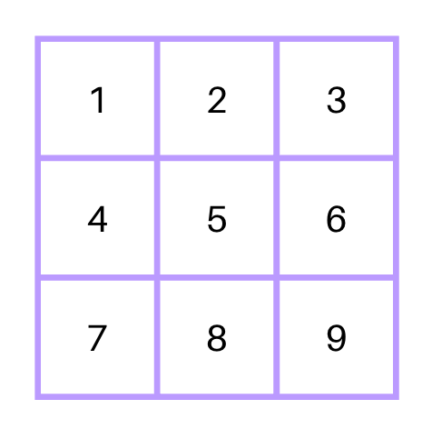
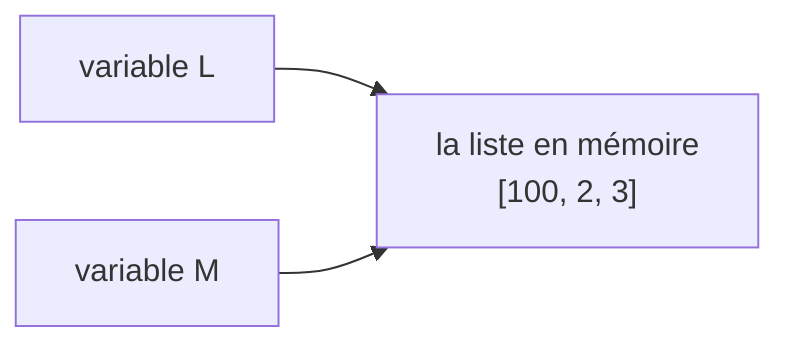

# Matrices et mémoire 🧮🧠

Nous savons créer, parcourir et modifier une liste. Deux questions restent en suspens :

- comment représenter un tableau **à deux dimensions**, comme une grille de jeu ou un tableau de notes ?
- que se passe-t-il **réellement** quand on écrit `M = L` ?

---

## Tableaux de tableaux : les matrices

Une liste peut contenir des nombres, des chaînes... et même **d'autres listes**. C'est tout ce dont nous avons besoin pour représenter un tableau à deux dimensions.

!!! definition "Définition : matrice"
    Une **matrice** est un tableau à **deux dimensions** : une liste dont chaque élément est une **ligne**, elle-même représentée par une liste.

Voici une grille de 3 lignes et 3 colonnes, et sa traduction en Python :

<div style="display: grid; grid-template-columns: repeat(auto-fit, minmax(260px, 1fr)); gap: 1rem; align-items: center;" markdown="1">

<div align="center" markdown="1">

</div>

```python title="Python" linenums="1"
M = [
    [1, 2, 3],
    [4, 5, 6],
    [7, 8, 9]
]
```

</div>

!!! warning "Restriction du programme"
    Dans le cadre du programme de NSI, toutes les lignes doivent avoir la **même taille**. On parle alors de matrices **homogènes**.

### Repérer une case

Chaque case est repérée par **deux** indices : d'abord sa ligne, ensuite sa colonne. Et, comme toujours, la numérotation commence à 0.

| | colonne 0 | colonne 1 | colonne 2 |
|:--|:--:|:--:|:--:|
| **ligne 0** | `M[0][0]` = 1 | `M[0][1]` = 2 | `M[0][2]` = 3 |
| **ligne 1** | `M[1][0]` = 4 | `M[1][1]` = 5 | `M[1][2]` = 6 |
| **ligne 2** | `M[2][0]` = 7 | `M[2][1]` = 8 | `M[2][2]` = 9 |

!!! python "Accéder à un élément"
    La syntaxe est `M[ligne][colonne]` :

    ```python linenums="1"
    print(M[0][1])   # 2  (ligne 0, colonne 1)
    print(M[2][0])   # 7  (ligne 2, colonne 0)
    M[1][1] = 50     # on remplace le 5 par 50
    ```

!!! tip "Comprendre `M[1][2]`"
    Lisez de gauche à droite, en deux temps :

    1. `M[1]` désigne la **ligne** d'indice 1, c'est-à-dire la liste `[4, 5, 6]` ;
    2. `[2]` désigne alors la case d'indice 2 **de cette ligne**, soit `6`.

    Une matrice n'a donc rien de mystérieux : c'est une liste, dont on ouvre ensuite l'un des éléments.

!!! warning "L'ordre ne s'invente pas"
    `M[0][2]` et `M[2][0]` ne désignent pas la même case ! On indique **toujours** la ligne en premier.

### Dimensions d'une matrice

!!! python "Nombre de lignes et de colonnes"
    `len(M)` compte les éléments de `M`... et ces éléments sont les **lignes**. Pour compter les **colonnes**, on mesure donc la longueur de l'une d'elles :

    ```python linenums="1"
    print(len(M))      # 3  : le nombre de LIGNES
    print(len(M[0]))   # 3  : le nombre de COLONNES (la longueur d'une ligne)
    ```

### Parcourir une matrice

Deux façons de procéder, selon que l'on travaille sur des **lignes entières** ou sur des **cases** individuelles.

!!! python "Parcours par ligne"
    Une seule boucle suffit : à chaque tour, la variable de boucle contient une ligne entière, c'est-à-dire une liste.

    {{ python_playground(
      key="ch4-cours-matrice-ligne",
      hauteur="200px",
      example_file="files/NSI/Python/exemples/ch4/cours_matrice_ligne.py"
    ) }}

!!! python "Parcours case par case"
    Il faut cette fois **deux boucles imbriquées** : la première choisit la ligne, la seconde la colonne.

    {{ python_playground(
      key="ch4-cours-matrice-case",
      hauteur="220px",
      example_file="files/NSI/Python/exemples/ch4/cours_matrice_case.py"
    ) }}

!!! expert "Pour aller plus loin : exploiter une matrice"
    Deux usages très courants des doubles boucles.

    **1. Additionner toutes les valeurs.** On retrouve le schéma de l'accumulateur, avec deux boucles au lieu d'une :

    ```python linenums="1"
    def somme_matrice(M):
        total = 0
        for i in range(len(M)):
            for j in range(len(M[i])):
                total = total + M[i][j]
        return total

    print(somme_matrice(M))   # 45
    ```

    **2. Construire une matrice par compréhension.** Les compréhensions s'imbriquent, elles aussi : celle de l'extérieur fabrique les lignes, celle de l'intérieur les cases.

    ```python linenums="1"
    # Une matrice 3x4 remplie de zéros
    Z = [[0 for j in range(4)] for i in range(3)]

    # La table de multiplication 3x3
    T = [[i * j for j in range(3)] for i in range(3)]
    ```

---

## Ce qui se passe dans la mémoire

Passons maintenant de l'autre côté du décor : où sont réellement rangées nos listes ?

### La mémoire est une suite de cases numérotées

!!! definition "Définition : adresse mémoire"
    La mémoire vive (RAM) est une longue suite de **cases**, chacune identifiée par un numéro unique appelé son **adresse**.

Imaginez une rue interminable de maisons numérotées : pour livrer un colis, nul besoin de parcourir la rue, le numéro suffit à s'y rendre directement.

Les éléments d'une liste sont rangés dans un **bloc de cases qui se suivent** :

| Adresse | 1000 | 1001 | 1002 | 1003 |
|:--------|:----:|:----:|:----:|:----:|
| Contenu | `12` | `15` | `8` | `18` |
| Se lit  | `notes[0]` | `notes[1]` | `notes[2]` | `notes[3]` |

!!! tip "Pourquoi les indices commencent-ils à 0 ?"
    Parce qu'un indice ne compte pas les éléments (« le premier », « le deuxième »), mais indique **combien de cases il faut sauter** depuis le début du bloc.

    Pour atteindre le premier élément, il n'y a rien à sauter : son indice est donc **0**. Pour le deuxième, on saute une case : indice 1. Et ainsi de suite jusqu'au dernier, d'indice $n-1$.

### Une variable est une étiquette, pas une boîte

Voici maintenant le piège le plus célèbre — et le plus déroutant — des listes.

!!! example "Un résultat surprenant"
    Lisez ce programme et prévoyez son affichage avant de poursuivre :

    ```python linenums="1"
    L = [1, 2, 3]
    M = L          # « je copie L dans M »... vraiment ?
    M[0] = 100
    print(L)       # [100, 2, 3]  😱
    ```

    Nous n'avons jamais touché à `L`, et pourtant `L` a changé !

L'explication tient en une phrase : **l'instruction `M = L` ne copie pas la liste, elle donne un second nom à la même liste.**

Une variable ne *contient* pas la liste : elle *pointe vers* l'endroit de la mémoire où celle-ci se trouve. `M = L` ne recopie que cette adresse — pas les valeurs.



!!! definition "Définition : alias"
    Deux variables sont des **alias** lorsqu'elles désignent le même objet en mémoire. Toute modification faite à travers l'une est visible à travers l'autre.

!!! python "Vérifier avec `is` et `id()`"
    La fonction `id()` révèle l'identifiant de l'objet en mémoire, et l'opérateur `is` compare ces identifiants.

    ```python linenums="1"
    L = [1, 2, 3]
    M = L             # un alias
    N = [1, 2, 3]     # une autre liste, au contenu identique

    print(id(L) == id(M))   # True  : c'est le même objet
    print(id(L) == id(N))   # False : deux objets distincts

    print(L == M)     # True  : même contenu
    print(L is M)     # True  : ... et même objet !
    print(L == N)     # True  : même contenu
    print(L is N)     # False : mais deux objets différents
    ```

!!! propriete "`==` ou `is` ?"
    - `==` compare les **contenus** : « ces deux listes se ressemblent-elles ? »
    - `is` compare les **identités** : « est-ce la même liste ? »

    Dans vos programmes, c'est presque toujours `==` qu'il faut utiliser.

### Copier vraiment une liste

!!! python "Trois façons de copier"
    Pour obtenir une liste indépendante, il faut le demander explicitement :

    ```python linenums="1"
    M = L.copy()     # la méthode dédiée (la plus lisible)
    M = L[:]         # une tranche reprenant toute la liste
    M = list(L)      # une reconstruction à partir de L
    ```

    ```python linenums="1"
    L = [1, 2, 3]
    M = L.copy()
    M[0] = 100
    print(L)         # [1, 2, 3]  ✅ L est intact
    print(L is M)    # False      ✅ deux objets bien distincts
    ```

!!! warning "Le même piège dans les fonctions"
    Quand vous passez une liste à une fonction, c'est **l'adresse** qui est transmise : la fonction travaille donc sur *votre* liste.

    ```python linenums="1"
    def ajouter_zero(tableau):
        tableau.append(0)      # modifie la liste de l'appelant !

    notes = [12, 15]
    ajouter_zero(notes)
    print(notes)               # [12, 15, 0]
    ```

    Ce n'est ni un bug, ni interdit — c'est même parfois exactement ce que l'on veut. Mais il faut le **savoir**. Si vous préférez ne rien modifier, travaillez sur une copie.

!!! expert "Pour aller plus loin : copier une matrice"
    `copy()` recopie la liste... mais pas les listes qu'elle contient ! Les lignes d'une matrice restent donc partagées :

    ```python linenums="1"
    M = [[1, 2], [3, 4]]
    N = M.copy()
    N[0][1] = 99
    print(M)          # [[1, 99], [3, 4]]  😱 encore raté
    ```

    On parle de **copie superficielle**. Pour une matrice, il faut recopier chaque ligne :

    ```python linenums="1"
    N = [ligne.copy() for ligne in M]
    ```

---

## À retenir 📌

!!! info "Résumé"
    - Une **matrice** est une **liste de listes** : `M[i][j]` désigne la case de la ligne `i` et de la colonne `j`, **dans cet ordre**.
    - `len(M)` donne le nombre de **lignes**, `len(M[0])` le nombre de **colonnes**.
    - On parcourt une matrice avec **deux boucles imbriquées**.
    - La mémoire est une suite de cases repérées par leur **adresse** ; une liste occupe un bloc de cases qui se suivent, et l'indice indique **combien de cases sauter** — d'où des indices qui commencent à **0**.
    - `M = L` ne copie **pas** la liste : les deux variables deviennent des **alias** du même objet. `==` compare les contenus, `is` compare les identités.
    - Pour une copie réelle : `L.copy()`, `L[:]` ou `list(L)` — et une copie **ligne par ligne** pour une matrice.
