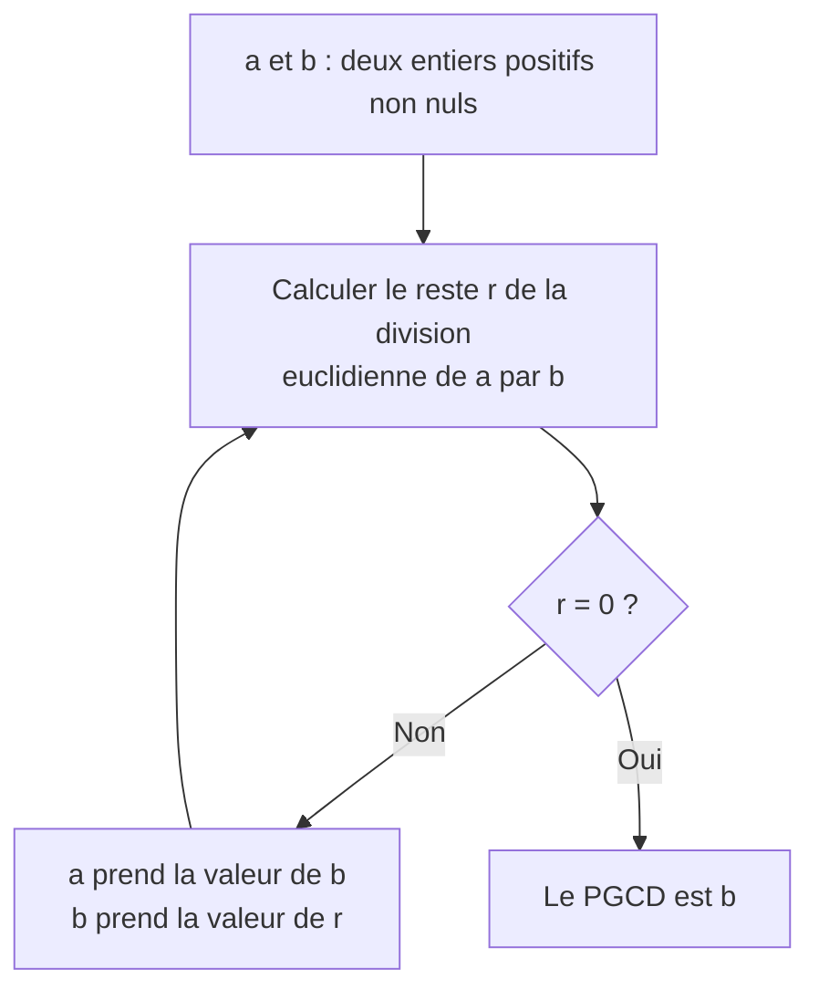

# TP1 — De l'algorithme au programme 🧮

L'algorithme de calcul du **PGCD** (Plus Grand Commun Diviseur) de deux entiers positifs non nuls a été proposé par le mathématicien grec **Euclide**, il y a plus de deux mille ans. Il est très utile pour simplifier une fraction.

Par exemple, $\text{PGCD}(48, 36) = 12$, ce qui permet d'écrire :

$$\frac{36}{48} = \frac{3 \times 3 \times 4}{2 \times 2 \times 3 \times 4} = \frac{3}{4}$$

Voici l'algorithme d'Euclide, présenté sous forme d'**organigramme** :



---

## 1 - Dérouler l'algorithme

**Question 1.** En vous aidant de l'organigramme, calculer le PGCD de 782 et 221 par la méthode d'Euclide. Recopier et compléter le tableau ci-dessous en faisant figurer **toutes** les valeurs intermédiaires prises par les trois variables.

| `a` | `b` | `r` |
|:---:|:---:|:---:|
| 782 | 221 | 119 |
| ...... | ...... | ...... |
| ...... | ...... | ...... |
| ...... | ...... | ...... |

💡 L'opérateur Python `%` vous aidera : `a % b` renvoie le reste de la division euclidienne de `a` par `b`. Vous pouvez le tester dans l'éditeur plus bas.

**Question 2.** En observant la structure de l'organigramme, justifier le caractère **itératif** de cet algorithme. Qu'apportent ces itérations ?

??? success "Correction"
    **1.**

    | `a` | `b` | `r` |
    |:---:|:---:|:---:|
    | 782 | 221 | 119 |
    | 221 | 119 | 102 |
    | 119 | 102 | 17 |
    | 102 | 17 | 0 |

    Le reste devient nul : le PGCD est le dernier `b`, soit **17**.

    **2.** L'organigramme contient une **flèche de retour** : après avoir remplacé `a` par `b` et `b` par `r`, on revient au calcul du reste. Ce retour en arrière est la marque d'une **itération**, c'est-à-dire d'une boucle.

    Ces itérations permettent de répéter le même calcul sur des nombres de plus en plus petits, jusqu'à tomber sur un reste nul — et ce **sans savoir à l'avance** combien de répétitions seront nécessaires. C'est donc une boucle **non bornée**, un `tant que`.

---

## 2 - Traduire en pseudo-code

!!! info "Comment écrire un algorithme en pseudo-code ?"
    Le **pseudo-code** est une façon de décrire un algorithme en langage presque naturel, sans référence à un langage de programmation en particulier. Voici les conventions que nous retiendrons :

    - préciser les **spécifications** en dehors de l'algorithme. Par exemple :
        - *En entrée* : deux nombres entiers positifs `a` et `b` non nuls.
        - *En sortie* : renvoie le PGCD de `a` et de `b`.
    - **indenter** le bloc d'instructions d'une boucle ou d'une fonction ;
    - utiliser le symbole `←` pour l'**affectation** ;
    - les tableaux commencent à 0 ; on accède à l'élément d'indice `i` avec `tableau[i]` ;
    - placer les arguments d'une fonction entre **parenthèses** ;
    - utiliser des noms de variable ou de fonction **explicites** ;
    - ne mettre que des instructions **génériques**, indépendantes de tout langage de programmation.

**Question 3.** En vous aidant de ces conventions, traduire l'organigramme en un algorithme écrit en pseudo-code.

??? success "Correction"
    ```text linenums="1"
    Algorithme pgcd

    Entrées :
        a, un entier positif non nul
        b, un entier positif non nul

    r ← reste de la division de a par b
    Tant que r ≠ 0 :
        a ← b
        b ← r
        r ← reste de la division de a par b
    Fin Tant que

    Renvoyer b

    Sortie :
        le PGCD de a et de b
    ```

    Remarquez que le pseudo-code est la **traduction fidèle** de l'organigramme : chaque boîte devient une instruction, le losange devient la condition du `tant que`, et la flèche de retour devient la boucle elle-même.

---

## 3 - Passer au programme

**Question 4.** Écrire une fonction Python `pgcd(a, b)` qui implémente l'algorithme d'Euclide.

{{ python_playground(
  key="ch4-tp-pgcd",
  hauteur="260px",
  example_file="files/NSI/Python/exemples/ch4/tp_pgcd.py",
  solution_file="files/NSI/Python/.corrections/ch4/tp_pgcd_solution.py",
  tests_file="files/NSI/Python/.corrections/ch4/tp_pgcd_tests.py"
) }}

**Question 5.** Écrire l'appel de la fonction qui permet de calculer le PGCD de 782 et de 221. Le résultat correspond-il à votre tableau de la question 1 ?

**Question 6.** Que renvoie l'appel `pgcd(221, 782)` ? Expliquer.

??? success "Correction des questions 5 et 6"
    **5.** On écrit `pgcd(782, 221)`, qui renvoie bien **17**.

    **6.** L'appel `pgcd(221, 782)` renvoie **également 17** — et c'est heureux, puisque le PGCD ne dépend pas de l'ordre des deux nombres.

    Ce qui est intéressant, c'est **comment** l'algorithme s'en sort. Au premier tour, `r` vaut `221 % 782`, c'est-à-dire `221` lui-même, puisque 221 est plus petit que 782. On affecte alors `a ← 782` et `b ← 221` : l'algorithme s'est **remis tout seul dans le bon ordre**, au prix d'un unique tour de boucle supplémentaire. Aucun test préalable n'est nécessaire.

---

!!! info "Ce qu'il faut retenir de ce TP"
    Nous venons de parcourir les trois étapes qui mènent d'une idée à un programme :

    1. un **organigramme**, qui décrit la méthode visuellement ;
    2. un **algorithme en pseudo-code**, indépendant de tout langage ;
    3. un **programme Python**, exécutable par la machine.

    L'algorithme est la **méthode** ; le programme n'en est qu'une **traduction** parmi d'autres. C'est cette distinction qui structure toute la partie suivante — et vous y retrouverez systématiquement le pseudo-code à gauche et Python à droite.
