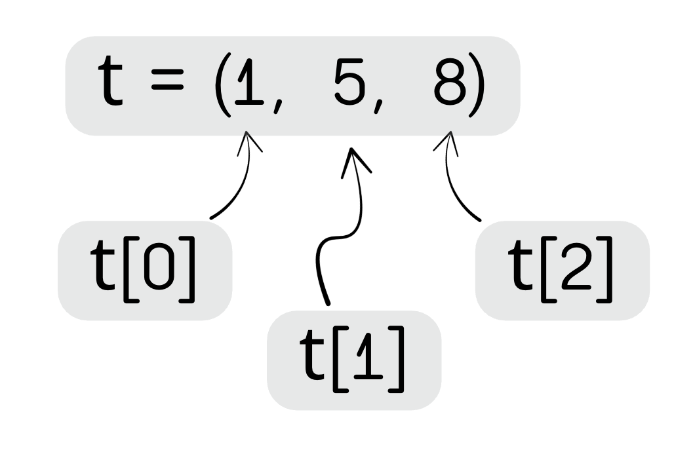

# Les p-uplets (tuples) 🎁

Les **p-uplets**, appelés *tuples* en Python, permettent de regrouper plusieurs valeurs dans un seul objet.  
Contrairement aux listes, que nous verrons dans la partie suivante, **ils ne sont pas modifiables**.

!!! definition "Définition : p-uplet"
    Un **p-uplet** (ou *tuple* en anglais) est une collection ordonnée d'éléments, appelés *composantes* ou *termes*. 

    Chaque terme peut être de n'importe quel type.

On parlera d'un *couple* ou d'un *doublet* pour un p-uplet de 2 éléments ($p=2$), d'un *triplet* pour un p-uplet de 3 éléments ($p=3$), etc.

!!! warning "Immuable"
    Les p-uplets sont **immuables** : on ne peut pas changer leurs composantes après création.

!!! python "Type d'un p-uplet"
    En Python, un **p-uplet** est de type `tuple`.

---

## Créer un p-uplet

!!! python "Syntaxe d'un p-uplet"
    En python, un p-uplet s'écrit avec des parenthèses :

    ```python linenums="1"
    t = (5, 10, 15)
    ```

    On peut mélanger différents types :

    ```python linenums="1"
    info = ("Alice", 23, True)
    ```

!!! info "Syntaxe alternative"
    En python, les parenthèses ne sont pas obligatoires, mais elles restent fortement conseillées pour la lisitibilité du code.

    Par exemple, on peut donc écrire : 

    ```python linenums="1"
    t = 5, 10, 15
    ```

!!! info "p-uplet d'un seul élément"
    Même si ce cas de figure est rare, il est possible de créer un p-uplet contenant un seul élément. 

    Ce dernier doit tout de même s'écrire avec une virgule afin d'éviter toute confusion avec les parenthèses d'une expression mathématique.

    ```python linenums="1"
    a = (1)
    print("Le type de a est : ",type(a))
    b = (1,)
    print("Le type de b est : ",type(b))
    ```
    ```
    Le type de a est : int
    Le type de b est : tuple
    ```

---

## Indexation des éléments

Les éléments d'un p-uplet sont **indexés** afin de permettre un accés rapide à chaque composante. 

!!! definition "Index"
    On appelle **index** d'une composante sa position dans le p-uplet. 

!!! warning "Index d'un p-uplet"
    Pour un p-uplet de $n$ éléments, les termes sont **indexés** de $0$ à $n-1$. 


!!! python "Accéder à un éléments d'un p-uplet"
    On considère le p-uplet ci-dessous : 

    <div align="center">
        
    </div>

    - `t[0]` désigne la première composante, `t[1]` la seconde, ...
    - `t[-1]` désigne la dernière composante.

!!! expert "Pour aller plus loin : p-uplet nommé"
    Un **p-uplet nommé** permet d’accéder aux valeurs par nom de champ, au lieu des indices.

    Ce type de p-uplet n'existe pas en Python : c'est le **dictionnaire** qui joue ce rôle, comme nous le verrons dans la partie qui lui est consacrée.

---

## Longueur d'un p-uplet

Il existe une fonction native de Python nous permettant d'obtenir le nombre d'élément d'un p-uplet : 

!!! python "Fonction `len()`"
    Soit `t` un p-uplet, la fonction `len(t)` renvoie le nombre d'élément du p-uplet.

    Par exemple : si `t=(1,2,3)`, alors `len(t)` vaudra 3. 

---

## Une fonction qui renvoie un p-uplet

Parfois, il sera indispensable pour une fonction de retourner plusieurs valeurs. On utilisera alors un p-uplet ou une liste. 

!!! example "Fonction `milieu` "
    On souhaite créer une fonction qui prend en paramètre les coordonnées de deux points $A(x_A, y_A)$ et $B(x_B,y_B)$.

    ``` python linenums="1"
    def milieu(A: tuple, B:tuple) -> tuple:
        """
        Renvoie les coordonnées du milieu du segment [AB]

        Arguments: 
            - A : 2-uplet contenant les coordonnées de A
            - B : 2-uplet contenant les coordonnées de B
        
        Retourne:
            - I : 2-uplet contenant les coordonnées du milieu de [AB]
        """
        assert len(A)==2, "Le point A doit avoir 2 coordonnées seulement"
        assert len(B)==2, "Le point B doit avoir 2 coordonnées seulement"
        
        xI = (A[0]+B[0])/2
        yI = (A[1]+B[1])/2

        return (xI, yI)
    ```

    On peut ensuite exploiter le résultat de cette fonction de deux manières différentes : 

    - **Avec un p-uplet** : 

        ```python linenums="1"
        A = (0,0)
        B = (5,6)
        coordo_milieu = milieu(A, B)
        ```
        
        Ici, la variable `coordo_milieu` est un `tuple` contenant les coordonnées du milieu. `coordo_milieu[0]` contient l'abscisse et `coordo_milieu[1]` contient l'ordonnée. 
    - **Avec deux variables** : 

        ```python linenums="1"
        A = (0,0)
        B = (5,6)
        xI, yI = milieu(A, B)
        ```

        Ici, on récupère le résultat de la fonction dans deux variables distinctes `xI` et `yI`. 

---

## Convertir un p-uplet en liste

Un p-uplet et une liste se ressemblent beaucoup : ce sont deux séquences ordonnées et indexées. Seule l'**immuabilité** les sépare. Il est donc naturel de vouloir passer de l'un à l'autre.

!!! python "Les fonctions `list()` et `tuple()`"
    La fonction `list()` fabrique une liste à partir d'un p-uplet, et `tuple()` fait le chemin inverse :

    ```python linenums="1"
    coordonnees = (1, 2, 3)

    L = list(coordonnees)   # [1, 2, 3]  : une liste, donc modifiable
    L[0] = 100              # autorisé !

    T = tuple(L)            # (100, 2, 3) : de nouveau un p-uplet
    ```

!!! tip "À quoi cela sert-il ?"
    C'est la technique classique pour « modifier » un p-uplet, qui ne se modifie pourtant jamais : on le convertit en liste, on travaille dessus, puis on reconstruit un p-uplet.

    Vous avez déjà rencontré exactement ce détour au chapitre sur les listes, pour « modifier » une chaîne de caractères — qui est, elle aussi, immuable.

---

## À retenir 📌

!!! info "Résumé"
    - Un **p-uplet** est un ensemble **ordonné immuable**.
    - Les **composantes** sont accessibles par **indices**.
    - Un p-uplet nommé associe des valeurs à des champs explicites.
    - Une fonction peut renvoyer un p-uplet pour transmettre plusieurs résultats.