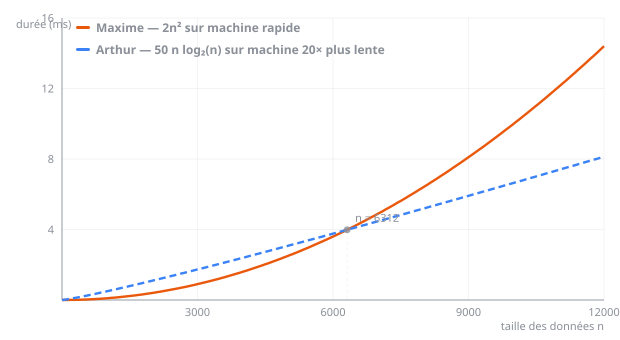

# Exercices 

Vous trouverez ci-dessous les exercices de cette séquence.

- Les exercices marqués avec :fontawesome-solid-pencil: se réalisent **sans ordinateur**.  
  Ceux indiqués par :fontawesome-solid-laptop: nécessitent **un ordinateur**.

- Le **niveau de difficulté** est indiqué par des étoiles :  
    <ul style="list-style: none;">
        <li>:fontawesome-solid-star: :fontawesome-regular-star: :fontawesome-regular-star: → Exercices pour **s'approprier les notions**.</li>
        <li>:fontawesome-solid-star: :fontawesome-solid-star: :fontawesome-regular-star: → Exercices pour **renforcer vos compétences**.</li>
        <li>:fontawesome-solid-star: :fontawesome-solid-star: :fontawesome-solid-star: → Exercices pour vous **challenger** et tester vos acquis.</li>
    </ul>

Les corrections sont généralement disponibles, mais elles ne doivent être consultées **qu'après validation de votre production par l'enseignant**.

---

## Coût d'un algorithme 

!!! exoordi "Exercice 1 - Classer les complexités - :fontawesome-solid-star: :fontawesome-regular-star: :fontawesome-regular-star:" 
    En utilisant l'interface « Complexité », [disponible ici](https://www.cahier-nsi.fr/complexite/), classer les temps d'exécution des algorithmes suivants de 1 (rapide) à 7 (extrêmement lent).

    | Complexité | $n^2$ | $n!$ | $n \cdot \log(n)$ | $\log(n)$ | $2^n$ | $n$ | $n^{\frac{3}{2}}$ |
    |------------|-------|------|-------------------|-----------|-------|-----|-------------------|
    | Classement | ...... | ...... | ...... | ...... | ...... | ...... | ...... |

    ??? success "Correction"
        | Complexité | $n^2$ | $n!$ | $n \cdot \log(n)$ | $\log(n)$ | $2^n$ | $n$ | $n^{\frac{3}{2}}$ |
        |------------|-------|------|-------------------|-----------|-------|-----|-------------------|
        | Classement | 4 | 7 | 3 | 1 | 6 | 2 | 5 |

!!! exoordi "Exercice 2 - Des durées d'exécution très concrètes - :fontawesome-solid-star: :fontawesome-solid-star: :fontawesome-regular-star:" 
    On considère ici un problème de taille $n = 10^6$ (par exemple, un tableau avec un million de données), traité avec un ordinateur capable d'effectuer $10^9$ opérations élémentaires par seconde. Le tableau ci-dessous propose de calculer la durée d'exécution de cet algorithme, en fonction de sa complexité.

    On indique que $\log_2(n) = \dfrac{\log(n)}{\log(2)}$.

    | Nom de la complexité | Notation $O$ | Durée de l'exécution de l'algorithme | Commentaire |
    |----------------------|--------------|---------------------------------------|-------------|
    | Temps constant | $O(1)$ | 1 ns | Le temps d'exécution ne dépend pas de la taille $n$ du problème |
    | ...... | $O(\log_2(n))$ | $\dfrac{\log_2(10^6)}{10^9} \approx 20 \text{ ns}$ | Quasi instantané |
    | ...... | $O(n)$ | ...... | ...... |
    | Quasi linéaire | $O(n \cdot \log_2(n))$ | ...... | ...... |
    | ...... | $O(n^2)$ | ...... | ...... |
    | ...... | $O(n^3)$ | ...... | ...... |
    | Polynomiale | $O(n^k)$ avec $k > 3$ | Pour $k = 4$ : ...... | ...... |
    | ...... | $O(2^n)$ | ...... | ...... |
    | ...... | $O(n!)$ | ...... | ...... |

    1. Compléter la première colonne en recherchant sur le Web le nom de chaque complexité.

    2. Compléter enfin les deux dernières colonnes en calculant le temps d'exécution des différents algorithmes, avec chaque modèle de complexité.

    3. Un GPS muni d'un processeur capable d'effectuer 800 000 calculs élémentaires par seconde doit traiter une carte routière composée de 100 000 entrées. Quelles sont les complexités envisageables pour l'algorithme afin que les calculs de route puissent être menés en temps réel pendant le déplacement du véhicule ?

    ??? success "Correction"
        **2. Noms et durées d'exécution pour $n = 10^6$ et $10^9$ op/s :**

        | Nom de la complexité | Notation $O$ | Durée | Commentaire |
        |----------------------|--------------|-------|-------------|
        | Temps constant | $O(1)$ | 1 ns | Indépendant de $n$ |
        | Logarithmique | $O(\log_2(n))$ | $\approx 20$ ns | Quasi instantané |
        | Linéaire | $O(n)$ | $\dfrac{10^6}{10^9} = 1$ ms | Très rapide |
        | Quasi linéaire | $O(n \cdot \log_2(n))$ | $\approx 20$ ms | Rapide |
        | Quadratique | $O(n^2)$ | $\dfrac{10^{12}}{10^9} \approx 16$ min | Lent |
        | Cubique | $O(n^3)$ | $\dfrac{10^{18}}{10^9} \approx 31$ ans | Très lent |
        | Polynomiale ($k=4$) | $O(n^4)$ | $\dfrac{10^{24}}{10^9} \approx 3 \times 10^7$ ans | Inutilisable |
        | Exponentielle | $O(2^n)$ | Astronomique | Totalement inutilisable |
        | Factorielle | $O(n!)$ | Astronomique | Totalement inutilisable |

        **3.** Pour un GPS avec 800 000 op/s et $n = 100\,000$ entrées, le calcul doit s'effectuer en temps réel (moins d'une seconde). Les complexités envisageables sont :

        - $O(1)$, $O(\log_2(n))$, $O(n)$ et $O(n \cdot \log_2(n))$ sont acceptables.
        - $O(n^2)$ donne $\dfrac{(10^5)^2}{8 \times 10^5} \approx 12\,500$ s → trop lent.
        
        Seules les complexités **constante, logarithmique, linéaire et quasi-linéaire** sont envisageables.

!!! exoordi "Exercice 3 - Deux façons de calculer une puissance - :fontawesome-solid-star: :fontawesome-solid-star: :fontawesome-regular-star:" 
    Reprenons les algorithmes 1 et 2 de calcul de $x^n$ : 

    ```text title="Algorithme 1"
    Algorithme : puissance1(x, n)
    p ← 1
    pour i allant de 1 à n
    p ← p * x
    renvoyer p
    ```

    ```text title="Algorithme 2"
    Algorithme : puissance2(x, n)
    p ← 1
    tant que n > 0
    si n est impair alors
        p ← p * x
    x ← x * x
    n ← n // 2
    renvoyer p
    ```

    1. Écrire une fonction Python `puissance1(x, n)` qui implémente l'algorithme 1 et qui renvoie la valeur de $x^n$.
    2. Écrire une fonction Python `puissance2(x, n)` qui implémente l'algorithme 2.
    3. En utilisant le module Python `time`, comparer les durées d'exécution des deux fonctions.
    4. Ces résultats sont-ils en accord avec la complexité attendue ?

    {{ python_playground(
      key="ch9-a-puissance",
      hauteur="420px",
      example_file="files/NSI/Python/exemples/ch9/a_puissance.py",
      solution_file="files/NSI/Python/.corrections/ch9/a_puissance_solution.py",
      tests_file="files/NSI/Python/.corrections/ch9/a_puissance_tests.py"
    ) }}

    ??? success "Correction"
        **1.** `puissance1` suit l'algorithme 1 : une boucle de $n$ tours, chacun effectuant une multiplication → complexité $O(n)$ :

        ```python
        def puissance1(x, n):
            p = 1
            for i in range(1, n + 1):
                p = p * x
            return p
        ```

        **2.** `puissance2` suit l'algorithme 2 : à chaque tour on divise $n$ par 2 → le nombre de tours est $\log_2(n)$ → complexité $O(\log_2(n))$ :

        ```python
        def puissance2(x, n):
            p = 1
            while n > 0:
                if n % 2 != 0:  # si n est impair
                    p = p * x
                x = x * x
                n = n // 2
            return p
        ```

        **3.** Mesure comparative avec le module `time` :

        ```python
        import time

        t1 = time.time()
        puissance1(2, 500000)
        t2 = time.time()
        print("puissance1 :", t2 - t1, "s")

        t1 = time.time()
        puissance2(2, 500000)
        t2 = time.time()
        print("puissance2 :", t2 - t1, "s")
        ```

        `puissance2` est nettement plus rapide que `puissance1`.

        **4.** Oui, les résultats sont en accord avec la complexité attendue :

        - `puissance1` est en $O(n)$ : le nombre de multiplications est exactement $n$.
        - `puissance2` est en $O(\log_2(n))$ : le nombre de tours de boucle est $\lfloor \log_2(n) \rfloor$.

        Pour $n = 500\,000$, `puissance2` effectue seulement $\approx 19$ tours contre $500\,000$ pour `puissance1`, ce qui explique la très grande différence de durée observée.

!!! exoordi "Exercice 4 - Arthur contre Maxime - :fontawesome-solid-star: :fontawesome-solid-star: :fontawesome-solid-star:" 
    Pour résoudre un problème algorithmique, qui traite un tableau de taille $n$, Arthur et Maxime ont implémenté un algorithme dans leur langage préféré.

    - Le programme de **Maxime** fait exactement $2n^2$ opérations élémentaires. Il le fait tourner sur sa super machine, capable d'effectuer **20 milliards** d'opérations élémentaires par seconde.
    - **Arthur**, quant à lui, propose un programme qui ne fait pas plus de $50 \cdot n \cdot \log_2(n)$ opérations élémentaires. Il le fait tourner en salle de TP tout en regardant YouTube, sa machine étant alors **20 fois plus lente** que celle de Maxime.

    Répondre aux questions suivantes : 

    1. En tenant compte de la complexité (ou coût) de chaque programme et de la performance des machines, émettre une conjecture sur la durée d'exécution la plus courte.
    2.  Exprimer la durée d'exécution d'un programme en fonction du nombre d'opérations $m$ et du nombre $N$ d'opérations par seconde.
    3. Vérifier la conjecture faite à la question 1 : compléter la fonction `bascule()` ci-dessous, qui renvoie le rang $n$ à partir duquel une solution l'emporte sur l'autre.

        {{ python_playground(
          key="ch9-a-bascule",
          hauteur="380px",
          example_file="files/NSI/Python/exemples/ch9/a_bascule.py",
          solution_file="files/NSI/Python/.corrections/ch9/a_bascule_solution.py",
          tests_file="files/NSI/Python/.corrections/ch9/a_bascule_tests.py"
        ) }}

        ⚠️ Attention au point de départ de votre boucle : $\log_2(1) = 0$, ce qui ferait passer le programme d'Arthur pour instantané.
    4. Le graphique ci-dessous représente la durée d'exécution des deux programmes en fonction de $n$. Redonner chaque courbe à son propriétaire, et conclure.

        <p align="center">
            
        </p>

    ??? success "Correction"
        **1.** Pour les petites valeurs de $n$, Maxime (complexité $O(n^2)$) peut être plus rapide grâce à sa machine plus puissante. Mais pour les grandes valeurs de $n$, Arthur (complexité $O(n \cdot \log_2(n))$) devrait l'emporter malgré une machine 20 fois plus lente.

        **2.** La durée d'exécution est :

        $$t = \frac{m}{N}$$

        - Durée pour Maxime : $t_M = \dfrac{2n^2}{20 \times 10^9}$
        - Durée pour Arthur : $t_A = \dfrac{50 \cdot n \cdot \log_2(n)}{10^9}$

        **3.** On avance $n$ tant que Maxime reste le plus rapide :

        ```python linenums="1"
        import math

        n = 2      # surtout pas 1 : log2(1) vaut 0, et Arthur semblerait instantané !
        while (2 * n ** 2) / 20e9 <= (50 * n * math.log2(n)) / 1e9:
            n = n + 1
        print("Arthur l'emporte à partir de n =", n)
        ```

        Le programme affiche **6312**. Jusqu'à $n = 6311$, la machine de Maxime compense son algorithme ; au-delà, plus rien ne peut la sauver.

        **4.** Sur le graphique :

        - la courbe **bleue en pointillés**, à la croissance presque droite, est celle d'**Arthur** — en $O(n \log_2 n)$ ;
        - la courbe **orange**, dont la pente s'accentue continûment, est celle de **Maxime** — en $O(n^2)$.

        Les deux se croisent au point marqué, $n = 6312$. Conclusion : **une meilleure machine ne rattrape jamais un moins bon algorithme**, elle ne fait que repousser le moment où l'écart devient flagrant.

        **Conclusion** : Même avec une machine plus lente, l'algorithme quasi-linéaire d'Arthur finit par surpasser l'algorithme quadratique de Maxime dès que $n$ devient suffisamment grand.

## Parcours et terminaison

!!! exopapier "Exercice 5 - Trouver l'erreur - :fontawesome-solid-star: :fontawesome-regular-star: :fontawesome-regular-star:"
    Théo a écrit un algorithme de recherche qui doit renvoyer « Vrai » si la valeur cherchée est présente dans la liste donnée, et « Faux » sinon.

    **Trouver l'erreur qui s'est glissée dans son algorithme !**

    ```linenums="1"
    Algorithme : présent(liste, valeur)
    trouvé ← Faux
    i ← 0
    tant que trouvé = Faux et i < longueur(liste)
        si liste[i] = valeur alors
            trouvé ← Vrai
    renvoyer trouvé
    ```

    ??? success "Correction"
        L'erreur se trouve à la ligne 04 : la variable `i` n'est jamais incrémentée, ce qui provoque une boucle infinie. Il faut ajouter `i ← i + 1` à la fin du bloc de la boucle :

        ```linenums="1"
        Algorithme : présent(liste, valeur)
        trouvé ← Faux
        i ← 0
        tant que trouvé = Faux et i < longueur(liste)
            si liste[i] = valeur alors
                trouvé ← Vrai
            i ← i + 1
        renvoyer trouvé
        ```

!!! exopapier "Exercice 6 - Montrer qu'un algorithme se termine - :fontawesome-solid-star: :fontawesome-solid-star: :fontawesome-regular-star:"
    Pour montrer qu'un algorithme se termine, il faut exhiber un entier naturel — appelé **variant de boucle** — qui décroît strictement à chaque tour, en un temps fini. Si la condition d'arrêt dépend de cet entier, il provoquera l'arrêt de la boucle dès qu'il sera nul ou négatif.

    On considère le programme suivant :

    ```python linenums="1"
    def zero(liste):
        k = 0
        while len(liste) > k:
            liste[k] = 0
            k = k + 1
        return liste
    ```

    **1.** Parmi les quantités suivantes, indiquer celle qui peut jouer le rôle d'un variant de boucle. Justifier pour chacune.

    - [ ] `len(liste)`
    - [ ] `len(liste) - k`
    - [ ] `k`
    - [ ] `liste[k]`

    **2.** Donner sa valeur avant l'entrée dans la boucle, puis sa valeur au moment où la boucle s'interrompt. Justifier que le programme se termine en un temps fini.

    **3.** Que fait ce programme ? Modifier la ligne 3 pour provoquer une boucle infinie, et expliquer pourquoi le variant n'en est alors plus un.

    ??? success "Correction"
        **1.** C'est `len(liste) - k` :

        - `len(liste)` ne varie pas : la longueur de la liste n'est jamais modifiée, elle ne peut donc pas décroître ;
        - `len(liste) - k` est bien un entier naturel qui **décroît strictement** de 1 à chaque tour, puisque `k` augmente de 1 ;
        - `k` est un entier naturel, mais il **croît** au lieu de décroître ;
        - `liste[k]` vaut 0 après affectation, mais ce n'est pas une quantité qui décroît d'un tour à l'autre — et il n'existe même plus quand `k` atteint la longueur de la liste.

        **2.** Avant la boucle, `k` vaut 0, donc le variant vaut `len(liste)`. La boucle s'interrompt lorsque la condition `len(liste) > k` devient fausse, c'est-à-dire lorsque `k` atteint `len(liste)` : le variant vaut alors **0**.

        Le variant part d'un entier positif, diminue de 1 à chaque tour et ne peut pas descendre en dessous de 0 : la boucle effectue donc exactement `len(liste)` tours, puis s'arrête. Le programme se termine.

        **3.** Il remplace toutes les valeurs de la liste par des zéros. En supprimant l'incrémentation `k = k + 1`, la quantité `len(liste) - k` reste constante : ce n'est plus un variant, rien ne garantit l'arrêt — et de fait, la boucle tourne indéfiniment.

---

## Analyser le coût

!!! exopapier "Exercice 7 - Parcours total ou partiel ? - :fontawesome-solid-star: :fontawesome-regular-star: :fontawesome-regular-star:"
    Pour chacun des algorithmes ci-dessous, écrits au chapitre *Listes et chaînes de caractères*, indiquer s'il effectue un parcours **total** ou **partiel**, et justifier en une phrase.

    1. `recherche(tableau, valeur)` : la valeur est-elle présente ?
    2. `indices_occurrences(tableau, valeur)` : toutes les positions d'une valeur.
    3. `maximum(tableau)` : la plus grande valeur.
    4. `premier_indice(tableau, valeur)` : l'indice de la première occurrence.
    5. `moyenne(tableau)` : la moyenne des valeurs.

    ??? success "Correction"
        1. **Partiel** : dès que la valeur est trouvée, la réponse est connue, inutile de continuer.
        2. **Total** : une occurrence peut encore se trouver dans la dernière case.
        3. **Total** : le record peut se trouver n'importe où, y compris en dernière position.
        4. **Partiel** : seule la *première* occurrence nous intéresse, on s'arrête dessus.
        5. **Total** : toutes les valeurs interviennent dans la somme.

!!! exopapier "Exercice 8 - Compter les comparaisons - :fontawesome-solid-star: :fontawesome-solid-star: :fontawesome-regular-star:"
    On recherche la valeur 7 dans le tableau `[4, 9, 7, 2, 7, 1]` à l'aide de l'algorithme `recherche` (parcours partiel).

    1. Combien de comparaisons sont effectuées ?
    2. Même question si l'on recherche la valeur 1.
    3. Même question si l'on recherche la valeur 5.
    4. Parmi ces trois recherches, laquelle correspond au **pire cas** ? Pourquoi la recherche d'une valeur **absente** est-elle toujours un pire cas ?
    5. On note $n$ la taille du tableau. Donner le coût de cet algorithme dans le meilleur cas, puis dans le pire cas.

    ??? success "Correction"
        1. **3 comparaisons** : le 7 se trouve à l'indice 2, l'algorithme s'arrête dès qu'il le rencontre. La seconde occurrence (indice 4) n'est jamais atteinte.
        2. **6 comparaisons** : le 1 est en dernière position, il faut lire tout le tableau.
        3. **6 comparaisons** : la valeur est absente, il faut avoir tout vérifié pour pouvoir l'affirmer.
        4. Les recherches de 1 et de 5 sont toutes deux des pires cas, avec 6 comparaisons. Pour affirmer qu'une valeur est **absente**, il n'existe aucun raccourci : il faut avoir examiné **toutes** les cases, sans exception.
        5. Meilleur cas $O(1)$ (la valeur occupe la première case, une seule comparaison, quel que soit $n$) ; pire cas $O(n)$.

!!! exopapier "Exercice 9 - Quel est le coût de ces fonctions ? - :fontawesome-solid-star: :fontawesome-solid-star: :fontawesome-regular-star:"
    Déterminer le coût de chacune des fonctions suivantes, en fonction de la taille $n$ du tableau.

    ```python title="Fonction A" linenums="1"
    def A(tableau):
        return tableau[0] + tableau[len(tableau) - 1]
    ```

    ```python title="Fonction B" linenums="1"
    def B(tableau):
        total = 0
        for element in tableau:
            total = total + element
        return total
    ```

    ```python title="Fonction C" linenums="1"
    def C(tableau):
        for i in range(len(tableau)):
            for j in range(len(tableau)):
                if tableau[i] == tableau[j] and i != j:
                    return True
        return False
    ```

    ```python title="Fonction D" linenums="1"
    def D(tableau):
        resultat = []
        for element in tableau:
            if tableau.count(element) == 1:
                resultat.append(element)
        return resultat
    ```

    ??? success "Correction"
        - **A** : $O(1)$. Deux accès par indice, quelle que soit la taille du tableau — rappelez-vous qu'accéder à `tableau[i]` ne demande aucun parcours.
        - **B** : $O(n)$. Un parcours total, une addition par élément.
        - **C** : $O(n^2)$ dans le pire cas. Deux boucles imbriquées ; l'algorithme peut s'arrêter tôt s'il trouve un doublon au début, mais si le tableau n'en contient aucun, il effectue $n \times n$ tours.
        - **D** : $O(n^2)$. Le piège de la partie 4 : une seule boucle est visible, mais `count()` parcourt lui-même tout le tableau, et il est appelé pour chacun des $n$ éléments.

!!! exoordi "Exercice 10 - Vérifier le coût expérimentalement - :fontawesome-solid-star: :fontawesome-solid-star: :fontawesome-solid-star:"
    On souhaite **vérifier expérimentalement** qu'un parcours total coûte $O(n)$ et qu'une double boucle coûte $O(n^2)$.

    **1.** Écrire une fonction `operations_parcours(n)` qui construit un tableau de `n` valeurs, le parcourt entièrement, et renvoie le nombre de tours de boucle effectués.

    **2.** Écrire de même `operations_double_boucle(n)` pour deux boucles imbriquées.

    {{ python_playground(
      key="ch9-a-operations",
      hauteur="340px",
      example_file="files/NSI/Python/exemples/ch9/a_operations.py",
      solution_file="files/NSI/Python/.corrections/ch9/a_operations_solution.py",
      tests_file="files/NSI/Python/.corrections/ch9/a_operations_tests.py"
    ) }}

    **3.** Compléter le tableau ci-dessous pour $n = 10$, $100$ et $1000$.

    | $n$ | parcours total | double boucle |
    |:---:|:---:|:---:|
    | 10 | ...... | ...... |
    | 100 | ...... | ...... |
    | 1000 | ...... | ...... |

    **4.** Quand $n$ est multiplié par 10, par combien est multiplié chacun des deux nombres d'opérations ? En quoi cela confirme-t-il les coûts annoncés ?

    ??? success "Correction"
        **1. et 2.**
        ```python linenums="1"
        def operations_parcours(n):
            tableau = [0] * n
            operations = 0
            for element in tableau:
                operations = operations + 1
            return operations

        def operations_double_boucle(n):
            tableau = [0] * n
            operations = 0
            for i in range(len(tableau)):
                for j in range(len(tableau)):
                    operations = operations + 1
            return operations
        ```

        **3.**

        | $n$ | parcours total | double boucle |
        |:---:|:---:|:---:|
        | 10 | 10 | 100 |
        | 100 | 100 | 10 000 |
        | 1000 | 1000 | 1 000 000 |

        **4.** Quand $n$ est multiplié par 10, le parcours total effectue **10 fois** plus d'opérations : le coût est bien proportionnel à $n$, donc $O(n)$. La double boucle, elle, en effectue **100 fois** plus, soit $10^2$ : le coût évolue comme le **carré** de $n$, donc $O(n^2)$.

        C'est toute la différence en pratique : sur un million de données, le premier algorithme reste instantané là où le second devient inutilisable.

---

## Algorithmes de tri

!!! exopapier "Exercice 11 - Dérouler un tri par sélection - :fontawesome-solid-star: :fontawesome-regular-star: :fontawesome-regular-star:"
    On applique le **tri par sélection** au tableau `[7, 3, 12, 5, 9]`.

    **1.** Recopier et compléter le tableau d'évolution. À chaque étape, indiquer le minimum trouvé dans la partie restante, puis l'état du tableau après l'échange.

    | Étape | Minimum trouvé | Tableau après l'échange |
    |:---:|:---:|:---|
    | Départ | — | `[7, 3, 12, 5, 9]` |
    | 1 | ...... | ...... |
    | 2 | ...... | ...... |
    | 3 | ...... | ...... |
    | 4 | ...... | ...... |

    **2.** Combien d'échanges l'algorithme a-t-il effectués au total ?

    **3.** Pourquoi la dernière étape est-elle inutile ? Retrouver cette remarque dans l'algorithme du cours.

    ??? success "Correction"
        **1.**

        | Étape | Minimum trouvé | Tableau après l'échange |
        |:---:|:---:|:---|
        | Départ | — | `[7, 3, 12, 5, 9]` |
        | 1 | `3` | `[3, 7, 12, 5, 9]` |
        | 2 | `5` | `[3, 5, 12, 7, 9]` |
        | 3 | `7` | `[3, 5, 7, 12, 9]` |
        | 4 | `9` | `[3, 5, 7, 9, 12]` |

        **2.** Quatre échanges, soit $n - 1$ pour un tableau de $n = 5$ éléments. Notez que le troisième échange déplace le 7 alors qu'il était déjà à sa place : l'algorithme ne s'en aperçoit pas.

        **3.** Une fois les quatre premiers éléments placés, le dernier est forcément le plus grand : il est déjà à sa place. C'est pourquoi la boucle du cours s'écrit `for i in range(len(tableau) - 1)` et non `range(len(tableau))`.

!!! exopapier "Exercice 12 - Dérouler un tri par insertion - :fontawesome-solid-star: :fontawesome-regular-star: :fontawesome-regular-star:"
    On applique cette fois le **tri par insertion** au même tableau `[7, 3, 12, 5, 9]`.

    **1.** Recopier et compléter le tableau d'évolution, en séparant d'une barre la partie déjà triée de la partie restante.

    | Valeur insérée | Tableau |
    |:---:|:---|
    | Départ | `[7 \| 3, 12, 5, 9]` |
    | `3` | ...... |
    | `12` | ...... |
    | `5` | ...... |
    | `9` | ...... |

    **2.** Pour chaque valeur insérée, indiquer combien de comparaisons ont été nécessaires.

    **3.** Quel serait le tableau de départ le plus favorable à cet algorithme ? Le plus défavorable ?

    ??? success "Correction"
        **1.**

        | Valeur insérée | Tableau |
        |:---:|:---|
        | Départ | `[7 \| 3, 12, 5, 9]` |
        | `3` | `[3, 7 \| 12, 5, 9]` |
        | `12` | `[3, 7, 12 \| 5, 9]` |
        | `5` | `[3, 5, 7, 12 \| 9]` |
        | `9` | `[3, 5, 7, 9, 12]` |

        **2.** Une comparaison pour `3`, une pour `12` (qui reste sur place), trois pour `5` (qui doit remonter jusqu'au début), deux pour `9`.

        **3.** Le plus favorable est un tableau **déjà trié** : chaque valeur reste sur place après une seule comparaison. Le plus défavorable est un tableau rangé dans l'**ordre décroissant** : chaque valeur doit alors traverser toute la partie triée. C'est exactement l'objet de l'exercice 15.

!!! exoordi "Exercice 13 - Ce tableau est-il déjà trié ? - :fontawesome-solid-star: :fontawesome-solid-star: :fontawesome-regular-star:"
    **1.** On souhaite écrire un algorithme déterminant si un tableau est déjà trié. Est-il préférable d'utiliser une boucle **bornée** ou **non bornée** ? Justifier.

    **2.** Écrire la fonction booléenne `deja_trie(T)`, qui renvoie `True` si le tableau `T` est rangé dans l'ordre croissant, `False` sinon.

    {{ python_playground(
      key="ch9-a-deja-trie",
      hauteur="220px",
      example_file="files/NSI/Python/exemples/ch9/a_deja_trie.py",
      solution_file="files/NSI/Python/.corrections/ch9/a_deja_trie_solution.py",
      tests_file="files/NSI/Python/.corrections/ch9/a_deja_trie_tests.py"
    ) }}

    **3.** Quel est le coût de cette fonction dans le meilleur cas ? Dans le pire cas ?

    ??? success "Correction des questions 1 et 3"
        **1.** Les deux conviennent, mais elles ne disent pas la même chose. Une boucle **non bornée** traduit le mieux l'intention : on avance *tant que* les voisins sont bien rangés, et on s'arrête dès qu'on trouve une inversion. Avec une boucle bornée, on obtient le même effet à condition d'utiliser un `return` pour sortir en cours de route — c'est la version du corrigé, souvent plus lisible.

        **2.** Meilleur cas : $O(1)$. Si les deux premiers éléments sont mal rangés, une seule comparaison suffit à répondre `False`.

        Pire cas : $O(n)$. Pour répondre `True`, il faut avoir vérifié **toutes** les paires de voisins — et l'inversion peut aussi se cacher dans la dernière paire.

    💡 Vous reconnaissez la structure d'un **parcours partiel**, exactement comme la recherche d'une occurrence.

!!! exoordi "Exercice 14 - Trier des lettres - :fontawesome-solid-star: :fontawesome-solid-star: :fontawesome-regular-star:"
    **1.** Écrire une fonction `genere_lettres(n)` qui renvoie un tableau de `n` caractères tirés au hasard entre `'a'` et `'z'`.

    **2.** Que renvoie l'instruction `'a' < 'b'` ? À quoi ce résultat peut-il bien servir ici ?

    **3.** Écrire une fonction `tri(liste_lettres)` qui renvoie le tableau des lettres rangées de `'a'` à `'z'`, **à l'aide d'un tri par sélection**, en conservant les doublons.

    {{ python_playground(
      key="ch9-a-tri-lexico",
      hauteur="380px",
      example_file="files/NSI/Python/exemples/ch9/a_tri_lexico.py",
      solution_file="files/NSI/Python/.corrections/ch9/a_tri_lexico_solution.py",
      tests_file="files/NSI/Python/.corrections/ch9/a_tri_lexico_tests.py"
    ) }}

    ??? success "Correction de la question 2"
        Elle renvoie `True`. Les chaînes de caractères se comparent dans l'**ordre lexicographique**, celui du dictionnaire — vous l'aviez rencontré au chapitre sur les chaînes de caractères.

        C'est tout ce dont l'algorithme a besoin : le tri par sélection ne fait rien d'autre que comparer des éléments deux à deux. Peu importe qu'il s'agisse de nombres, de lettres ou de mots, l'algorithme est **exactement le même**.

!!! exopapier "Exercice 15 - L'invariant du tri par sélection - :fontawesome-solid-star: :fontawesome-solid-star: :fontawesome-regular-star:"
    On rappelle l'invariant du tri par sélection : *au début de l'étape `i`, les `i` premiers éléments du tableau sont triés et contiennent les `i` plus petites valeurs du tableau initial.*

    1. Vérifier que cet invariant est vrai **avant le premier tour**, pour `i = 0`.
    2. En supposant l'invariant vrai au début de l'étape `i`, expliquer pourquoi il est encore vrai au début de l'étape `i + 1`.
    3. Que dit l'invariant lorsque la boucle se termine ? Pourquoi cela prouve-t-il que le tableau est trié ?
    4. Cet invariant prouve-t-il que l'algorithme **se termine** ? Justifier.

    ??? success "Correction"
        1. Pour `i = 0`, la partie gauche est **vide**. Une partie vide est triée, et elle contient bien les 0 plus petites valeurs : l'invariant est vrai, un peu trivialement.

        2. À l'étape `i`, l'algorithme cherche le minimum de la partie **restante**, puis l'échange avec l'élément d'indice `i`. Ce minimum est plus grand que toutes les valeurs déjà placées — sinon il aurait été sélectionné plus tôt — et plus petit que toutes celles qui restent. La partie gauche compte donc un élément de plus, toujours triée, et contient les `i + 1` plus petites valeurs.

        3. À la fin, `i` vaut `n`, donc les `n` premiers éléments — c'est-à-dire **tout le tableau** — sont triés et contiennent les `n` plus petites valeurs. Le tableau est donc entièrement trié : c'est exactement ce qu'on voulait démontrer.

        4. **Non.** Un invariant prouve la **correction partielle** : *si* l'algorithme s'arrête, le résultat est bon. La terminaison se démontre séparément — ici, elle est immédiate, puisque l'algorithme n'utilise que des boucles `for` bornées.

!!! exoordi "Exercice 16 - Meilleur cas et pire cas du tri par insertion - :fontawesome-solid-star: :fontawesome-solid-star: :fontawesome-regular-star:"
    Dans le **pire cas**, la complexité d'un algorithme est maximale ; dans le **meilleur cas**, elle est minimale. On s'intéresse ici au tri par insertion, dont la fonction de comptage des comparaisons vous est donnée.

    1. Quels sont le meilleur cas et le pire cas de cet algorithme ?
    2. Écrire `generer_meilleur_cas(n, maximum)` et `generer_pire_cas(n, maximum)`, qui renvoient un tableau de `n` valeurs comprises entre 0 et `maximum`, dans chacun des deux cas.
    3. À l'aide du compteur de comparaisons, étudier l'évolution du coût dans les deux cas, et conclure sur l'intérêt du tri par insertion.

    {{ python_playground(
      key="ch9-a-pire-meilleur",
      hauteur="500px",
      example_file="files/NSI/Python/exemples/ch9/a_pire_meilleur.py",
      solution_file="files/NSI/Python/.corrections/ch9/a_pire_meilleur_solution.py",
      tests_file="files/NSI/Python/.corrections/ch9/a_pire_meilleur_tests.py"
    ) }}

    ??? success "Correction des questions 1 et 3"
        **1.** Le meilleur cas est un tableau **déjà trié** : chaque valeur est comparée une fois à sa voisine de gauche, puis reste sur place. Le pire cas est un tableau rangé dans l'**ordre décroissant** : chaque valeur doit remonter toute la partie déjà triée.

        **3.** En faisant varier `n`, on constate :

        | `n` | meilleur cas | pire cas |
        |:---:|:---:|:---:|
        | 10 | 9 | 45 |
        | 20 | 19 | 190 |
        | 40 | 39 | 780 |

        Dans le meilleur cas, le nombre de comparaisons vaut $n - 1$ : le coût est **linéaire**, $O(n)$. Dans le pire cas, il vaut $\dfrac{n(n-1)}{2}$ : le coût est **quadratique**, $O(n^2)$ — quadrupler à chaque doublement de `n` le confirme.

        D'où l'intérêt du tri par insertion : il est **remarquablement efficace sur un tableau presque trié**, situation très fréquente en pratique — par exemple lorsqu'on ajoute quelques valeurs à une liste déjà ordonnée. Le tri par sélection, lui, met le même temps quoi qu'il arrive.

!!! exoordi "Exercice 17 - Les plus hauts sommets du monde - :fontawesome-solid-star: :fontawesome-solid-star: :fontawesome-regular-star:"
    On s'intéresse aux sommets dont l'élévation dépasse 8 000 mètres. Chacun est représenté par un p-uplet `(nom, altitude)`.

    1. Écrire `tri_selection(liste)`, qui renvoie la liste des sommets triée par **altitude décroissante**.
    2. Écrire `plus_hauts1(liste_triee, n)`, qui renvoie les `n` sommets les plus hauts.
    3. Écrire `plus_hauts2(liste_triee, altitude)`, qui renvoie les sommets dépassant l'altitude donnée.

    {{ python_playground(
      key="ch9-a-sommets",
      hauteur="520px",
      example_file="files/NSI/Python/exemples/ch9/a_sommets.py",
      solution_file="files/NSI/Python/.corrections/ch9/a_sommets_solution.py",
      tests_file="files/NSI/Python/.corrections/ch9/a_sommets_tests.py"
    ) }}

    ??? tip "Coups de pouce"
        - Pour trier par ordre **décroissant**, on cherche à chaque étape le **maximum** de la partie restante, et non le minimum.
        - Chaque élément est un p-uplet : l'altitude du sommet d'indice `j` s'écrit `liste[j][1]`. C'est sur cette valeur, et sur elle seule, que portent les comparaisons.
        - Une fois la liste triée, les questions 2 et 3 deviennent très simples : les sommets les plus hauts sont tout simplement les **premiers** de la liste.

!!! exoordi "Exercice 18 - Fusionner deux tableaux triés - :fontawesome-solid-star: :fontawesome-solid-star: :fontawesome-solid-star:"
    Soient deux tableaux d'entiers `L1` et `L2`, déjà triés séparément dans l'ordre croissant, et de tailles éventuellement différentes.

    Écrire une fonction `fusion(L1, L2)` qui renvoie un nouveau tableau contenant tous leurs éléments, rangés dans l'ordre croissant.

    Par exemple, `fusion([1, 5, 6], [2, 4, 8, 12, 20])` doit renvoyer `[1, 2, 4, 5, 6, 8, 12, 20]`.

    ⚠️ Interdit d'utiliser `sort()` ou `sorted()` : le travail de tri est déjà fait, il serait absurde de le refaire.

    {{ python_playground(
      key="ch9-a-fusion",
      hauteur="280px",
      example_file="files/NSI/Python/exemples/ch9/a_fusion.py",
      solution_file="files/NSI/Python/.corrections/ch9/a_fusion_solution.py",
      tests_file="files/NSI/Python/.corrections/ch9/a_fusion_tests.py"
    ) }}

    ??? tip "Coup de pouce"
        Imaginez deux piles de copies déjà classées par note. Pour n'en faire qu'une seule bien classée, vous regardez la copie du dessus de chaque pile, prenez la plus petite des deux, et recommencez. Quand une pile est vide, il ne reste qu'à poser l'autre par-dessus.

        Il vous faut donc **deux compteurs**, un par tableau, qui avancent indépendamment — et deux boucles de nettoyage à la fin, pour vider celui qui reste.

    !!! expert "Pour aller plus loin : le tri fusion"
        Vous venez d'écrire la brique centrale du **tri fusion**, l'un des tris efficaces évoqués en fin de cours. Son principe : couper le tableau en deux, trier chaque moitié — de la même façon — puis fusionner les deux résultats avec la fonction que vous venez d'écrire.

        Ce coût en $O(n \log n)$ le rend infiniment plus rapide que nos deux tris quadratiques sur de grands tableaux. Vous l'étudierez en Terminale.
