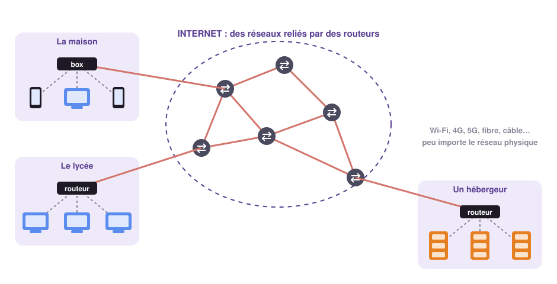

# Internet et les réseaux physiques 🔌

## 1 - Dessine-moi Internet ✏️

!!! example "Activité 1 - Dessine-moi Internet"
    Sur une feuille, **seul et sans regarder la suite**, représente Internet tel que tu
    l'imagines : ce qu'il y a dedans, comment les choses sont reliées, où vont tes messages.

    Il n'y a pas de bonne ou de mauvaise réponse : nous comparerons ensuite vos dessins
    pour voir ce qu'ils ont en commun… et ce qui leur manque.

Pour se rendre compte du chemin parcouru, regardons comment on présentait Internet aux
Français en **1996**, quand presque personne n'y avait encore accès :

<figure class="snt-video">
  <video controls preload="metadata" src="../../../files/SNT/Internet/videos/ina-1996-c-est-quoi-internet.mp4"></video>
  <figcaption>« C'est quoi Internet ? », archive de l'INA, 1996.</figcaption>
</figure>

Voici une représentation plus fidèle de ce qu'est Internet. Compare-la avec ton dessin :

{ .snt-schema }

!!! definition "Définition : Internet"
    **Internet** est un **réseau de réseaux** : il relie entre eux, à l'échelle mondiale,
    des millions de réseaux plus petits (celui de ta maison, du lycée, d'une entreprise…)
    et permet à des milliards d'appareils de **communiquer**.

!!! info "À retenir !"
    - Un **réseau** est un ensemble de machines reliées entre elles pour **échanger des informations**.
    - **Internet** est un **réseau de réseaux**, à l'échelle mondiale.
    - Il transporte des informations **de toute nature** : texte, image, son, vidéo… C'est pour
      cela qu'il a remplacé peu à peu le courrier, le fax et bientôt le téléphone fixe.

!!! warning "Internet ≠ Web"
    On confond souvent les deux. **Internet** est le réseau, l'infrastructure qui
    transporte les données. Le **Web** n'est qu'**un des services** qui l'utilisent, comme
    la messagerie, les jeux en ligne ou la visioconférence. Nous étudierons le Web dans un
    autre thème.

---

## 2 - Les réseaux physiques 📡

Pour transporter l'information d'une machine à une autre, il faut un **support** : c'est le
**réseau physique**. On en distingue deux grandes familles.

!!! definition "Liaisons filaires et sans fil"
    - Une **liaison filaire** transporte l'information dans un **câble** : signal électrique
      dans un fil de cuivre (ADSL, câble Ethernet) ou **lumière** dans un fil de verre
      (fibre optique).
    - Une **liaison sans fil** (ou **hertzienne**) transporte l'information par des **ondes
      radio** : Wi-Fi, Bluetooth, réseaux mobiles 4G et 5G, satellite.

| Réseau physique | Filaire ou sans fil ? | Ordre de grandeur du débit | Usage typique |
|---|---|---|---|
| Modem 56k | filaire (ligne téléphonique) | 56 kbit/s | obsolète |
| Bluetooth | sans fil, quelques mètres | 2 Mbit/s | casque, montre, enceinte |
| ADSL | filaire (ligne téléphonique) | 10 à 50 Mbit/s | box internet, en voie de disparition |
| 4G | sans fil, plusieurs kilomètres | 100 Mbit/s | smartphone |
| Wi-Fi | sans fil, quelques dizaines de mètres | 100 Mbit/s à 1 Gbit/s | dans la maison, autour de la box |
| Câble Ethernet (RJ45) | filaire | 100 Mbit/s à 1 Gbit/s | ordinateur fixe, console |
| 5G | sans fil, quelques centaines de mètres | 1 Gbit/s | smartphone |
| Fibre optique | filaire | 1 à 8 Gbit/s | box internet, liaisons entre pays |

!!! info "À retenir !"
    - Le **réseau physique** est le support qui transporte l'information entre deux machines.
    - Une **liaison filaire** utilise un **câble** : cuivre (ADSL, Ethernet) ou fibre optique.
    - Une **liaison sans fil**, aussi appelée **liaison hertzienne**, utilise des **ondes radio** :
      Wi-Fi, Bluetooth, 4G, 5G, satellite.
    - Internet **ne dépend pas** d'un réseau physique particulier : ses règles de
      communication sont des **logiciels**, installés dans chaque machine. Ton téléphone peut
      donc passer de la 4G au Wi-Fi sans que ta vidéo s'arrête.

---

## 3 - Le débit 🚀

!!! definition "Définition : Débit"
    Le **débit** est la **quantité d'informations** transmise **par seconde**. On le note $d$ :

    $$d = \frac{q}{\Delta t}$$

    où $q$ est la quantité de données et $\Delta t$ la durée du transfert.
    Il s'exprime en **bits par seconde** (bit/s) et ses multiples : kbit/s, Mbit/s, Gbit/s.

!!! methode "Méthode : calculer une durée de téléchargement"
    La taille d'un fichier s'exprime en **octets**, le débit en **bits** par seconde. Les
    conversions à connaître :

    | Unité | Vaut |
    |---|---|
    | 1 octet (o) | 8 bits |
    | 1 kilooctet (Ko) | 1 024 octets |
    | 1 mégaoctet (Mo) | 1 024 Ko |
    | 1 gigaoctet (Go) | 1 024 Mo |
    | 1 téraoctet (To) | 1 024 Go |

    Les bits suivent la même règle : 1 kbit = 1 024 bits, 1 Mbit = 1 024 kbit, 1 Gbit = 1 024 Mbit.

    **En pratique**, en trois étapes :

    1. on exprime la taille du fichier en **Mo** (si elle est en Go : × 1 024) ;
    2. on la convertit en **Mbit**, l'unité du débit (× 8) ;
    3. on divise par le débit : $\Delta t = \dfrac{q}{d}$.

    *Exemple* : un film de 2 Go, avec une connexion à 100 Mbit/s.

    1. 2 Go = 2 × 1 024 = 2 048 Mo ;
    2. 2 048 Mo = 2 048 × 8 = 16 384 Mbit ;
    3. $\Delta t = \dfrac{16\,384}{100} \approx 164$ s, soit environ **2 min 44 s**.

À toi de jouer : lance la course et observe les écarts entre les réseaux. En temps réel,
certaines barres n'avancent presque pas : accélère la simulation pour les voir finir.

!!! example "Activité 2 - Les appareils de Chloé"
    Chloé écoute de la musique en streaming avec son casque Bluetooth. Elle se demande comment
    ses différents appareils sont reliés à Internet.

    1. Pour chacun des cas suivants, précise le réseau physique utilisé parmi : câble Ethernet,
       Wi-Fi, 4G/5G, Bluetooth.

        a. Son smartphone quand elle est chez elle, puis sur le chemin du lycée.  
        b. Sa console de jeux, branchée à la box.  
        c. Son ordinateur portable chez elle, puis chez une copine.  
        d. Sa montre connectée, reliée à son smartphone.

    2. Indique pour chacun de ces réseaux s'il est filaire ou sans fil.
    3. À l'aide du tableau et du simulateur, cite le réseau le plus lent et le plus rapide
       encore utilisés aujourd'hui. Quel réseau physique est devenu obsolète ?
    4. Le Bluetooth est bien plus lent que le Wi-Fi. Pourquoi le fabricant du casque l'a-t-il
       pourtant choisi ?

    ??? success "Correction"
        1. a. Wi-Fi chez elle, 4G/5G dans la rue. b. Câble Ethernet (ou Wi-Fi).
           c. Wi-Fi dans les deux cas. d. Bluetooth.
        2. Seul le câble Ethernet est filaire ; Wi-Fi, 4G/5G et Bluetooth sont sans fil.
        3. Le plus lent est le Bluetooth, le plus rapide la fibre optique. Le modem 56k est obsolète.
        4. Le Bluetooth **consomme très peu d'énergie** : idéal pour un appareil sur batterie.
           Son débit suffit largement pour transmettre de la musique.
