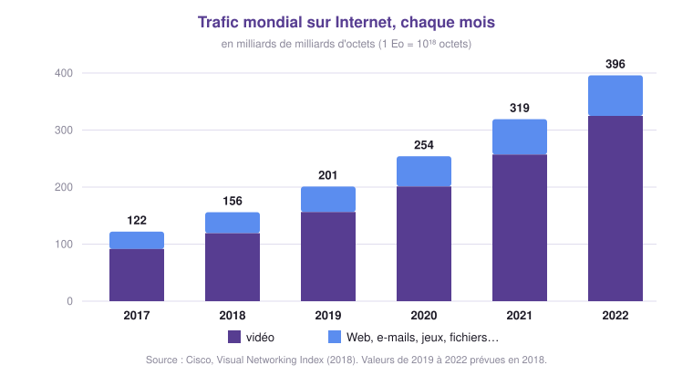

# Le trafic sur Internet 📈

## 1 - Une explosion des échanges 💥

!!! example "Activité 3 - Comment a évolué le trafic ?"
    { .snt-schema }

    | En France | 2009 | 2019 |
    |---|---|---|
    | Nombre d'internautes | 30 millions | 57 millions |
    | Part des Français ayant un smartphone | 12 % | 81 % |
    | Temps passé sur Internet chaque jour | 1 h 30 | 4 h 48 |

    1. Décris l'évolution de la quantité de données échangées chaque mois entre 2017 et 2022.
       Par combien a-t-elle été multipliée ?
    2. Quelle activité est responsable de la plus grande part du trafic ?
    3. Comment expliquer que le temps passé sur Internet ait été multiplié par trois en dix ans ?
    4. La 5G multiplie environ par dix le débit des smartphones par rapport à la 4G.
       Que peut-on prévoir pour le trafic des années à venir ?

    ??? success "Correction"
        1. Le trafic passe de 122 à 396 milliards de milliards d'octets par mois :
           il est multiplié par plus de **3** en 5 ans ($396 \div 122 \approx 3{,}2$).
        2. La **vidéo** : environ les trois quarts du trafic en 2017, plus de 80 % en 2022.
        3. L'arrivée du **smartphone** : 12 % des Français en avaient un en 2009, 81 % en 2019.
           On est connecté partout, tout le temps.
        4. Avec plus de débit, on regarde plus de vidéos, en meilleure qualité : le trafic
           devrait continuer d'augmenter fortement.

!!! info "À retenir !"
    - Le trafic sur Internet **ne cesse d'augmenter** : il a été multiplié par plus de trois
      en cinq ans et se compte aujourd'hui en **milliards de milliards d'octets** chaque mois.
    - La **vidéo** (streaming, réseaux sociaux, visioconférence) représente à elle seule
      **plus de 80 %** du trafic.

---

## 2 - La neutralité du Net ⚖️

Sur Internet, toutes les données sont découpées en **paquets**, et rien ne distingue à
première vue un paquet de vidéo d'un paquet de musique ou d'un e-mail. Les routeurs
les transportent **tous de la même façon**.

!!! definition "Définition : Neutralité du Net"
    La **neutralité du Net** est le principe selon lequel les fournisseurs d'accès doivent
    traiter **toutes les données de la même manière**, quels que soient leur contenu, leur
    origine ou leur destination : ni ralentissement, ni priorité, ni supplément payant pour
    un type de données particulier.

C'est un des principes fondateurs d'Internet. Mais la vidéo coûte cher à transporter, et
certains opérateurs aimeraient faire payer davantage les plateformes ou les utilisateurs
les plus gourmands. En Europe, un règlement de 2015 protège la neutralité du Net ; ailleurs,
elle est régulièrement remise en cause.

!!! example "Activité 4 - Débat : faut-il un Internet à plusieurs vitesses ?"
    Imaginons qu'un opérateur propose deux forfaits :

    - **Essentiel** à 10 € : Web, e-mails et réseaux sociaux à pleine vitesse, mais vidéos limitées à la basse qualité ;
    - **Premium** à 25 € : tout à pleine vitesse, et vos plateformes de streaming favorites en priorité.

    1. Pourquoi un fournisseur d'accès pourrait-il vouloir abandonner la neutralité du Net ?
    2. Qui seraient les gagnants et les perdants de ce système : les utilisateurs ?
       les grandes plateformes ? les petits sites qui débutent ?
    3. Est-ce que cela changerait tes habitudes ? Argumente, puis confrontez vos avis.

    ??? success "Pistes pour le débat"
        - **Pour l'opérateur** : la vidéo occupe l'essentiel de ses réseaux ; faire payer
          ceux qui la consomment ou la diffusent lui rapporterait de quoi investir.
        - **Contre** : un Internet « à plusieurs vitesses » favorise ceux qui peuvent payer.
          Une grande plateforme achèterait la priorité, un nouveau site ne le pourrait pas :
          l'innovation et l'égalité d'accès à l'information en souffriraient.
        - Les utilisateurs aux revenus modestes auraient un accès dégradé à une partie
          d'Internet.
