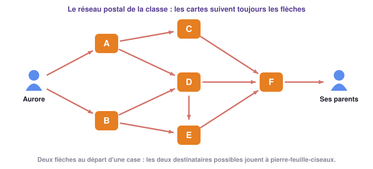
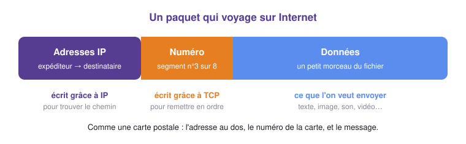
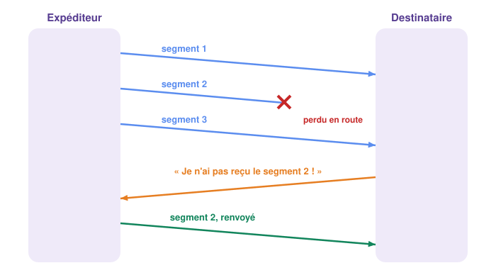

# Comment voyagent les données ? 📦

## 1 - Le jeu des cartes postales ✉️

!!! example "Activité 5 - Le message en cartes postales (sans ordinateur)"
    Partie en vacances, Aurore veut écrire à ses parents. Sa phrase est trop longue pour une
    seule carte postale : elle la coupe en **quatre morceaux**, un par carte. Nous allons
    rejouer le voyage de ces cartes dans la classe.

    { .snt-schema }

    **Mise en place** (5 minutes)

    - Un élève joue **Aurore**. Il écrit une phrase coupée en quatre morceaux, un par carte,
      **sans numéroter** les cartes. Par exemple : *« Le chien du voisin »*, *« a poursuivi »*,
      *« le chat de ma tante »*, *« jusque dans le jardin. »*
    - Six élèves jouent les **centres de tri** A à F, placés dans la classe comme sur le plan.
      Un élève joue **les parents**, au bout du réseau.
    - Les autres élèves sont **observateurs** : chacun suit une carte et note son chemin.

    **La règle** : une carte avance toujours **en suivant les flèches**. Quand deux flèches
    partent d'une case, les **deux destinataires possibles jouent à pierre-feuille-ciseaux** :
    le gagnant prend la carte (en cas d'égalité, on rejoue). Quand une seule flèche part
    d'une case, on donne simplement la carte. Aurore envoie ses quatre cartes l'une après
    l'autre, sans attendre que la précédente soit arrivée.

    **Manche 1** : les parents posent les cartes sur la table dans l'ordre où elles arrivent,
    puis lisent la phrase à voix haute. Est-ce bien celle d'Aurore ?

    **Manche 2** : Aurore écrit une nouvelle phrase, mais elle **numérote** ses cartes
    (1/4, 2/4, 3/4, 4/4). Pendant le trajet, le professeur **confisque** discrètement une
    carte, comme si elle s'était perdue. Quand les parents s'en aperçoivent, ils demandent à
    Aurore de la **renvoyer**.

    **Questions**

    1. Manche 1 : les parents ont-ils retrouvé la phrase d'Aurore ? Pourquoi les cartes ne
       sont-elles pas arrivées dans l'ordre où elles sont parties ?
    2. D'après les observateurs, toutes les cartes ont-elles pris le même chemin ?
    3. Manche 2 : qu'est-ce qui a permis aux parents de remettre les cartes dans l'ordre ?
    4. Comment les parents ont-ils su qu'une carte manquait ? Comment l'ont-ils récupérée ?
    5. Aurore pouvait-elle savoir **quand** ses cartes arriveraient ?

    ??? success "Correction"
        1. Rarement : un pierre-feuille-ciseaux qui s'éternise retarde une carte, un chemin plus
           long en retarde une autre. Les cartes arrivent **dans le désordre**, et sans numéro la
           phrase devient… « Le chat de ma tante a poursuivi le chien du voisin ».
        2. Non : à chaque case, le chemin a été choisi **au moment où la carte est arrivée**.
           Deux cartes de la même phrase ont pu prendre des chemins différents.
        3. La **numérotation** des cartes.
        4. Il manquait un numéro dans la suite : ils ont **redemandé** la carte à Aurore.
        5. Non : on sait que les cartes finissent par arriver, mais **pas quand**.

        Sur Internet, c'est exactement pareil : les cartes sont des **paquets**, les centres de
        tri des **routeurs**, et la numérotation comme le renvoi des paquets perdus sont le
        travail du protocole **TCP**. C'est la suite du cours.

---

## 2 - S'identifier : l'adresse IP 🏷️

Pour qu'un message arrive, il faut savoir **où** l'envoyer. Sur Internet, chaque machine
connectée possède une adresse, comme chaque maison a une adresse postale.

!!! definition "Définition : Adresse IP"
    Une **adresse IP** est un numéro qui **identifie de façon unique** une machine connectée
    à un réseau.

Il en existe deux versions :

| Version | À quoi elle ressemble | Combien d'adresses ? |
|---|---|---|
| **IPv4** | 4 nombres de 0 à 255 séparés par des points : `193.51.24.12` | environ 4,3 milliards |
| **IPv6** | 8 groupes de chiffres et de lettres séparés par « : » : `2001:0db8:0000:85a3:0000:0000:ac1f:8001` | environ 340 milliards de milliards de milliards de milliards |

!!! info "À retenir !"
    4,3 milliards d'adresses IPv4, c'est moins que le nombre d'humains… et bien moins que le
    nombre d'objets connectés ! Elles sont épuisées depuis 2019 en Europe : la version
    **IPv6** les remplace peu à peu.

---

## 3 - Des paquets et des routeurs 🛣️

Un fichier n'est jamais envoyé d'un seul bloc. Il est **découpé en petits paquets** qui
voyagent chacun de leur côté. Chaque paquet porte un **en-tête**, comme l'adresse au dos
d'une carte postale :

{ .snt-schema }

Entre l'expéditeur et le destinataire, les paquets traversent des **routeurs**. Chaque
routeur lit l'adresse IP de destination et transmet le paquet au routeur voisin le mieux
placé pour le rapprocher du but : c'est le **routage**.

!!! definition "Définitions : Routeur et routage"
    - Un **routeur** est un équipement qui relie plusieurs réseaux et fait passer les paquets
      de l'un à l'autre, **de proche en proche**. Ta box internet en contient un.
    - Le **routage** est le mécanisme qui achemine un paquet de sa source à sa destination
      à travers les routeurs.

!!! example "Activité 6 - Le jeu du routeur"
    Joue le rôle du réseau. Chaque paquet porte un nombre : c'est son **TTL**, qui diminue de
    1 à chaque routeur traversé.

    <div class="snt-outil" data-outil="routage"></div>

    1. Envoie plusieurs paquets, un par un. Prennent-ils toujours le même chemin ? Le chemin
       est-il fixé à l'avance ?
    2. Le routeur R5 tombe en panne et le lien R1–R2 est coupé par des travaux. Trouve un
       chemin que peut encore prendre un paquet, puis vérifie avec le simulateur.
    3. Quel est l'intérêt qu'il existe **plusieurs chemins** entre deux machines ?
    4. Clique sur « Tout réparer », puis mets R3 en panne. Envoie des paquets : certains
       font demi-tour. Où, et pourquoi ?
    5. Mets maintenant **aussi** R6 en panne. Que deviennent les paquets ? Observe leur TTL.
    6. Pour finir, mets R1 en panne. Que se passe-t-il ?

    ??? success "Correction"
        1. Non : chaque routeur choisit le saut suivant **au moment où le paquet arrive**,
           selon l'état du réseau. Deux paquets d'un même fichier peuvent prendre des routes
           différentes.
        2. Par exemple : Expéditeur → R1 → R7 → R6 → R8 → Destinataire.
        3. Si un routeur ou un lien tombe en panne, les paquets **contournent** l'obstacle :
           le réseau continue de fonctionner.
        4. En R2 : sans R3, R2 n'a plus d'autre voisin que R1. C'est un **cul-de-sac**, le
           paquet doit revenir sur ses pas. Même chose en R4, qui ne touche plus que R8.
        5. Il n'existe plus aucun chemin jusqu'au destinataire : les paquets errent de
           cul-de-sac en cul-de-sac, leur TTL diminue, et ils sont **détruits** quand il atteint 0.
        6. Plus aucun paquet ne passe : R1 est le seul accès de l'expéditeur au réseau.

        Le routage a ses **limites** : une panne mal placée, ou un routeur saturé qui jette
        des paquets, et le message n'arrive pas.

!!! definition "Définition : TTL"
    Le **TTL** (*Time To Live*, « reste à vivre ») est un compteur inscrit dans chaque paquet,
    souvent fixé à 64 au départ. Chaque routeur le **diminue de 1** ; quand il atteint 0, le
    routeur **détruit** le paquet. Ainsi, un paquet perdu qui tournerait en rond n'encombre pas
    le réseau indéfiniment.

!!! info "À retenir !"
    Le protocole **IP** (*Internet Protocol*) fixe les règles pour **adresser** les paquets
    et les **acheminer** de routeur en routeur jusqu'au destinataire. Mais il ne garantit
    rien : un paquet peut **se perdre** (panne, routeur saturé) et les paquets peuvent
    **arriver dans le désordre**.

---

## 4 - Remettre de l'ordre : le protocole TCP 🧩

Puisque IP ne garantit pas que tout arrive, ni dans l'ordre, un second protocole travaille
avec lui : **TCP**. Avant l'envoi, TCP découpe les données en **segments numérotés**. À
l'arrivée, il les **remet dans l'ordre** et **redemande** ceux qui manquent.

{ .snt-schema }

À toi de jouer le rôle de TCP :

<div class="snt-outil" data-outil="tcp"></div>

!!! definition "Définition : Protocole"
    Un **protocole** est un ensemble de **règles communes** que les machines respectent pour
    pouvoir communiquer, comme une langue partagée.

!!! info "À retenir !"
    - **IP** adresse et achemine les paquets, de routeur en routeur.
    - **TCP** numérote les segments, les remet dans l'ordre et fait renvoyer ceux qui se sont perdus.
    - Ensemble, **TCP/IP** assurent la **fiabilité de la transmission** : tout le message
      finit par arriver, complet et dans l'ordre.

---

## 5 - Fiable… mais pas ponctuel ⏱️

TCP/IP garantit que tout arrive, quitte à renvoyer des paquets. Mais il ne garantit **pas
quand** : un paquet renvoyé arrive en retard, un routeur encombré ralentit tout.

!!! info "À retenir !"
    L'ensemble TCP/IP assure la **fiabilité** de la transmission, mais **pas de garantie
    temporelle** : on ne sait pas combien de temps mettra un paquet. Pour un e-mail ou une
    page web, ce n'est pas grave. Pour une **visioconférence** ou un **jeu en ligne**, un
    paquet en retard, c'est une image figée ou un « lag ».

!!! example "Activité 7 - Mesurer le voyage des paquets avec `ping` (sur ordinateur)"
    La commande `ping` envoie quelques petits paquets à une machine, qui répond à chacun : on
    mesure ainsi le temps d'un **aller-retour**.

    1. Ouvre le **Terminal** de Windows : touche Windows, tape `cmd`, puis Entrée.
    2. Tape la commande `ping qwant.fr` puis Entrée. Relève :
        a. l'adresse IP du site ; b. le nombre de paquets envoyés et reçus ;
        c. la taille des données de chaque paquet ; d. les durées minimale, maximale et moyenne.
    3. Recommence avec `ping www.govt.nz`, le site du gouvernement de Nouvelle-Zélande, à
       l'autre bout de la Terre. Compare la durée moyenne avec celle de `qwant.fr`.
    4. Relance deux fois `ping qwant.fr`. Obtiens-tu exactement les mêmes durées ? Quelle
       notion du cours cela illustre-t-il ?
    5. Des paquets ont-ils été perdus ?

    Le terminal affiche l'adresse IP du site alors que tu n'as tapé que son nom : nous verrons
    au chapitre 2 comment l'ordinateur la trouve.

    ??? note "Si la commande est bloquée sur ton poste"
        Travaille sur cet affichage, obtenu sur un autre ordinateur :

        ```text
        C:\Users\eleve> ping qwant.fr

        Envoi d'une requête 'ping' sur qwant.fr [217.70.184.55] avec 32 octets de données :
        Réponse de 217.70.184.55 : octets=32 temps=54 ms TTL=50
        Réponse de 217.70.184.55 : octets=32 temps=104 ms TTL=50
        Réponse de 217.70.184.55 : octets=32 temps=31 ms TTL=50
        Réponse de 217.70.184.55 : octets=32 temps=75 ms TTL=50

        Statistiques Ping pour 217.70.184.55:
            Paquets : envoyés = 4, reçus = 4, perdus = 0 (perte 0%),
        Durée approximative des boucles en millisecondes :
            Minimum = 31ms, Maximum = 104ms, Moyenne = 66ms
        ```

    ??? success "Correction"
        Les valeurs dépendent du poste et du moment ; voici ce qu'on observe en général.

        2. Une adresse IPv4 (par exemple `217.70.184.55`), 4 paquets envoyés et 4 reçus,
           32 octets de données, quelques dizaines de millisecondes en moyenne.
        3. Vers la Nouvelle-Zélande, la durée est en général **beaucoup plus longue**
           (souvent plusieurs centaines de millisecondes) : les paquets traversent plus de
           routeurs et des milliers de kilomètres de câbles sous-marins. Si elle est courte,
           c'est que le site est servi par une copie installée près de chez nous : nous en
           reparlerons au chapitre 2.
        4. Non, les durées changent d'un paquet à l'autre et d'une fois sur l'autre :
           c'est l'**absence de garantie temporelle**.
        5. En général non, mais une perte est possible : TCP/IP la rattrape en renvoyant le paquet.
