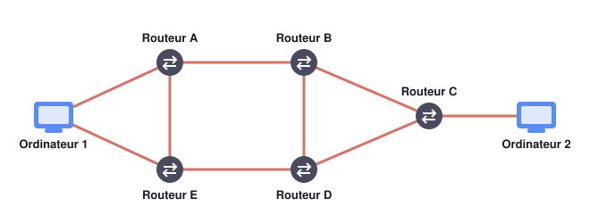

# Exercices

Vous trouverez ci-dessous les exercices de ce chapitre.

- Les exercices marqués avec :fontawesome-solid-pencil: se réalisent **sans ordinateur**.  
  Ceux indiqués par :fontawesome-solid-laptop: nécessitent **un ordinateur**.

- Le **niveau de difficulté** est indiqué par des étoiles :  
    <ul style="list-style: none;">
        <li>:fontawesome-solid-star: :fontawesome-regular-star: :fontawesome-regular-star: → Exercices pour **s'approprier les notions**.</li>
        <li>:fontawesome-solid-star: :fontawesome-solid-star: :fontawesome-regular-star: → Exercices pour **renforcer vos compétences**.</li>
        <li>:fontawesome-solid-star: :fontawesome-solid-star: :fontawesome-solid-star: → Exercices pour vous **challenger** et tester vos acquis.</li>
    </ul>

---

## Réseaux physiques et débit

!!! exopapier ":fontawesome-solid-star: :fontawesome-regular-star: :fontawesome-regular-star: Qui peut se connecter comment ?"
    Recopie et complète le tableau par « oui » ou « non » : l'appareil peut-il, en général,
    utiliser ce type de liaison pour se connecter à Internet ?

    | Appareil | Câble réseau | 4G ou 5G | Wi-Fi |
    |---|---|---|---|
    | Smartphone | | | |
    | Ordinateur portable | | | |
    | Ordinateur fixe | | | |

    Donne ensuite le nom de la liaison **filaire** la plus rapide, puis de la liaison **sans fil** la plus rapide.

    ??? success "Correction"
        | Appareil | Câble réseau | 4G ou 5G | Wi-Fi |
        |---|---|---|---|
        | Smartphone | non | oui | oui |
        | Ordinateur portable | oui | non (sauf partage de connexion) | oui |
        | Ordinateur fixe | oui | non | oui, s'il a une carte Wi-Fi |

        La liaison filaire la plus rapide est la **fibre optique**, la liaison sans fil la plus rapide la **5G**.

!!! exopapier ":fontawesome-solid-star: :fontawesome-regular-star: :fontawesome-regular-star: Quel réseau physique choisir ?"
    Djibril dispose d'une connexion Internet à 100 Mbit/s.

    1. Quels types de réseaux physiques sont compatibles avec le débit de sa connexion ?
    2. Pour télécharger plus vite ses vidéos, quel réseau peut-on lui conseiller :
        a. comme réseau sans fil ? b. comme réseau filaire ?

    Djibril passe à un forfait à 1 Gbit/s. Il connecte son ordinateur portable en Wi-Fi et
    constate que son débit n'a pas augmenté.

    3. Pourquoi ne profite-t-il pas de son nouveau forfait ? Que lui conseiller ?

    ??? success "Correction"
        1. Tous ceux qui atteignent 100 Mbit/s : 4G, 5G, Wi-Fi, câble Ethernet, fibre optique.
           Le Bluetooth et l'ADSL sont trop lents.
        2. a. La **5G**. b. La **fibre optique**.
        3. Le débit est limité par le maillon **le plus lent** de la chaîne : ici la liaison
           Wi-Fi entre l'ordinateur et la box. Il peut **brancher un câble Ethernet**, ou
           utiliser un équipement Wi-Fi plus récent.

!!! exopapier ":fontawesome-solid-star: :fontawesome-solid-star: :fontawesome-regular-star: Écologie"
    Pour une même quantité de données, le réseau 4G consomme en moyenne **10 fois plus
    d'énergie** que la fibre optique, et une connexion 4G vide la batterie d'un téléphone
    **23 fois plus vite** que le Wi-Fi.

    Tana a un forfait 4G illimité et la fibre à la maison. Quand elle est chez elle, quelle
    connexion lui conseiller pour surfer sur le Web ? Argumente.

    ??? success "Correction"
        Le **Wi-Fi de sa box fibre** : il consomme beaucoup moins d'énergie (bon pour
        l'environnement) et beaucoup moins de batterie (bon pour son téléphone). Son forfait
        illimité ne change rien à la consommation d'électricité des antennes 4G.

!!! exopapier ":fontawesome-solid-star: :fontawesome-solid-star: :fontawesome-regular-star: Comment a évolué le débit depuis l'an 2000 ?"
    Léo veut télécharger un album de musique de **650 Mo**.

    1. Convertis la taille de l'album en mégabits (Mbit).
    2. Avant l'an 2000, on utilisait un modem à **56 kbit/s**. Combien de temps durait le téléchargement ?
    3. Aujourd'hui, la fibre optique offre environ **300 Mbit/s**. Combien de temps dure le téléchargement ?
    4. Par combien le débit a-t-il été multiplié ?

    ??? success "Correction"
        1. 650 × 8 = **5 200 Mbit**.
        2. Le débit est en kbit/s : 5 200 Mbit = 5 200 × 1 024 = 5 324 800 kbit, donc
           $\Delta t = \dfrac{5\,324\,800}{56} \approx 95\,086$ s, soit environ **26 h 25 min** :
           plus d'une journée !
        3. $\Delta t = \dfrac{5\,200}{300} \approx 17{,}3$ s.
        4. 300 Mbit/s = 300 × 1 024 = 307 200 kbit/s, et $307\,200 \div 56 \approx 5\,486$ :
           le débit a été multiplié par plus de **5 000**.

!!! exopapier ":fontawesome-solid-star: :fontawesome-solid-star: :fontawesome-regular-star: Le film de Liam"
    Liam veut télécharger un film de **1,8 Go**. Sa connexion a un débit de **500 Mbit/s**.

    1. Convertis la taille du film en mégaoctets, puis en mégabits.
    2. Combien de temps durera le téléchargement ?
    3. La salle informatique du lycée dispose d'une connexion à 1 000 Mbit/s. Combien de
       mégaoctets peut-elle recevoir chaque seconde ?

    ??? success "Correction"
        1. 1,8 Go = 1,8 × 1 024 = **1 843,2 Mo** = 1 843,2 × 8 = **14 745,6 Mbit**.
        2. $\Delta t = \dfrac{14\,745{,}6}{500} \approx 29{,}5$ s.
        3. 1 000 Mbit/s = 1 000 ÷ 8 = **125 Mo/s**.

---

## Trafic sur Internet

!!! exopapier ":fontawesome-solid-star: :fontawesome-regular-star: :fontawesome-regular-star: La consommation des vidéos"
    | Type de données consultées | Quantité échangée par heure |
    |---|---|
    | Vidéo 4K (très haute définition) | 7 Go |
    | Vidéo HD (haute définition) | 3 Go |
    | Vidéo SD (définition standard) | 0,7 Go |
    | Réseaux sociaux | 0,156 Go |
    | Navigation sur le Web | 0,020 Go |

    1. Compare la quantité de données échangée en une heure entre :
        a. une vidéo SD et une vidéo 4K ; b. une vidéo HD et les réseaux sociaux ;
        c. les réseaux sociaux et la navigation sur le Web.
    2. Explique pourquoi le trafic mondial sur Internet a été multiplié par plus de trois en cinq ans.

    ??? success "Correction"
        1. a. $7 \div 0{,}7 = 10$ : la 4K consomme **10 fois plus**.
           b. $3 \div 0{,}156 \approx 19$ : une heure de vidéo HD vaut **près de 20 heures** de réseaux sociaux.
           c. $0{,}156 \div 0{,}020 \approx 8$ : les réseaux sociaux (pleins de vidéos) consomment **8 fois plus** que le Web.
        2. On regarde de plus en plus de vidéos, en meilleure qualité (HD, 4K), sur des
           smartphones toujours connectés, et le nombre d'internautes augmente.

---

## Protocoles TCP/IP

!!! exopapier ":fontawesome-solid-star: :fontawesome-regular-star: :fontawesome-regular-star: Combien de chemins ?"
    Voici le réseau reliant deux ordinateurs :

    { .snt-schema }

    1. Liste tous les chemins possibles de l'ordinateur 1 à l'ordinateur 2, sans passer deux fois par le même routeur.
    2. Quels sont les chemins les plus directs ?
    3. Le routeur B tombe en panne. Quels chemins restent possibles ?

    ??? success "Correction"
        1. Huit chemins :
            - A → B → C ; A → B → D → C ; A → E → D → C ; A → E → D → B → C ;
            - E → D → C ; E → D → B → C ; E → A → B → C ; E → A → B → D → C.
        2. **A → B → C** et **E → D → C** : trois routeurs seulement.
        3. Il reste **A → E → D → C** et **E → D → C** : le réseau continue de fonctionner.

!!! exopapier ":fontawesome-solid-star: :fontawesome-solid-star: :fontawesome-regular-star: L'en-tête d'un paquet"
    En t'appuyant sur le cours :

    1. Que contient l'en-tête ajouté par **IP** ? À quoi sert-il ?
    2. Que contient l'en-tête ajouté par **TCP** ? À quoi sert-il ?
    3. Lequel des deux assure la fiabilité de la transmission ?

    ??? success "Correction"
        1. Les **adresses IP** de l'expéditeur et du destinataire (et le TTL) : les routeurs
           s'en servent pour **acheminer** le paquet.
        2. Le **numéro du segment** : le destinataire s'en sert pour **remettre les segments
           dans l'ordre** et repérer ceux qui manquent.
        3. **TCP**, grâce à la numérotation et au renvoi des segments perdus.

!!! exopapier ":fontawesome-solid-star: :fontawesome-solid-star: :fontawesome-regular-star: Combien de paquets ?"
    Sur un réseau Ethernet, un paquet mesure au plus **1 500 octets**. Son en-tête IP
    (version 4) occupe **20 octets** et son en-tête TCP également **20 octets**.

    1. Combien d'octets de données utiles un paquet peut-il transporter ?
    2. Combien de paquets faut-il pour transférer une vidéo de **700 Mo** ?
    3. Quelle proportion de chaque paquet est occupée par les en-têtes ?
    4. En IPv6, l'en-tête IP mesure **40 octets**. Que devient cette proportion ?

    ??? success "Correction"
        1. 1 500 − 20 − 20 = **1 460 octets**.
        2. 700 Mo = 700 × 1 024 × 1 024 = 734 003 200 octets, et
           $734\,003\,200 \div 1\,460 \approx 502\,741{,}9$ : il faut **502 742 paquets**
           (le dernier n'est pas plein).
        3. $40 \div 1\,500 \approx 2{,}7\,\%$.
        4. $(40 + 20) \div 1\,500 = 4\,\%$ : un peu plus de place perdue, mais beaucoup plus d'adresses.

!!! exoordi ":fontawesome-solid-star: :fontawesome-solid-star: :fontawesome-regular-star: Le voyage d'un paquet jusqu'en Nouvelle-Zélande"
    La commande `tracert` affiche, ligne par ligne, les routeurs traversés par un paquet pour
    joindre un site : chaque ligne est un **saut**.

    1. Dans le Terminal de Windows, tape `tracert -4 www.govt.nz` puis Entrée. L'affichage
       prend un peu de temps : chaque routeur est interrogé à son tour.
    2. Combien de routeurs le paquet traverse-t-il ?
    3. Choisis cinq sauts. Pour chacun, relève l'adresse IP, puis trouve où se trouve le
       routeur grâce au site [my-ip-finder.fr :octicons-link-external-16:](https://www.my-ip-finder.fr){ target="_blank" },
       onglet « Trouver une adresse IP ».
    4. Place ces routeurs sur une carte ([Google Maps :octicons-link-external-16:](https://maps.google.com){ target="_blank" }
       ou [Géoportail :octicons-link-external-16:](https://www.geoportail.gouv.fr){ target="_blank" })
       et trace le trajet du paquet.
    5. À quel saut la durée augmente-t-elle brusquement ? Qu'est-ce que cela peut indiquer ?

    Certaines lignes affichent `* * * Délai d'attente de la demande dépassé` : ce routeur ne
    répond pas à `tracert`, mais il transmet bien les paquets. C'est normal.

    ??? success "Correction"
        Les résultats dépendent du lycée, de l'opérateur et du moment.

        2. En général entre 10 et 30 routeurs.
        3. et 4. Les premiers sauts sont la box ou le routeur du lycée (adresse en `192.168…`
           ou `10.…`, non localisable), puis les routeurs de l'opérateur en France, puis ceux
           de grands réseaux internationaux. La géolocalisation d'une adresse IP reste
           approximative.
        5. Une hausse brusque, souvent de 100 ms ou plus, signale la traversée d'un **océan**,
           par un câble sous-marin : la distance parcourue ajoute du temps.

!!! exopapier ":fontawesome-solid-star: :fontawesome-solid-star: :fontawesome-solid-star: Assez d'adresses pour tout le monde ?"
    Une adresse IPv4 est codée sur **4 octets**, une adresse IPv6 sur **16 octets**.
    Un octet contient 8 bits, et chaque bit vaut 0 ou 1.

    1. Combien de bits contient une adresse IPv4 ? En déduire le nombre d'adresses IPv4 possibles.
    2. La Terre compte environ 8 milliards d'habitants. Pourquoi a-t-on eu besoin d'IPv6 ?
    3. Combien d'adresses IPv6 peut-on créer ? Donne le résultat sous forme d'une puissance de 2.

    ??? success "Correction"
        1. 4 × 8 = 32 bits, donc $2^{32} = 4\,294\,967\,296$ adresses, environ 4,3 milliards.
        2. C'est moins que le nombre d'humains, et chacun possède plusieurs appareils connectés :
           les adresses IPv4 sont épuisées.
        3. 16 × 8 = 128 bits, donc $2^{128} \approx 3{,}4 \times 10^{38}$ adresses : de quoi en donner
           des milliards à chaque grain de sable de la Terre.

!!! exopapier ":fontawesome-solid-star: :fontawesome-solid-star: :fontawesome-solid-star: Le site est inaccessible !"
    Le site de recettes préféré de Robin ne répond plus. Curieux, il tape la commande
    `traceroute`, qui affiche les routeurs traversés par un paquet pour joindre un site
    (au plus 15 ici) :

    ```text
    traceroute to www.milleetunerecettes.com (172.217.18.228), 15 hops max
     1  192.168.1.1       2.102 ms
     2  80.10.235.45      3.919 ms
     3  193.253.86.158    4.700 ms
     4  193.252.161.25    7.366 ms
     5  81.253.183.34     7.361 ms
     6  72.14.197.204     8.125 ms
     7  108.170.252.241   7.787 ms
     8  81.253.183.34     7.365 ms
     9  72.14.197.204     8.129 ms
    10  108.170.252.241   7.775 ms
    11  81.253.183.34     7.361 ms
    12  72.14.197.204     8.125 ms
    13  108.170.252.241   8.785 ms
    14  81.253.183.34     8.363 ms
    15  72.14.197.204     9.127 ms
    ```

    1. Combien de routeurs **différents** ce paquet a-t-il traversés ?
    2. Que constate-t-on à partir du 8ᵉ routeur ?
    3. Cela peut-il expliquer que le site soit inaccessible ? Est-ce l'ordinateur de Robin qui a un problème ?
    4. Chaque paquet a un **TTL**, souvent fixé à 64 au départ, qui diminue de 1 à chaque routeur.
       Que fait un routeur quand le TTL arrive à 0 ? Explique l'utilité du TTL dans cette situation.

    ??? success "Correction"
        1. **7** routeurs différents (lignes 1 à 7).
        2. Le paquet **tourne en rond** entre trois routeurs (5, 6 et 7), qui se le renvoient.
        3. Oui : le paquet n'arrivera jamais. Ce n'est pas l'ordinateur de Robin : les premiers
           routeurs répondent normalement, le problème est plus loin dans le réseau (une
           **limite du routage**).
        4. Il **détruit** le paquet. Sans TTL, ce paquet perdu tournerait indéfiniment et
           encombrerait le réseau.
