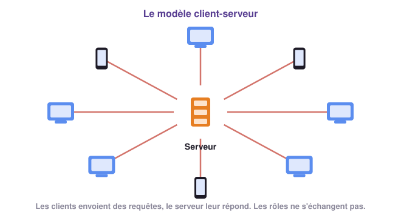

# Clients et serveurs 🖥️

## 1 - Qui demande, qui répond ? 🙋

Quand tu regardes une vidéo, elle n'est pas dans ton téléphone : elle est stockée sur un
autre ordinateur, quelque part dans le monde, qui te l'envoie morceau par morceau. Ton
téléphone **demande**, cet ordinateur **répond**.

!!! example "Activité 1 - Qui sert qui ?"
    Pour chacune des situations suivantes, indique qui **demande** quelque chose, qui
    **répond**, et ce qui est demandé.

    1. Tu regardes une vidéo sur YouTube avec ton téléphone.
    2. Tu consultes tes notes sur Pronote depuis l'ordinateur familial.
    3. Tu envoies un message à un ami sur une messagerie.
    4. Tu joues à un jeu en ligne avec des joueurs du monde entier.
    5. Au CDI, tu lances l'impression d'un document sur l'imprimante partagée.

    ??? success "Correction"
        | Situation | Qui demande ? | Qui répond ? | Ce qui est demandé |
        |---|---|---|---|
        | 1 | ton téléphone (l'application YouTube) | un serveur de YouTube | la vidéo |
        | 2 | ton navigateur | le serveur de Pronote | la page de tes notes |
        | 3 | ton application de messagerie | le serveur de la messagerie | transmettre le message à ton ami |
        | 4 | ta console ou ton ordinateur | le serveur du jeu | la position des autres joueurs |
        | 5 | ton ordinateur | le serveur d'impression du lycée | imprimer le document |

        Dans les cinq cas, une machine **demande** un service à une autre, qui le **fournit**.

!!! definition "Définitions : Client et serveur"
    - Un **serveur** est une machine (ou un logiciel) qui **stocke des données ou rend un
      service** et le met à disposition d'autres machines.
    - Un **client** est une machine (ou un logiciel) qui **se connecte à un serveur** pour
      utiliser ce service. Ton navigateur web est un client.
    - Le client envoie une **requête**, le serveur lui renvoie une **réponse**.

Dans le **modèle client-serveur**, les rôles sont fixés : les serveurs fournissent les
services, les clients s'y connectent. Un client ne sert jamais les autres clients.

{ .snt-schema }

!!! info "À retenir !"
    - Un **serveur** fournit un service ; un **client** l'utilise.
    - Dans le **modèle client-serveur**, les clients envoient des **requêtes** et les serveurs
      leur **répondent**. Les rôles ne sont pas interchangeables.
    - Un serveur est un ordinateur comme un autre, souvent sans écran, rangé avec des milliers
      d'autres dans un **centre de données** (*data center*).

---

## 2 - Quand tout le monde se connecte en même temps 🎫

Un serveur ne peut traiter qu'un nombre limité de requêtes à la fois. Que se passe-t-il
quand tout le monde se connecte au même moment ?

!!! example "Activité 2 - La billetterie du concert"
    Ce matin à 10 h, la vente des places d'un concert très attendu ouvre sur le site de la
    billetterie. Chaque serveur du site peut traiter **500 visiteurs** en même temps.

    

    1. Avec 300 visiteurs et un seul serveur, en combien de temps le site répond-il ?
    2. Augmente peu à peu le nombre de visiteurs. À partir de combien le site
       **ralentit**-il ? À partir de combien est-il **saturé** ?
    3. Il y a 2 000 visiteurs. Quelle solution l'organisateur peut-il mettre en place pour que
       tout le monde puisse acheter sa place ? Teste-la.
    4. Un pirate lance une **attaque** contre le site. Que se passe-t-il pour les vrais
       visiteurs ? Ajouter des serveurs suffit-il à les protéger ?

    ??? success "Correction"
        1. En 0,4 s environ : le serveur est peu chargé.
        2. Le site ralentit au-delà de 350 visiteurs (70 % de la capacité) et sature au-delà de
           500 : une partie des visiteurs ne reçoit plus de réponse.
        3. **Dupliquer le serveur** : les visiteurs se répartissent entre plusieurs copies
           identiques. Avec 4 serveurs (2 000 places), le site n'est plus saturé mais reste lent ;
           à partir de 6 serveurs, il répond normalement.
        4. Les fausses requêtes de l'attaque (20 000 à la fois) saturent tous les serveurs :
           les vrais visiteurs ne peuvent plus accéder au site. Même 8 serveurs (4 000 places)
           ne suffisent pas.

Pour qu'un site très visité résiste, on **duplique** son serveur à l'identique : les
visiteurs sont répartis entre plusieurs copies. C'est ce que font les grands sites, et les
organisateurs d'événements qui attendent une forte affluence.

!!! definition "Définition : Attaque par déni de service (DDoS)"
    Lors d'une **attaque par déni de service** (DDoS, pour *Distributed Denial of Service*),
    un pirate prend le contrôle d'un grand nombre de machines, souvent à l'insu de leurs
    propriétaires, et leur fait envoyer **en même temps** une avalanche de requêtes vers un
    même site. Le site, surchargé, devient **inaccessible** pour ses vrais utilisateurs.

!!! warning "C'est un délit"
    En France, entraver le fonctionnement d'un système informatique est puni de **cinq ans
    d'emprisonnement et de 150 000 € d'amende** (article 323-2 du Code pénal).

!!! info "À retenir !"
    - Un serveur peut être **dupliqué** à l'identique pour supporter un grand nombre de
      clients connectés en même temps.
    - Internet est vulnérable aux **attaques par déni de service** : en saturant un serveur de
      requêtes, un pirate le rend indisponible.
