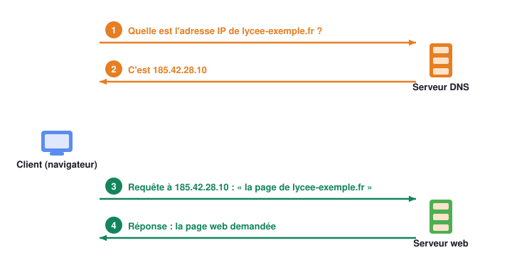

# Les noms de domaine et le DNS 📖

## 1 - Des noms plutôt que des numéros 🏷️

Au chapitre 1, nous avons vu que chaque machine connectée à Internet possède une **adresse
IP**. Un serveur web aussi. Alors, pourquoi tape-t-on `wikipedia.org` et jamais une adresse IP ?

!!! example "Activité 3 - Le Web sans noms de domaine"
    Imaginons un monde où l'on ne désignerait les sites web que par leur adresse IP.
    Voici une conversation entre Hugo et Théo :

    > **Hugo** : As-tu vu le nouveau site web **133.125.232.127** ?  
    > **Théo** : Non ! Et toi, tu as vu le site **3a01:cb1c:3cc:8100:b8dd:b019:a392:61b3** ?

    1. Sans relire, peux-tu redire les deux adresses de mémoire ?
    2. Quel est l'intérêt de désigner un site par un **nom**, comme `wikipedia.org`, plutôt
       que par son adresse IP ?
    3. Sur ton téléphone, tu appelles un ami en touchant son **nom** dans tes contacts, sans
       jamais taper son numéro. Que fait le téléphone à ta place ?

    ??? success "Correction"
        1. Presque personne n'y arrive, surtout la seconde, une adresse IPv6.
        2. Un nom est **facile à retenir** et dit souvent de quoi parle le site ou à qui il
           appartient. Une adresse IP n'est qu'une suite de chiffres.
        3. Il cherche le **numéro** qui correspond au nom dans le répertoire, puis le compose.
           Sur Internet, ce répertoire existe : c'est le **DNS**.

{ .snt-schema }

!!! definition "Définition : Nom de domaine"
    Un **nom de domaine** est une adresse composée de lettres, facile à retenir, qui
    désigne un site sur Internet : `lycee-exemple.fr`, `wikipedia.org`. Il correspond souvent
    au nom de l'organisation ou du service. Il se termine par une **extension** :

    | Extension | Pour qui ? | Exemple |
    |---|---|---|
    | `.fr`, `.de`, `.it`… | un pays | `service-public.fr` |
    | `.com` | à l'origine, les entreprises commerciales | `amazon.com` |
    | `.org` | à l'origine, les organisations non commerciales | `wikipedia.org` |
    | `.gouv.fr` | le gouvernement français | `education.gouv.fr` |
    | `.edu` | les universités américaines | `harvard.edu` |

---

## 2 - Le répertoire d'Internet : le DNS 📖

Les routeurs ne connaissent que des adresses IP. Avant d'envoyer la moindre requête, ton
navigateur doit donc **traduire** le nom du site en adresse IP. Il la demande à un **serveur DNS**.

!!! definition "Définition : Serveur DNS"
    Un **serveur DNS** (*Domain Name System*, « système de noms de domaine ») fait la
    **correspondance entre les noms de domaine et les adresses IP**, comme le répertoire
    d'un téléphone fait la correspondance entre les noms et les numéros.

{ .snt-schema }

1. Le navigateur demande au serveur DNS l'adresse IP de `lycee-exemple.fr`.
2. Le serveur DNS lui renvoie l'adresse correspondante, `185.42.28.10`.
3. Le navigateur envoie sa requête au serveur web d'adresse `185.42.28.10`, en rappelant le
   nom du site demandé.
4. Le serveur web renvoie la page, que le navigateur affiche.

!!! example "Activité 4 - Suivre une requête DNS"
    

    1. Visite `lycee-exemple.fr`. Combien d'échanges faut-il avant que la page s'affiche ?
       Entre quelles machines ?
    2. Visite à nouveau `lycee-exemple.fr`. Que remarques-tu ? Pourquoi est-ce utile ?
    3. Visite `lycee-exmple.fr`. Que se passe-t-il ? Qu'affiche le navigateur ?
    4. Coche « Voir aussi les coulisses du serveur DNS », puis visite `encyclopedie.org`.
       Le serveur DNS connaissait-il la réponse ? Comment l'a-t-il trouvée ?

    ??? success "Correction"
        1. Quatre échanges : deux avec le serveur DNS (la question, puis l'adresse IP), deux
           avec le serveur web (la requête, puis la page).
        2. Le serveur DNS répond aussitôt : il **se souvient** des noms qu'on vient de lui
           demander. Cela évite de refaire toutes les recherches à chaque visite.
        3. Aucune adresse IP ne correspond à ce nom mal orthographié : le navigateur affiche
           « Ce site est inaccessible ». Il n'a même pas pu contacter de serveur web.
        4. Non : il a interrogé le **serveur racine**, qui l'a renvoyé vers le serveur des
           noms en `.org`, qui l'a renvoyé vers le serveur du domaine, le seul à connaître
           l'adresse. Le DNS est un annuaire **réparti** entre de nombreux serveurs.

!!! info "À retenir !"
    - Un **serveur DNS** traduit un **nom de domaine** en **adresse IP**. Sans lui, il
      faudrait taper l'adresse IP de chaque site dans la barre d'adresse.
    - Un même nom de domaine peut correspondre à **plusieurs adresses IP** : ce sont des
      serveurs dupliqués, qui se partagent les visiteurs.
    - Une même adresse IP peut correspondre à **plusieurs noms de domaine** : un seul serveur
      peut héberger plusieurs sites. C'est pour cela que le navigateur rappelle le nom du site
      dans sa requête.

!!! example "Activité 5 - Retrouver des adresses IP (sur ordinateur)"
    **Partie A : dans le terminal**

    1. Ouvre le **Terminal** de Windows (touche Windows, tape `cmd`, puis Entrée).
    2. Tape `nslookup www.google.fr` puis Entrée. La commande interroge un serveur DNS.
       Relève la ou les adresses IP obtenues. Reconnais-tu une adresse IPv4 ? une IPv6 ?
    3. Recommence avec `nslookup www.youtube.com`. Combien d'adresses obtiens-tu ? Pourquoi
       un site aussi visité en a-t-il plusieurs ?
    4. Fais l'inverse : tape `nslookup 8.8.8.8`. Quel nom correspond à cette adresse IP ?

    **Partie B : avec un site web**

    5. Rends-toi sur [my-ip-finder.fr :octicons-link-external-16:](https://www.my-ip-finder.fr){ target="_blank" },
       onglet « DNS Lookup ». Relève l'adresse IP de `google.fr`, de `google.com` et de `google.de`.
    6. Tape l'adresse IPv4 de `google.fr` directement dans la barre d'adresse du navigateur.
       Que se passe-t-il ?
    7. Que peux-tu conclure des questions 5 et 6 ?

    ??? success "Correction"
        Les adresses changent selon le lieu et le moment : ce sont les observations qui comptent.

        2. En général une adresse IPv4 (quatre nombres séparés par des points) et une adresse
           IPv6 (des groupes séparés par « : »).
        3. Plusieurs adresses : YouTube répartit ses milliards de visiteurs entre de nombreux
           serveurs identiques.
        4. `dns.google` : c'est le serveur DNS public de Google. On peut aussi retrouver un nom
           à partir d'une adresse IP.
        5. Les trois noms donnent souvent des adresses différentes, parfois très proches.
        6. En général, une page de Google s'affiche (parfois avec un avertissement de
           sécurité) : un serveur web répond bien à cette adresse.
        7. Une même entreprise utilise plusieurs noms de domaine et de nombreux serveurs ;
           un serveur peut répondre pour plusieurs noms.

!!! question "Alors, vrai ou faux ?"
    *« Si des pirates rendaient tous les serveurs DNS indisponibles, plus personne ne
    pourrait surfer sur le Web. »*

    ??? success "Réponse"
        **En grande partie vrai.** Les routeurs fonctionneraient toujours et on pourrait, en
        théorie, taper les adresses IP des sites… mais personne ne les connaît, et un serveur
        qui héberge plusieurs sites a besoin du nom pour savoir lequel renvoyer. En pratique,
        le Web serait paralysé. C'est pourquoi les serveurs DNS sont **très nombreux** et
        **répartis dans le monde entier** : une attaque ne peut pas tous les atteindre.
