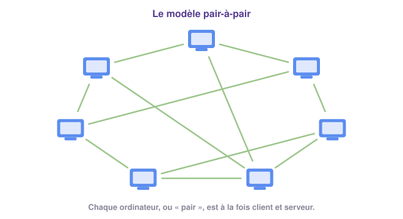

# Le pair-à-pair 🔗

## 1 - Quand chacun devient serveur 🔁

Un éditeur de jeu vidéo publie une mise à jour. Des millions de joueurs veulent la
télécharger le même jour. Son serveur va-t-il tenir le choc ?

!!! example "Activité 6 - La mise à jour du jeu"
    La mise à jour est découpée en **8 morceaux**. À chaque tour, le serveur de l'éditeur
    peut envoyer **2 morceaux**. En pair-à-pair, chaque ordinateur peut **en plus** envoyer
    à un autre un morceau qu'il possède déjà.

    

    1. En **client-serveur**, lance la distribution avec 6, puis 12, puis 24 ordinateurs.
       Note les durées. Que se passe-t-il quand le nombre d'ordinateurs double ?
    2. Fais de même en **pair-à-pair**. Que remarques-tu ?
    3. Explique pourquoi le pair-à-pair est beaucoup plus rapide quand il y a beaucoup d'ordinateurs.
    4. En pair-à-pair, mets le serveur en panne une fois que les **8 morceaux** sont présents
       chez les ordinateurs. La distribution s'arrête-t-elle ? Et si tu le mets en panne dès
       le 2ᵉ tour ?
    5. Que se passe-t-il si le serveur tombe en panne en client-serveur ?

    ??? success "Correction"
        1. Environ 24, 48 puis 96 tours : la durée **double** quand le nombre d'ordinateurs
           double. Le serveur doit tout envoyer à tout le monde, seul.
        2. Environ 8, 10 puis 12 tours : la durée augmente à peine.
        3. Chaque ordinateur qui a reçu un morceau le **retransmet** aux autres : plus il y a
           d'ordinateurs, plus il y a d'« envoyeurs ». Le serveur n'est plus le seul à travailler.
        4. Une fois les 8 morceaux présents chez les ordinateurs, la distribution continue
           sans le serveur. Au 2ᵉ tour, certains morceaux n'existent encore nulle part :
           elle se bloque.
        5. Tout s'arrête : plus personne ne peut rien recevoir.

!!! definition "Définition : Modèle pair-à-pair"
    Le **modèle pair-à-pair** (en anglais *peer-to-peer*, souvent abrégé **P2P**) est un
    principe d'échange où **chaque ordinateur est à la fois client et serveur** : il reçoit
    des données des autres et leur en fournit. On appelle ces ordinateurs des **pairs**.

{ .snt-schema }

Les fichiers sont **découpés en petits morceaux**. Un ordinateur peut télécharger une partie
d'un fichier chez un pair et le reste chez d'autres : il n'a pas besoin de posséder le
fichier entier pour commencer à le partager.

!!! info "À retenir !"
    - Dans un réseau **pair-à-pair**, chaque ordinateur est à la fois **client et serveur**.
    - Les données sont **réparties** sur de nombreuses machines : plus il y a de pairs, plus
      le partage est **rapide**, et aucun serveur central n'est surchargé.
    - Le réseau continue de fonctionner même si certains ordinateurs s'arrêtent.

---

## 2 - À quoi sert le pair-à-pair ? 🧰

Le pair-à-pair est surtout connu pour le **partage de fichiers** entre internautes. Mais il
a bien d'autres usages, parfaitement légaux :

- **les mises à jour** : Windows et de nombreux jeux vidéo distribuent leurs mises à jour
  en pair-à-pair. Un ordinateur qui a téléchargé la mise à jour la transmet à d'autres, ce
  qui soulage les serveurs de l'éditeur ;
- **les cryptomonnaies** : la liste de toutes les transactions en Bitcoin, la *blockchain*
  (« chaîne de blocs »), est copiée sur des milliers d'ordinateurs en pair-à-pair. Aucune
  banque centrale ne la contrôle ;
- **le calcul partagé** : des volontaires prêtent la puissance de leur ordinateur, quand ils
  ne s'en servent pas, à des projets scientifiques. En France, le projet *Décrypthon* a
  réuni plus de 75 000 volontaires pour étudier les protéines du corps humain : un calcul qui
  aurait demandé plus de **1 100 ans** à un seul ordinateur.

!!! info "À retenir !"
    Le pair-à-pair sert à **partager des fichiers** entre internautes, mais aussi à
    distribuer des **mises à jour**, à faire fonctionner les **cryptomonnaies** et à
    **partager la puissance de calcul** d'ordinateurs volontaires.
