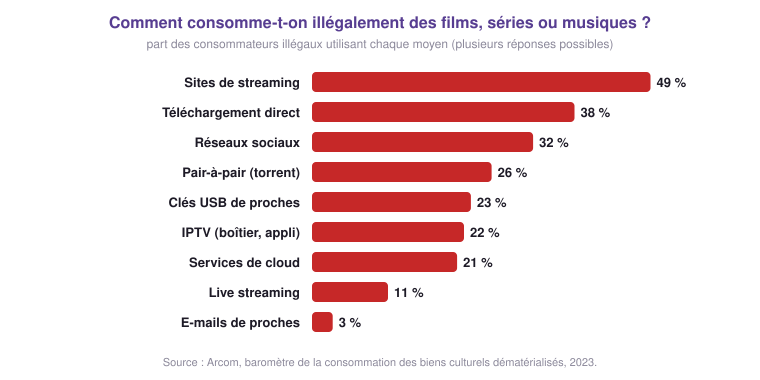
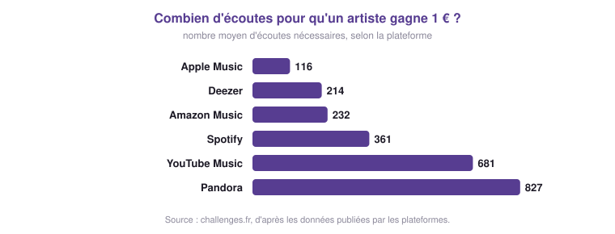

# Télécharger : légal ou illégal ? ⚖️

## 1 - Ce qui compte, c'est ce qu'on partage 📁

Utiliser un logiciel de pair-à-pair est **parfaitement légal**. Ce qui peut être illégal,
c'est le **fichier** que l'on télécharge ou que l'on partage.

!!! definition "Définition : Droit d'auteur"
    Une œuvre (un film, une chanson, un jeu vidéo, un livre, un logiciel…) appartient à son
    auteur. Le **droit d'auteur** lui permet de décider qui peut la copier, la diffuser, et à
    quel prix. Télécharger ou partager une œuvre **sans l'accord de son propriétaire** est
    illégal, que ce soit en pair-à-pair, par un lien de téléchargement direct ou sur un site
    de streaming pirate.

!!! example "Activité 7 - Légal ou illégal ?"
    Pour chaque situation, choisis la bonne réponse, puis vérifie.

    

    
    

---

## 2 - L'Arcom et les risques encourus 🚨

!!! definition "L'Arcom"
    L'**Arcom** (Autorité de régulation de la communication audiovisuelle et numérique) est
    née en 2022 de la fusion du CSA et d'Hadopi. Elle protège les œuvres en luttant contre
    les offres illégales et en encourageant le développement des offres légales.

{ .snt-schema }

!!! warning "Les risques"
    Un internaute repéré en train de partager illégalement une œuvre reçoit un **premier
    avertissement** de l'Arcom par e-mail, puis un **second** par courrier. S'il
    continue, son dossier peut être transmis à la justice : il risque jusqu'à **1 500 €
    d'amende**.

Le téléchargement illégal prive les créateurs de leurs revenus. Or même les écoutes légales
rapportent peu à un artiste :

{ .snt-schema }

!!! example "Activité 8 - Débat : dans la peau de…"
    **Le contexte** : une jeune chanteuse vient de sortir un morceau qui « cartonne » sur les
    plateformes de streaming. Il devient vite l'un des plus téléchargés illégalement en
    pair-à-pair. La chanteuse consulte un juriste et le directeur de la plateforme pour
    connaître son manque à gagner, et demande une enquête à l'Arcom.

    **Le casting** :

    - la jeune chanteuse ;
    - un ou plusieurs internautes qui téléchargent son morceau illégalement ;
    - le juriste de la chanteuse ;
    - un ou plusieurs internautes qui écoutent le morceau sur une plateforme légale ;
    - la directrice de la plateforme de streaming ;
    - l'enquêteur de l'Arcom.

    **Déroulement**

    1. Choisis un rôle. À l'aide des documents de cette page, prépare deux ou trois arguments
       pour défendre le point de vue de ton personnage.
    2. Improvisez ensemble une scène où chaque personnage intervient.
    3. La question à trancher : **la chanteuse doit-elle porter plainte contre les internautes
       qui téléchargent illégalement sa musique ?**

    ??? success "Pistes pour le débat"
        - **La chanteuse et son juriste** : chaque téléchargement illégal est une écoute qui
          ne lui rapporte rien ; avec quelques centaines d'écoutes pour gagner 1 €, le manque
          à gagner est réel. La loi est de son côté.
        - **Les internautes « pirates »** : le prix des abonnements, une offre légale parfois
          incomplète (ce sont les raisons citées par l'Arcom) ; le partage fait aussi connaître
          l'artiste.
        - **Les auditeurs légaux** : ils paient, eux ; le piratage est injuste pour ceux qui
          respectent les règles.
        - **La plateforme** : elle verse une part de ses revenus aux artistes et aux maisons de
          disques ; moins d'abonnés, c'est moins d'argent pour tout le monde.
        - **L'Arcom** : elle avertit d'abord, sanctionne ensuite, et encourage les offres légales.

!!! info "À retenir !"
    - Utiliser un logiciel de pair-à-pair est **légal**. En revanche, **télécharger ou partager
      un fichier sans l'accord de son propriétaire est illégal**, quel que soit le moyen
      utilisé.
    - Le téléchargement illégal nuit à la **rémunération des créateurs** : acteurs,
      chanteurs, auteurs, développeurs…
    - L'**Arcom** avertit les internautes qui partagent illégalement des œuvres ; ils risquent
      jusqu'à **1 500 € d'amende**.
