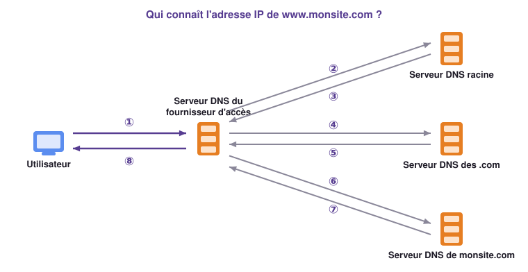

# Exercices

Vous trouverez ci-dessous les exercices de ce chapitre.

- Les exercices marqués avec :fontawesome-solid-pencil: se réalisent **sans ordinateur**.  
  Ceux indiqués par :fontawesome-solid-laptop: nécessitent **un ordinateur**.

- Le **niveau de difficulté** est indiqué par des étoiles :  
    <ul style="list-style: none;">
        <li>:fontawesome-solid-star: :fontawesome-regular-star: :fontawesome-regular-star: → Exercices pour **s'approprier les notions**.</li>
        <li>:fontawesome-solid-star: :fontawesome-solid-star: :fontawesome-regular-star: → Exercices pour **renforcer vos compétences**.</li>
        <li>:fontawesome-solid-star: :fontawesome-solid-star: :fontawesome-solid-star: → Exercices pour vous **challenger** et tester vos acquis.</li>
    </ul>

---

## Clients et serveurs

!!! exopapier ":fontawesome-solid-star: :fontawesome-regular-star: :fontawesome-regular-star: Les Jeux olympiques en ligne"
    Pendant les prochains Jeux olympiques, le site officiel de la compétition va être
    extrêmement sollicité : des millions de personnes consulteront les résultats en même temps.

    1. Quel risque court le site s'il ne dispose que d'un seul serveur ?
    2. Quelle solution l'administrateur du site peut-il mettre en œuvre pour l'éviter ?
    3. Des pirates menacent de rendre le site inaccessible pendant la cérémonie d'ouverture.
       Quel type d'attaque redoute-t-on ? Explique son principe.

    ??? success "Correction"
        1. Le serveur serait **saturé** : il répondrait très lentement, ou plus du tout.
        2. **Dupliquer le serveur** : plusieurs serveurs identiques, répartis dans le monde, se
           partagent les visiteurs.
        3. Une **attaque par déni de service** (DDoS) : des milliers de machines contrôlées par
           les pirates envoient en même temps une avalanche de requêtes, jusqu'à saturer les serveurs.

!!! exopapier ":fontawesome-solid-star: :fontawesome-solid-star: :fontawesome-regular-star: Le débit partagé"
    Quand plusieurs clients téléchargent en même temps depuis un même serveur, ils se
    partagent son débit. Loana a écrit la fonction Python suivante :

    ```python
    def debit(debit_max, nombre_utilisateurs):
        return debit_max / nombre_utilisateurs
    ```

    `debit_max` est le débit maximal du serveur, en Mbit/s, et `nombre_utilisateurs` le nombre
    de clients connectés.

    1. Combien d'arguments faut-il donner à la fonction `debit` lors de son appel ?
    2. Que renvoie l'appel `debit(500, 10)` ? Que signifie ce résultat ?
    3. 50 clients se connectent à un serveur dont le débit maximal est de 1 Gbit/s. En
       utilisant la fonction `debit`, calcule le débit théorique de chaque client.
    4. Pourquoi ce problème de partage se pose-t-il beaucoup moins en pair-à-pair ?

    ??? success "Correction"
        1. Deux arguments : le débit maximal et le nombre d'utilisateurs.
        2. `50.0` : chacun des 10 clients dispose de 50 Mbit/s.
        3. 1 Gbit/s = 1 024 Mbit/s, et `debit(1024, 50)` renvoie `20.48` : environ 20 Mbit/s par client.
        4. En pair-à-pair, chaque client devient aussi serveur : le nombre d'« envoyeurs »
           augmente avec le nombre de clients, au lieu de se partager un seul débit.

---

## Noms de domaine et DNS

!!! exopapier ":fontawesome-solid-star: :fontawesome-regular-star: :fontawesome-regular-star: Les extensions"
    Relie chaque extension au type d'organisation auquel elle était destinée à l'origine.

    | Extension | | Organisation |
    |---|---|---|
    | `.com` | | organisation gouvernementale |
    | `.edu` | | organisation du réseau Internet |
    | `.gouv` | | organisation non commerciale |
    | `.org` | | organisation dans l'éducation |
    | `.net` | | organisation commerciale |

    ??? success "Correction"
        `.com` → commerciale · `.edu` → éducation · `.gouv` → gouvernementale ·
        `.org` → non commerciale · `.net` → réseau Internet.

!!! exopapier ":fontawesome-solid-star: :fontawesome-regular-star: :fontawesome-regular-star: Lire une adresse web"
    Pour chacune des adresses suivantes, donne le **protocole**, le **nom de domaine** et
    son **extension**.

    1. `https://www.parcoursup.gouv.fr`
    2. `https://fr.wikipedia.org/wiki/Internet`
    3. `http://www.lyceeimmacespalion.org/contact`

    ??? success "Correction"
        1. Protocole `https`, nom de domaine `parcoursup.gouv.fr`, extension `.gouv.fr` (en fait `.fr`, réservé ici au gouvernement).
        2. Protocole `https`, nom de domaine `wikipedia.org`, extension `.org` (`fr.` est un sous-domaine, pour la version française).
        3. Protocole `http`, nom de domaine `lyceeimmacespalion.org`, extension `.org`.

!!! exoordi ":fontawesome-solid-star: :fontawesome-solid-star: :fontawesome-regular-star: Quelles sont leurs adresses IP ?"
    Rends-toi sur [my-ip-finder.fr :octicons-link-external-16:](https://www.my-ip-finder.fr){ target="_blank" },
    onglet « DNS Lookup », ou utilise la commande `nslookup` dans le Terminal.

    1. Relève les adresses IP de `instagram.com`, `www.youtube.com` et `netflix.com`.
       Lequel de ces sites a le plus d'adresses ?
    2. Pourquoi les services de streaming ont-ils autant de serveurs ?
    3. Pour `canalplus.com`, combien d'adresses IPv4 et IPv6 s'affichent ?

    ??? success "Correction"
        Les résultats varient selon le moment et le lieu.

        1. Les grands sites renvoient souvent **plusieurs** adresses IP.
        2. Des millions de personnes regardent des vidéos en même temps : il faut de nombreux
           serveurs pour se partager les spectateurs, répartis dans le monde pour être proches d'eux.
        3. Le plus souvent une ou plusieurs adresses de chaque version.

!!! exoordi ":fontawesome-solid-star: :fontawesome-solid-star: :fontawesome-regular-star: Un lycée à la page"
    1. Avec `nslookup` ou [my-ip-finder.fr :octicons-link-external-16:](https://www.my-ip-finder.fr){ target="_blank" },
       détermine la ou les adresses IP du site de ton lycée, `lyceeimmacespalion.org`.
    2. Tape cette adresse IP dans la barre d'adresse du navigateur. La page du lycée
       s'affiche-t-elle ? Comment l'expliquer ?

    ??? success "Correction"
        1. Le résultat dépend de l'hébergeur du site.
        2. Souvent **non** : le site est hébergé sur un serveur qui accueille de nombreux autres
           sites. Sans le nom de domaine, le serveur ne sait pas lequel renvoyer. Une même
           adresse IP peut correspondre à plusieurs noms de domaine.

!!! exopapier ":fontawesome-solid-star: :fontawesome-solid-star: :fontawesome-regular-star: Le site est inaccessible !"
    Robin veut consulter son site de recettes préféré, `www.milleetunerecettes.com`. Il tape
    l'adresse un peu vite, et son navigateur affiche :

    ```text
    Ce site est inaccessible
    Impossible de trouver l'adresse IP du serveur de www.mileetunerecettes.com.
    DNS_PROBE_FINISHED_NXDOMAIN
    ```

    1. Quelle machine n'a pas pu répondre à la demande du navigateur ?
    2. Le navigateur a-t-il pu contacter le serveur web du site ?
    3. Compare l'adresse affichée par le navigateur et le nom du site. Quelle est l'explication ?

    ??? success "Correction"
        1. Le **serveur DNS** : aucune adresse IP ne correspond à ce nom.
        2. Non : sans adresse IP, il ne sait pas où envoyer sa requête.
        3. Robin a fait une **faute de frappe** : il manque un « l » à « mille ». Aucun site ne
           porte ce nom, donc aucune adresse IP ne lui correspond.

!!! exopapier ":fontawesome-solid-star: :fontawesome-solid-star: :fontawesome-solid-star: Le voyage d'une requête DNS"
    Le serveur DNS du fournisseur d'accès ne connaît pas toujours la réponse : il interroge
    alors d'autres serveurs DNS, chacun spécialisé dans une partie du nom.

    { .snt-schema }

    Associe chacun des messages suivants au bon numéro, de ① à ⑧ :

    - « C'est 202.21.77.100. » (deux fois)
    - « Essaie le serveur 122.34.12.19. »
    - « Essaie le serveur 201.11.97.10. »
    - « Quelle est l'adresse IP de www.monsite.com ? » (deux fois)
    - « Quel est le serveur DNS des noms en .com ? »
    - « Quel est le serveur DNS de monsite.com ? »

    ??? success "Correction"
        ① « Quelle est l'adresse IP de www.monsite.com ? »
        ② « Quel est le serveur DNS des noms en .com ? »
        ③ « Essaie le serveur 122.34.12.19. » (l'adresse du serveur des .com)
        ④ « Quel est le serveur DNS de monsite.com ? »
        ⑤ « Essaie le serveur 201.11.97.10. » (l'adresse du serveur de monsite.com)
        ⑥ « Quelle est l'adresse IP de www.monsite.com ? »
        ⑦ « C'est 202.21.77.100. »
        ⑧ « C'est 202.21.77.100. »

!!! exopapier ":fontawesome-solid-star: :fontawesome-solid-star: :fontawesome-solid-star: Cybersécurité : le DNS empoisonné"
    Le **DNS spoofing** (ou empoisonnement du DNS) est une attaque où un pirate modifie les
    réponses d'un serveur DNS pour rediriger les internautes vers un site frauduleux.

    Arthur veut consulter le site de son club de natation. Il tape l'adresse exacte du club,
    mais arrive sur une page qui lui propose de participer à une tombola en donnant ses
    coordonnées bancaires.

    1. L'adresse tapée par Arthur était correcte. Quelle machine lui a donné une fausse
       adresse IP ?
    2. La tombola a-t-elle, a priori, un lien avec le club ?
    3. Quelle attitude Arthur doit-il adopter ?
    4. À ton avis, pourquoi le pirate a-t-il organisé cette redirection ?

    ??? success "Correction"
        1. Le **serveur DNS**, piraté, lui a renvoyé l'adresse IP d'un autre serveur.
        2. Non : c'est une page frauduleuse qui imite le club.
        3. Ne rien saisir, quitter la page, prévenir le club. Se méfier de toute page qui
           demande des coordonnées bancaires de façon inattendue.
        4. Pour **voler** des données personnelles ou bancaires (hameçonnage), et nuire à
           l'image du club.

---

## Le pair-à-pair

!!! exopapier ":fontawesome-solid-star: :fontawesome-regular-star: :fontawesome-regular-star: Distribuer un logiciel gratuit"
    Pour diffuser son nouveau logiciel gratuit, une entreprise a choisi le pair-à-pair.

    1. Explique ce choix en termes de durée de téléchargement.
    2. Au bout d'une semaine, la durée moyenne de téléchargement a nettement baissé, alors que
       le serveur de l'entreprise n'a pas changé. Explique pourquoi.

    ??? success "Correction"
        1. Chaque utilisateur qui a téléchargé le logiciel le partage à son tour : le
           téléchargement se répartit sur de nombreux ordinateurs au lieu d'un seul serveur.
        2. En une semaine, le nombre d'utilisateurs qui possèdent le logiciel, et le partagent,
           a beaucoup augmenté : il y a plus de sources, donc les téléchargements sont plus rapides.

!!! exopapier ":fontawesome-solid-star: :fontawesome-regular-star: :fontawesome-regular-star: Est-ce légal ?"
    Dans chacune des situations suivantes, le réseau pair-à-pair est-il utilisé dans un cadre
    légal ?

    a. Un achat sur le Web payé avec une cryptomonnaie.  
    b. Le partage de l'album photo d'une réunion de famille.  
    c. La rediffusion d'un match de football enregistré sur une chaîne payante.  
    d. Le téléchargement d'un logiciel libre.  
    e. Le téléchargement d'un jeu vidéo payant, sans l'avoir acheté.

    ??? success "Correction"
        a. Légal. b. Légal. c. Illégal : la chaîne n'a pas donné son accord.
        d. Légal. e. Illégal.

!!! exopapier ":fontawesome-solid-star: :fontawesome-solid-star: :fontawesome-regular-star: Des mises à jour plus écologiques"
    Autrefois, Microsoft envoyait les grandes mises à jour de Windows sur des DVD. Aujourd'hui,
    il les distribue en pair-à-pair : chaque ordinateur qui a téléchargé une mise à jour la met
    à disposition des autres.

    Quel est l'intérêt de ce choix du point de vue :
    a. de la fabrication ? b. des déchets ? c. de la consommation d'électricité de Microsoft ?

    ??? success "Correction"
        a. Plus besoin de fabriquer des DVD et leurs boîtiers.
        b. Plus de DVD ni d'emballages à jeter.
        c. Les serveurs de Microsoft envoient beaucoup moins de données : il en faut moins,
           et ils consomment moins.

!!! exopapier ":fontawesome-solid-star: :fontawesome-solid-star: :fontawesome-regular-star: Écologie : le coût du Bitcoin"
    Les transactions en Bitcoin sont vérifiées par une opération appelée **minage**, réalisée
    en pair-à-pair par des milliers d'ordinateurs. En 2022, le minage mondial de bitcoins a
    consommé environ **143 TWh** d'électricité, alors que la France entière en a consommé
    environ **450 TWh**.

    1. Quelle part de la consommation de la France le minage représente-t-il ?
    2. Une centrale nucléaire compte quatre réacteurs qui produisent chacun **7 TWh** par an.
       Combien de centrales faudrait-il pour fournir l'électricité du minage mondial ?
    3. Commente ce résultat d'un point de vue écologique.

    ??? success "Correction"
        1. $143 \div 450 \approx 0{,}32$ : près d'**un tiers** de la consommation de la France.
        2. Une centrale produit $4 \times 7 = 28$ TWh par an, et $143 \div 28 \approx 5{,}1$ :
           il faudrait plus de **5 centrales**, donc 6.
        3. Le minage consomme énormément d'électricité, souvent produite à partir de
           charbon dans certains pays : son impact sur le climat est important.

!!! exopapier ":fontawesome-solid-star: :fontawesome-solid-star: :fontawesome-solid-star: Le calcul partagé"
    Le projet français *Décrypthon* a étudié 559 275 protéines grâce à **75 000 volontaires**
    qui ont prêté la puissance de leur ordinateur. Chaque ordinateur a calculé en moyenne
    **133 heures**.

    1. Combien d'heures de calcul ont été réalisées au total ?
    2. Combien d'années un seul ordinateur aurait-il mis pour faire ce calcul ? (Une année
       compte 8 760 heures.)
    3. Pourquoi ces projets ont-ils intérêt à utiliser une architecture pair-à-pair plutôt
       qu'un unique superordinateur ?

    ??? success "Correction"
        1. $75\,000 \times 133 = 9\,975\,000$ heures, environ **10 millions d'heures**.
        2. $9\,975\,000 \div 8\,760 \approx 1\,139$ : plus de **1 100 ans**.
        3. Le calcul est partagé entre des milliers d'ordinateurs qui travaillent en même temps :
           il va beaucoup plus vite, et ne coûte presque rien, car il utilise des ordinateurs
           qui existent déjà et ne servent pas à ce moment-là.
